<!-- source: https://palantir.com/docs/foundry/building-pipelines/remove-inherited-markings/ · mirrored 2026-08-18 from Palantir Foundry docs -->

# Remove inherited Markings and Organizations

[Markings](/docs/foundry/security/markings/) and [Organizations](/docs/foundry/security/orgs-and-spaces/#organizations) restrict access to resources based on a user's eligibility.

When restricted content is removed or obfuscated while deriving a dependent resource, users may wish to remove the Marking and/or Organization on that derived resource. This process of removing inherited Markings and Organizations can be done by using the [`stop_propagating`](/docs/foundry/api-reference/transforms-python-library/api-input/#transforms.api.Input) and `stop_requiring` input transform properties.

* [`stop_propagating`](/docs/foundry/api-reference/transforms-python-library/api-input/#transforms.api.Input) is used to remove inherited [Markings](/docs/foundry/platform-security-management/manage-markings/#remove-an-inherited-marking) (for example, PII).
* `stop_requiring` is used to remove inherited [Organizations](/docs/foundry/security/orgs-and-spaces/#organizations) (e.g. Palantir).

## Terminology

* [Organizations](/docs/foundry/security/orgs-and-spaces/#organizations) are an access requirement applied to Projects that guarantees strict silos between groups of users and resources. In order to meet access requirements, users must be a member or guest member of at least one Organization applied to a Project.
* [Markings](/docs/foundry/security/markings/) are an access requirement applied to resources that restricts access in an all-or-nothing fashion. In order to meet access requirements, a user must be a member of **all** Markings applied on the resource.
* [Roles](/docs/foundry/security/projects-and-roles/#roles) are a collection of permissions that define the specific workflows a user can perform on a given resource (e.g. Viewer, Editor, etc.).

## Important to know

* The `stop propagating` and `stop requiring` key phrases only apply to Organizations and Markings and **NOT** Roles.
* The repository needs to have at least one protected branch (for example, **main**). This branch must also [enforce at least one required approver](/docs/foundry/code-repositories/branch-settings/#require-code-reviews).
* You can only remove Organizations and Markings on protected branches. Mentioning an un-protected branch (e.g. `on_branches=[..., "not-protected-branch"]`) will cause the build to fail.
* Removal of organizations and Markings is supported in Python, Java, and SQL.
* Special user permissions are necessary to approve the removal of inherited Organizations and Markings. A user will need `Remove marking` permissions to remove Markings and `Expand access` permissions to remove Organizations.

## Basic workflow

:::callout{theme="neutral"}
The gray dataset boxes in Project C below highlight the fact that Project References must be added for all the inputs in the destination Project.
:::

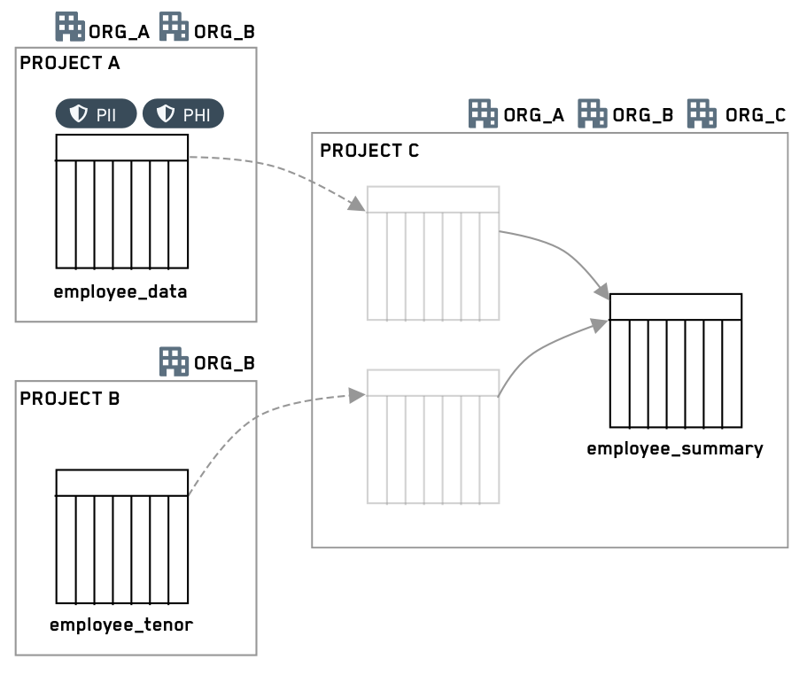

### Steps

1. Create a new branch off of a protected branch (for example, *main*).

2. Add one or both of the `stop_propagating` and `stop_requiring` properties to the input transform. For example:

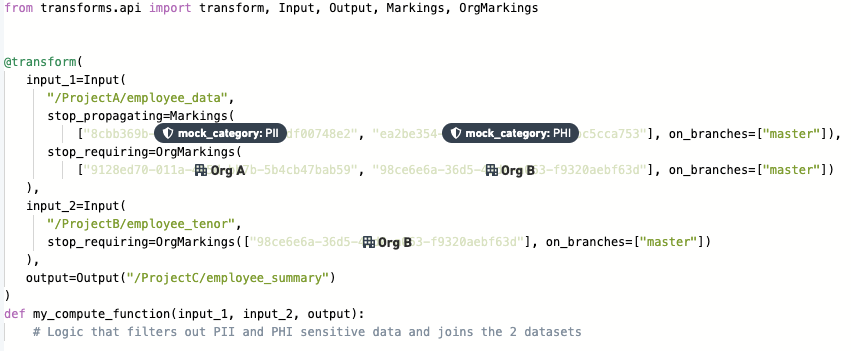

3. Create a pull request to merge this code into a protected branch.

4. A user with either `Remove marking` permissions for Markings or `Expand access` for Organizations can approve or reject the proposed changes. If multiple reviewers are added, rejection by any reviewer will result in rejection of the entire pull request.

5. If approved, the code editor merges the PR and builds the output dataset. After the output dataset is built, it will no longer have the propagated Markings and/or Organizations.

:::callout{theme="neutral"}
Internally, Organizations are represented as a slightly different kind of Marking, hence the transforms keyword following `stop_requiring` is called `OrgMarkings`.
:::

## Input transform property

To remove inherited Markings (e.g. PII), use the `stop_propagating` keyphrase.

To remove inherited Organizations (e.g. Palantir), use the `stop_requiring` keyphrase.

Each of these keyphrases must be specified on **every** input that requires removal of Markings or Organizations. For every removal, you must also specify the protected branches to which the removal should apply. Marking IDs, Organization IDs, and branches should always be specified as quoted strings.

:::callout{theme="neutral"}
You need to provide at least one upstream Organization, since users only need to satisfy at least one Organization. Approvals will be required for each listed Organization. The [detailed workflow](#detailed-workflow) below provides an example illustrating this point.
:::

### Python

In Python, Marking removal is specified in the input constructor.

```python
@transform(
  input_1=Input("<input_id>",
      stop_propagating=Markings([markingId1, ...], [branch1, ...]),
      stop_requiring=OrgMarkings([orgMarking1, ...], [branch2, ...])),
  output=Output("<output_id>")
  )
```

The `Markings` class takes a list of Marking IDs and a list of protected branches on which to apply the marking removal. Marking IDs can be found in the `Markings` list on the `Settings` page.

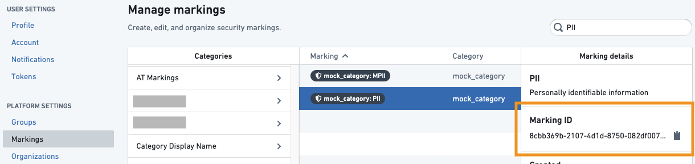

The `OrgMarking` class takes a list of Organization IDs and a list of protected branches on which to apply the Marking removal. Organization IDs can be found in the `Organizations` list on the `Settings` page.

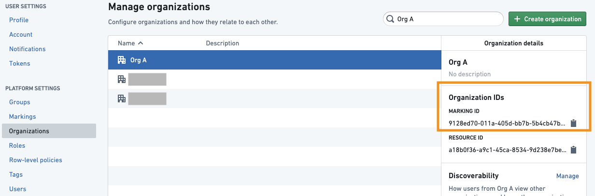

### Java

#### Java automatic registration

In Java, Marking removal is specified via annotations on the inputs for automatically registered transforms.

Syntax:

```java
@Compute
public void myComputation(
  @StopPropagating(markings = {markingId1, ...}, onBranches = {branch1, ...})
  @StopRequiring(orgMarkings = {orgId1, ...}, onBranches = {branch2, ...})
  @Input("<input_id>")
  FoundryInput input,
  @Output("<output_id>")
  FoundryOutput output)
```

The `@StopPropagating` and `@StopRequiring` annotations take a set of Marking IDs and a set of protected branches on which to apply the Marking removal.
When only one Marking or branch is specified you do not need to wrap it in `{}` (e.g. `@StopPropagating(markings = marking1, onBranches = "my-branch")`).

#### Java manual registration

For manually registered Java transforms, we use the following syntax to specify unmarkings during registration in the `MyPipelineDefiner.java` file.

```java
  @Override
    public void define(Pipeline pipeline) {
        HighLevelTransform highLevelManualTransform = HighLevelTransform.builder()
                .computeFunctionInstance(new HighLevelManualFunction())
                .putParameterToInputAlias("myInput", "/path/to/input/dataset")
                .returnedAlias("/path/to/output/dataset")
                        .desiredUnmarkings(Set.of(
                                    Unmarking.builder()
                                        .branch("branch1")
                                        .input(alias("/input1"))
                                        .output(alias("/output"))
                                        .markingId(MarkingId.valueOf("markingId"))
                                        .build(),
                                    Unmarking.builder()
                                        .branch("branch1")
                                        .input(alias("/input1"))
                                        .output(alias("/output"))
                                        .markingId(MarkingId.valueOf("orgId1"))
                                        .build()
                                    ))
                .build();
        pipeline.register(highLevelManualTransform);
    }
```

### SQL

In SQL, Marking removal is specified by using SparkSQL hint statements:

```sql
CREATE TABLE <output_id> AS
  SELECT /*+ foundry_stop_propagating(markingId1, ...) foundry_stop_requiring(orgMarkingId1, ...) foundry_on_branches(branch1, ...) */ *
  FROM <input_id>
```

Marking and Organization removal in SQL can be added to any `SELECT` statement. For example:

```sql
CREATE TABLE <output_id> AS SELECT * FROM <input_1_id>
  CROSS JOIN (SELECT /*+ foundry_stop_propagating(markingId1) foundry_on_branches("my-branch") */ * FROM <input_2_id>)
```

## Removal permissions

To be able to view code and approve pull requests in general, the
approver must pass any Organizations and Markings on the Project and the
repository itself, as well as having a [Role](/docs/foundry/security/projects-and-roles/#roles) that includes the basic Stemma `View Repository` workflow (by default, included in the Viewer role). Users must also have permissions on each Organization and Marking to set approval modes or approve pull requests removing those Organizations and Markings. Users do not necessarily need to be members of the Organization or Marking.

:::callout{theme="neutral"}
For a Marking approval, the user approving needs to have the `Remove marking` role on the Marking.
:::

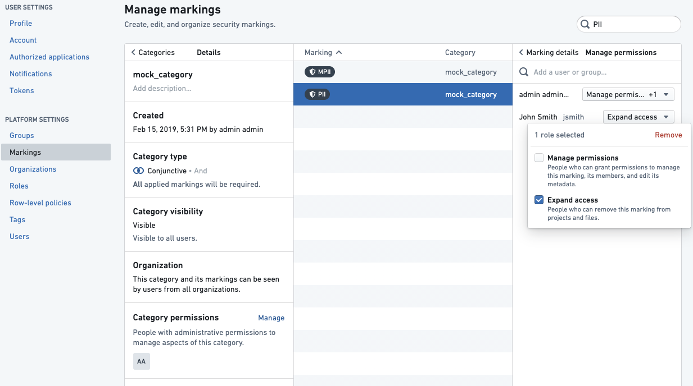

:::callout{theme="neutral"}
For an Organization approval, the user approving needs to have the `Expand access` role on the Marking.
:::

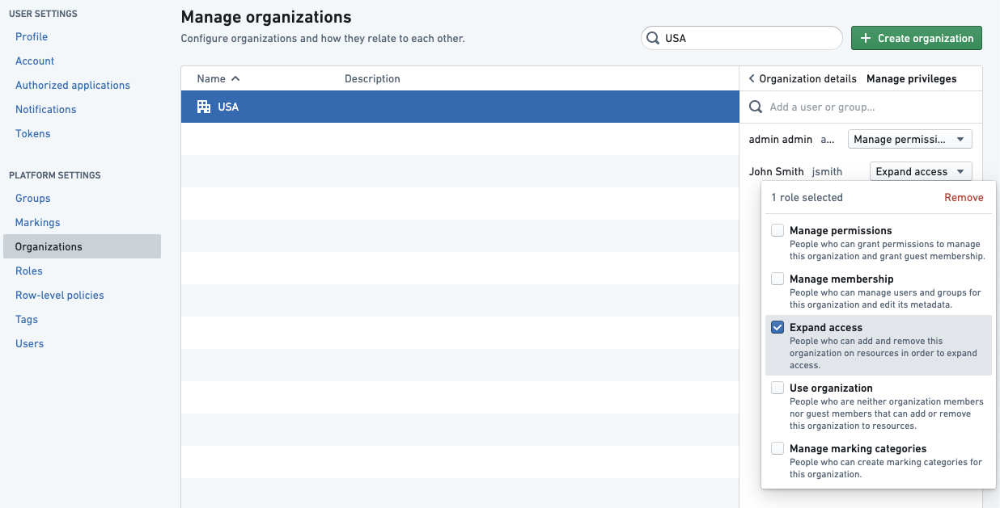

## Approval modes

For each repository and each Organization and Marking, a data governance user can define which mode should be used to trigger a new approval:

* **Require re-approval:** This is the default mode for every Organization and Marking. The repo will always require security approvals for any pull request made to a branch where this Organization and Marking has been removed. This mode guards against changes to the logic, thereby ensuring that Organizations and Markings are safely removed.
* **Don’t require re-approval:** When this Organization and/or Marking is removed on a transform for the first time for a given input, approval is required. Subsequent changes to the logic will not be blocked on security approvals.

### Example 1

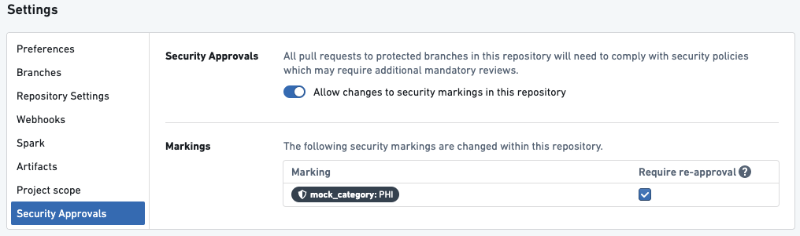

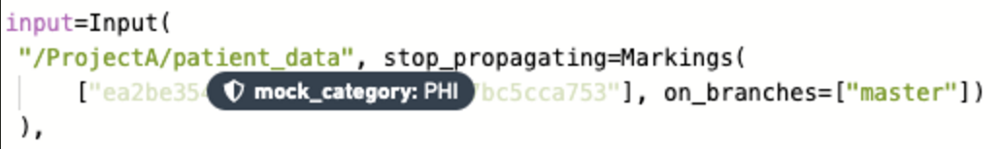

*Above is a transform in a repository with one Marking `PHI` that requires re-approval.*

Given the above setup, the following will happen:

* When the user creates their first PR to stop propagating the PHI Marking, they will be required to get approval from a user with the `Remove` role on the PHI Marking.
* If the user later modifies the transform above in their next PR, they will again be asked to get approval.
* If the user modifies anything in the repository – in this file or any other file – they will again be asked to get approval for PHI Marking.

### Example 2

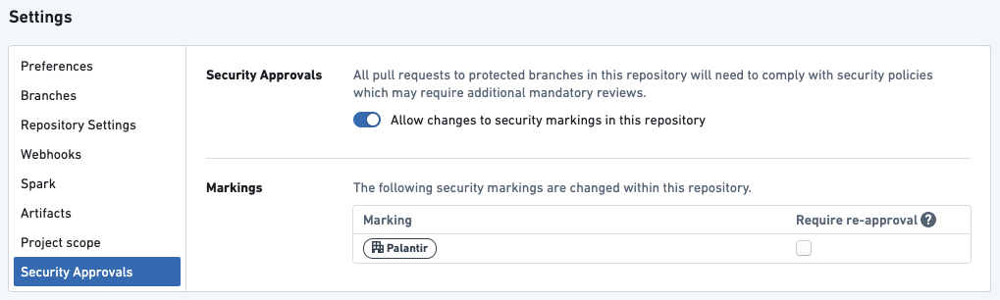

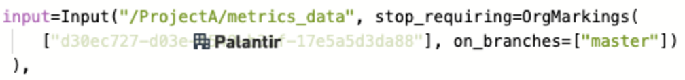

*Above is a transform in a repository with one organization, `PALANTIR`, that does **NOT** require re-approval.*

Given the above setup, the following will happen:

* When the user creates their first pull request to stop requiring the `PALANTIR` Organization, they will be required to get approval from someone with the `Expand access` role on the `PALANTIR` Organization.
* If the user later modifies the transform above in their next pull request, they will **NOT** be asked to get approval.
* If the user subsequently modifies anything in this repository, they will **NOT** be asked to get approval.

### Example 3

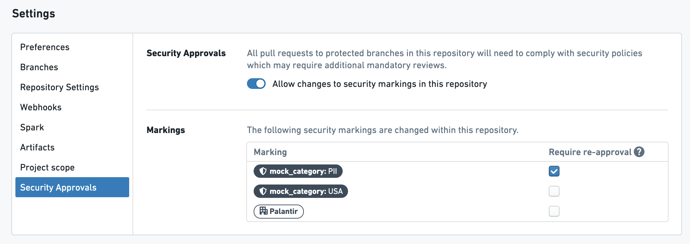

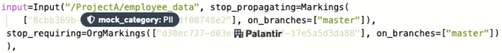

*Transform 1: Above is a transform with one Marking, `PII`, and one Organization, `PALANTIR`. The `PII` Marking requires re-approval and the `PALANTIR` Organization does not require re-approval.*

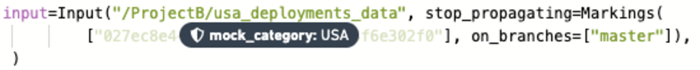

*Transform 2: Above is a transform with one Marking, `USA`, that does **NOT** require re-approval.*

Given the above setup, here's what will happen:

* When the user creates their first pull request in Transform 1, they will be required to get approval from a user with `Remove marking` role on the `PII` Marking **AND** a user with `Expand access` role on the `PALANTIR` Organization.
* If the user later modifies Transform 1 in their next pull request, they will be asked to get approval from **ONLY** a user with `Remove marking` role.
  on the `PII` Marking.
* When the user creates their first pull request for Transform 2, they will be required to get approval from a user with `Remove marking` role on the `USA` Marking **AND** a user with `Remove marking` role on the `PII` Marking.
* If the user later modifies Transform 2 in their next pull request, they will be asked to get approval from **ONLY** a user with `Remove marking` role on the `PII` Marking.
* If the user subsequently modifies anything in this repository, they will be asked to get approval from **ONLY** a user with `Remove marking` role on the `PII` Marking.

## Detailed workflow

In this example scenario, a code editor wants to use two datasets from a sensitive upstream project, remove certain information, and allow a wider audience to access the resulting dataset. The two datasets, which have two Markings each, have been added as references in the downstream Project. The code editor wants three of the four Markings to stop propagating, such that they do not appear on the output dataset. In addition, the upstream Project is restricted to users from OrgA or OrgB, and the intent is to distribute the downstream data to users from OrgC.

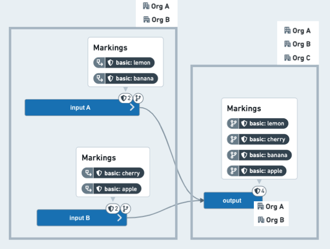

*Before: The **output** dataset on the code editors branch has inherited all four Markings and is still restricted to users from OrgA or OrgB.*

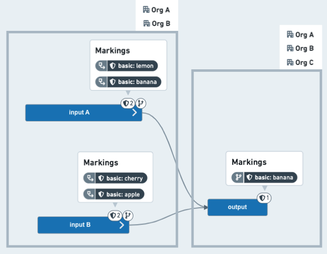

*After: The **output** dataset, once merged into a protected branch (for example, **main**), now has only one inherited Marking and does not require users to be members of `OrgA` or `OrgB`.*

### Steps

1. The code editor writes a new transform on the
   `feature/clean-data` branch of the repository of the downstream Project.

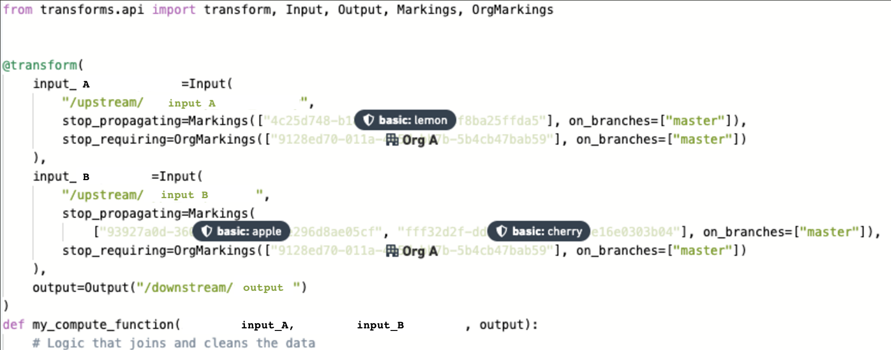

2. Since all the marking changes are being requested for the `master` branch, no approvals are needed to work on `feature/clean-data`. In other words, when the output dataset is built on the `feature/clean-data` branch, all the upstream Markings will still be inherited.

3. The code editor creates a pull request to the main branch and requests approvals from the data governance users, who manage data restricted by the `lemon`, `apple`, and `cherry` Markings. The code editor also requests an approval from an `Expand access` Organization administrator from OrgA, who can approve when OrgA data needs to be shared with other Organizations.

:::callout{theme="neutral"}
Expanding access by removing an inherited Organization has the effect of removing all inherited Organizations, but approval is only required from users with the appropriate permissions on the Organizations listed in the transform. If you want to require approval from all of the Organizations, then you need to list all of the IDs in the \`stop\_requiring\` component. In this example, OrgA is primarily responsible for the data in the upstream Project, so the editor chose OrgA for the cross-Organization approval process. As such, the editor only needs approval from an OrgA admin to remove inherited Organizations. Depending on which Organization approvals the editor wants to request, the editor can choose to \`stop\_requiring\` either:
(1) OrgA (with approval by an OrgA admin),
(2) OrgB (with approval by an OrgB admin), or
(3) both OrgA and OrgB (with approval from admins from both Organizations).

The end result is that the output dataset will not inherit any Organizations from the inputs and will only respect the Organizations from the Project in which it is located.
:::

4. The data governance users and Organization administrators receive
   Foundry notifications that their approval has been requested.

5. Assuming the PR is approved, the code editor merges it and builds the output dataset as shown in the *After* image above.

6. The following week, another code editor makes a change to a different code file and opens a PR to merge to `master`.

:::callout{theme="neutral"}
If all the Markings do not require re-approval, the PR can be approved without going through a security review. If any of the Markings do require approval, this new PR will require a security review by the data governance or organization administrator who manages that Marking.
:::
