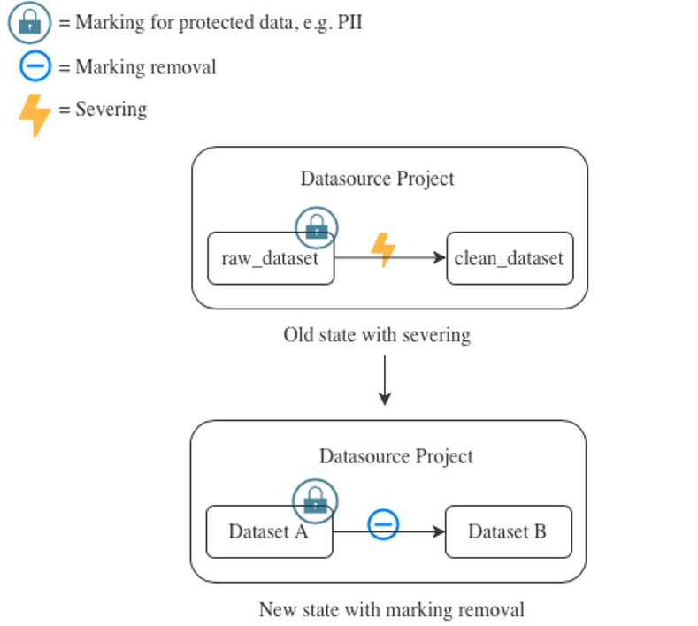
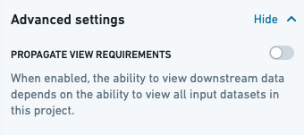
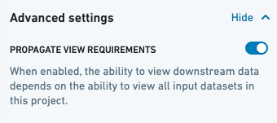
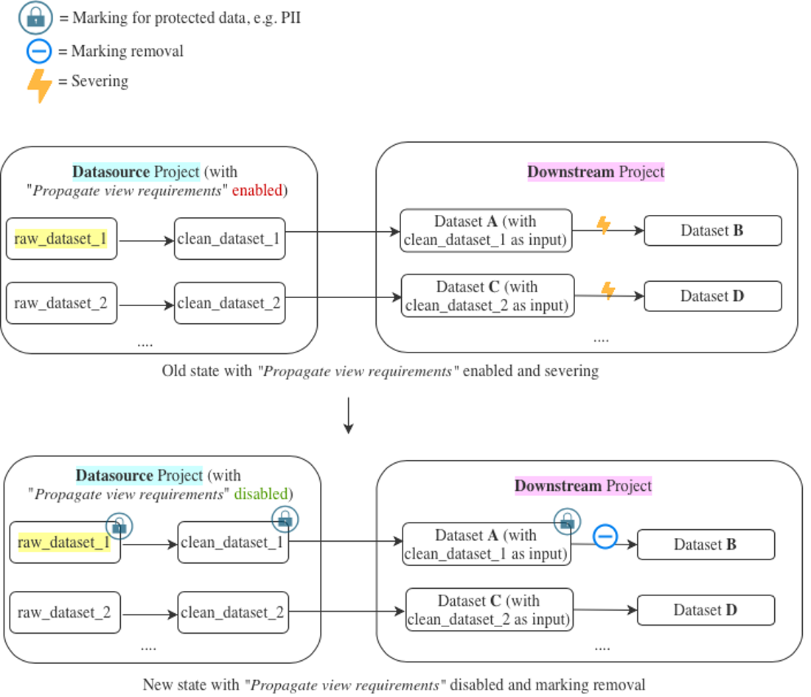
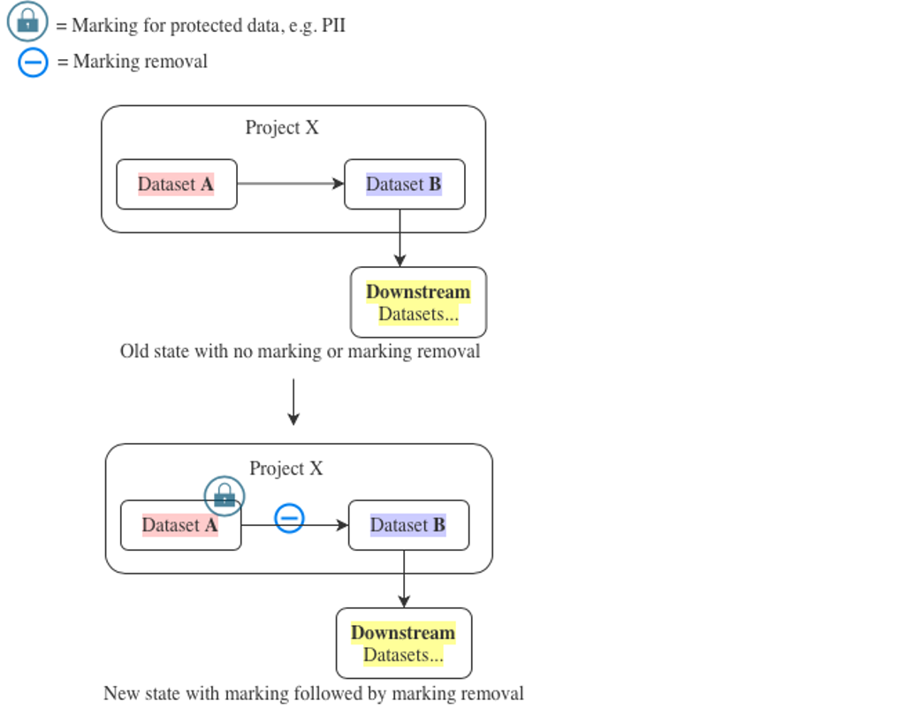
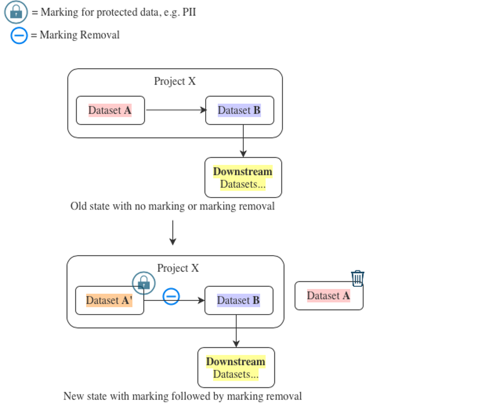

<!-- source: https://palantir.com/docs/foundry/building-pipelines/remove-markings/ · mirrored 2026-08-18 from Palantir Foundry docs -->

# Guidance on removing markings

Access requirements for platform resources are controlled by [Markings](/docs/foundry/security/markings/). Markings restrict access in an **all-or-nothing** fashion: in order to access a resource, a user must be a member of all Markings applied to the resource. In addition, Markings are **inherited** along both the file hierarchy and direct dependencies. If you have the correct permissions, you can remove Markings directly from resources and [along direct dependencies](/docs/foundry/building-pipelines/remove-inherited-markings/).

Markings are frequently used because they are legible throughout the platform and propagate along direct dependencies, protecting sensitive data. In some circumstances, a Marking may be applied early in a pipeline and need to be removed later in a pipeline. This page provides more information on how to remove Markings depending on your pipeline structure.

* If you are starting to apply Markings to your pipelines, we suggest reading through the [scenarios](#scenarios) section below to make sure you don't accidentally lock out any of your end users.
* Additionally, we recommend following the [best practices](#best-practices) when applying and removing Markings, and consulting the [documentation on how to remove inherited Markings and Organizations](/docs/foundry/building-pipelines/remove-inherited-markings/) for more advanced information.

You can also [remove markings or organizations with Pipeline Builder](/docs/foundry/pipeline-builder/outputs-remove-markings-and-organizations/).

## Scenarios

Below are three scenarios related to applying a Marking early in a pipeline and removing it later in a pipeline.

### Scenario 1: Replacing severing by Marking removal

This scenario is for when the pipeline:

* already has a Marking applied,
* the Marking is removed by severing, and
* the Project-level propagate view requirements permissions are not turned on.

Therefore, you are migrating from using severing (a deprecated feature) to removing an inherited Marking.



In the old state shown in the example above, severing has been used to prevent the Marking from propagating. Assuming that severing is only being used to remove a Marking, we strongly recommend that you replace severing with [Marking removal](/docs/foundry/building-pipelines/remove-inherited-markings/#input-transform-property), as in the new state in the example above. When removing the Marking, it is useful to think about the [approval mode](/docs/foundry/building-pipelines/remove-inherited-markings/#approval-modes) configuration of the repository which contains the Marking removal transform.

In the case that propagate view requirements is enabled, read scenario 2 below.

### Scenario 2: Apply a Marking followed by Marking removal to disable "Propagate View Requirements"

This scenario involves applying Markings to a dataset in your pipeline in order to disable the project-level propagate view requirements settings.



New Projects have the **Propagate View Requirements** option disabled by default, as seen above. For these new Projects, view requirements will not be enforced for downstream derived datasets. Specifically, this means that users accessing a downstream version of the data in a separate Project would not also require access to the upstream data in the Projects where this configuration is disabled.

:::callout{title="Reminder"}
Markings always propagate. If data in a new Project has a Marking, that Marking will still propagate to all downstream datasets, regardless of the "propagate view requirements" setting.
:::



If you have Projects with the **Propagate View Requirements** option enabled as in the image above, then view requirements have propagated for datasets in these Projects. This means that users accessing a downstream version of the data in a separate Project would additionally require access to the upstream Project(s) with this config enabled.

We highly recommend ***disabling*** *view requirement propagation* in favor of using *Markings*.

Before disabling view requirement propagation and introducing Markings to your pipeline, it is worth considering the original purpose of enabling propagating view requirements:

1. Perhaps there is no compelling reason for having "propagate view requirements" enabled. In that case, you might be able to simply disable this setting, and then ensure that users are only granted access to the datasets to which they explicitly require access. Users will no longer also require access to the upstream datasets which were previously propagating view requirements.
2. There are a few sensitive datasets in the Project. In this case, it’s best to isolate the sensitive datasets from non-sensitive ones and follow the steps outlined below. Those steps demonstrate how to replace view requirement propagation with Markings, which are the appropriate security primitive meant for these scenarios.
3. If the steps below do not meet your needs, contact your Palantir representative.

In the example below, our goal is to disable "propagate view requirements" on the **Datasource** Project. After following the steps above, we learned that the reason "propagate view requirements" is enabled on the project was to protect the `raw_dataset_1` dataset because it has sensitive data.



In the old state, viewing the contents of Dataset **A** would require at least “viewer” access on both the **Datasource** Project and the **Downstream** Project. Subsequently, severing has been used to remove the view requirement propagation on Dataset **B**.

In the new state, viewing contents of Dataset **A** requires at least “viewer” access on the **Downstream** Project and access to the Marking. Note that with "propagate view requirements" disabled, requiring access to Datasets **C** & **D** only requires “viewer” access on the **Downstream** Project.

This change allows disabling of "propagate view requirements" by using a security Marking. In the proposed solution below, we’ll apply a Marking on `raw_dataset_1` which is then *immediately* propagated to all downstream datasets which have any non-severed transaction of `raw_dataset_1` as an input. There is an assumption that **severing was already in place**, and severing is only being replaced by Marking removal. If this is not true in your situation, see [Scenario 3](#scenario-3-applying-a-new-marking-followed-by-marking-removal-at-the-dataset-level), where we discuss implications of applying a Marking to a dataset in detail.

The following steps are recommended for introducing this change so that users don’t lose access to Dataset **B** when the Marking is added after disabling "propagate view requirements" in the **Datasource** Project:

1. Create a new Marking and give relevant users access to the Marking.
2. Apply the Marking on `raw_dataset_1`.
3. Now that the Marking has been applied, you can safely disable "propagate view requirements" in the **Datasource** Project.
4. Replace severing with Marking removal in the transform, and ensure that unsevering and Marking removal happens at the same time.
5. Ensure all datasets in the pipeline are built.
6. Remove users from the **Datasource** Project who no longer require access to it.

### Scenario 3: Applying a new Marking followed by Marking removal at the dataset level

This potentially complex scenario involves introducing a new Marking early in an existing pipeline without accidentally locking out users later in the pipeline.



It is critical to note that the Marking introduced on Dataset **A** will immediately propagate to all resources that are downstream of that dataset along the transaction lineage. Users will require the marking to access anything derived from the marked dataset.

To understand this better, let’s extend the example above with a pipeline as follows: Dataset **A** → Dataset **B** → **Downstream** Datasets:

* Dataset **A** is a raw dataset (about to be marked).
* Dataset **B** is derived from Dataset **A** with sensitive data removed (so the Marking can be removed).
* **Downstream** Datasets are datasets derived from Dataset **B** for which users need access.

Our goal in this example is to ensure that **Downstream** Datasets never inherit the Marking from Dataset **A**.

The first thing we need to understand is that marking Dataset **A** (or a folder enclosing Dataset **A**) effectively marks all transactions in the entire history of Dataset **A**. As a consequence, Dataset **B** and **Downstream** Datasets inherit the Marking immediately.

If we perform the following steps:

* Add Marking removal in the Dataset **A** → Dataset **B** transform,
* Update Dataset **B**’s code, and
* Rebuild Dataset **B** ...

... then the latest snapshot transaction on Dataset **B** will be Marking-free, but all older transactions on Dataset **B** will still be marked.

:::callout{theme="neutral"}
Note that while marking a dataset will mark all of its transactions, removing a Marking in transforms will only remove the Marking for new output transactions. Markings will not be removed from existing transactions. This behavior is **not** symmetrical.
:::

This means that any data in the **Downstream** Datasets derived from an older transaction on Dataset **B**, such as **Downstream** datasets that are built incrementally, will still inherit the Marking.
However, Foundry checks only the most recent transaction for each input when verifying permissions on a dataset view. For incremental datasets, this means a regular build is sufficient to remove the marking.

To ensure each incremental **Downstream** dataset is unmarked, everything between the unmarking transform on Dataset **B** and the incremental **Downstream** dataset **must be rebuilt** after the unmarking transform is applied on Dataset **B**. This will ensure that each **Downstream** dataset depends only on the latest (unmarked) transaction on Dataset **B**, rather than earlier (marked) transactions.

If the number of **Downstream** datasets is infeasible for manually triggering a rebuild, we suggest the following steps:



1. Create a Dataset **A′** and make sure its contents are identical to Dataset **A**.
2. Rewrite the code for Dataset **B** to use Dataset **A′** as an input in place of Dataset **A**. At the same time, make sure to add appropriate Marking removal to the transform and then build Dataset **B** immediately afterward. There is no need to snapshot build Dataset **B**.

:::callout{theme="neutral"}
Consider the performance effects of doing this swap as it could trigger a `SNAPSHOT` build of Dataset **B**.
:::

1. Mark Dataset **A′**.
2. Move Dataset **A** into trash.
3. No further rebuilds are required at this point.

If you are making these changes in an important pipeline or are unsure about any of these steps, contact your Palantir representative for assistance.

## Best practices

* **Do not** set a repo to “Don’t require re-approval” mode unless absolutely necessary.
  * If you must enable this mode, **do** minimize the set of editors of that repository and **do** ensure that you get a sign-off (if required) for this setting.
* **Do** have clear, well-defined criteria for what makes a resource require a Marking.
* **Do** write Marking removal transforms to actively select data that does not require a Marking
* **Do not** write Marking removal transforms that filter out data which requires a Marking. This is because new data which merits a Marking can commonly be introduced upstream, and you need to protect against it accidentally flowing through your Marking removal transform.
  * Examples showing “filter in” approach (recommended):
    ```python
    # column-based
    df.select("salary","title","department")

    # row-based
    states_to_keep =["OH","CA","DE"]
    df.filter(df.state.isin(states_to_keep))
    ```
  * Examples showing “filter out” approach (**not** recommended):
    ```python
    # column-based
    df.drop("firstname","lastname")

    # row-based
    states_to_drop =["FL","TX","IL"]
    df.filter(~df.state.isin(states_to_drop))
    ```
* **Do** perform the Marking removal in the transform where sensitive data removal logic is implemented.
  * **Do not** abstract or hide this logic in a different repository.
  * Similarly, **do not** create a separate Markings removal repository (with a suite of identity transforms). The marking removal logic **should be** explicitly approved during the Marking removal PR review.
* **Do** remove Marking from the data either as far upstream (when a marked dataset is added as an import) or as far downstream (in the last step before creating a Project export) as possible while performing Marking removal *within* a Project.

## FAQs

### Do we need an approval for the Marking removal every time there is any logic changes in the code?

This depends on whether the **require re-approval** or **don't require re-approval** approval mode is set on the repository which has your Marking removal transform. [Learn more about approval modes.](/docs/foundry/building-pipelines/remove-inherited-markings/#approval-modes)

### The Marking removal workflow and the “one repo per Project” recommendations don’t go very well together. How many repositories should we set up per Project for the Marking removal workflow?

Ideally, every time the *logic* of a Marking removal transform changes, it should undergo a security approval. To balance between excessive friction in the approval process and good security posture, we recommend that, if you can, move all transforms with Marking removal logic (such as obfuscating data, removing columns, and so on) to a separate repo and set the separate repo to “Require re-approvals”.

### Can I add the Marking removal properties (*stop\_propagating* and *stop\_requiring*) on an output in my transforms?

No, these are **input** properties and cannot be added on outputs. If your goal is to remove a Marking from a certain output, you need to identify all inputs that carry a Marking and add `stop_propagating` statements to them respectively. For more details, refer to the [input transform property](/docs/foundry/building-pipelines/remove-inherited-markings/#input-transform-property) documentation.

### Which languages support Marking removal?

The following languages support Marking removal:

* [Python](/docs/foundry/building-pipelines/remove-inherited-markings/#python)
* [SQL](/docs/foundry/building-pipelines/remove-inherited-markings/#sql)
* [Java](/docs/foundry/building-pipelines/remove-inherited-markings/#java)

### Why is Marking removal preferred over severing?

Declassification should be carried out carefully and not scattered around Projects and repositories. Marking removal features in the platform provide granular control over permission propagation changes and ensure that such changes are appropriately reviewed.

### We are transitioning repos to use Marking removal instead of severing. How can we disable severing for new transforms?

Contact your Palantir representative to disallow adding severing on datasets that have not had severing enabled before.
