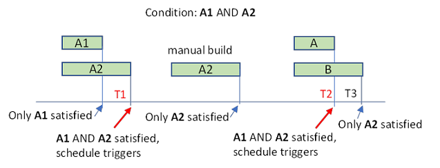
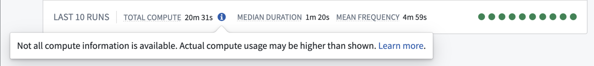

<!-- source: https://palantir.com/docs/foundry/building-pipelines/schedule-troubleshooting/ · mirrored 2026-08-22 from Palantir Foundry docs -->

# Troubleshooting reference

This page describes common scheduling issues with steps to debug.

## Scheduled build issues

### Schedule metrics page

One of the best ways to begin troubleshooting a schedule issue is by looking at the [schedule metrics page](/docs/foundry/building-pipelines/view-modify-schedules/). The metrics page can tell you the source of your failure. Common failures include:

* The [scheduled builds are failing](#scheduled-builds-are-failing). You will see evidence of failed builds in the **Run History** tab. Selecting these builds will navigate to the Build Report in the [Builds application](/docs/foundry/data-integration/application-reference/#builds) for full logs.
* The [scheduled builds were ignored](#scheduled-builds-were-ignored). The **Run History** tab will show `Ignored` in the Status column for any builds that were triggered, but not built.
* The [schedule was not triggered](#schedule-was-not-triggered) at the expected time or cadence. For this case, the **Run History** tab may not show a build was triggered when you expected it to have.

Another useful tab is the **Versions** tab that shows past schedule versions and edits. If your schedule suddenly begins behaving differently than expected, check for any changes to the schedule version that align with this change, and consider reverting your schedule to a previously working state.

### Scheduled builds are failing

You can verify if a schedule was triggered at the expected time by checking the **Run History** tab on the [schedule metrics page](/docs/foundry/building-pipelines/view-modify-schedules/).

If the schedule was triggered, but the build subsequently failed, you can debug this build in the [Builds application](/docs/foundry/data-integration/application-reference/#builds) similar to any other build.

A schedule will also fail to build if the appropriate permissions are not set. The permissions of a schedule depends on the token mode the schedule is in. Learn more about [Project-scoped schedules](/docs/foundry/data-integration/schedules/#project-scope).

### Scheduled builds were ignored

You can verify if a schedule was triggered at the expected time by checking the **Run History** tab on the [schedule metrics page](/docs/foundry/building-pipelines/view-modify-schedules/). This information will usually give the reason that the schedule was ignored.

#### All datasets are up to date

A schedule run will be ignored if all the target datasets are up-to-date (i.e. if their inputs have not updated since the last build on that dataset). If this is the case, you will see this reason in the **Run History** tab. In the [schedule editor](/docs/foundry/building-pipelines/view-modify-schedules/), navigate to the schedules list. You will then have the option to color the Data Lineage graph by `Out-of-date`, which will give you an overview of which job specs are considered stale.

This behavior can be overridden in special circumstances using the **Force Build** option in [advanced settings](/docs/foundry/building-pipelines/create-schedule/#advanced-settings), though this is computationally wasteful outside these circumstances. If any of the target datasets build by Object Storage v1 (Phonograph) syncs, transforms with API calls, or Data Connection syncs, they may not show up as stale and may require the **Force Build** option to be enabled for the schedule to run.

### Schedule builds a subset of job specs

If the schedule only triggers a subset of job specs, you will see evidence of this in the **Run History** tab on the [schedule metrics page](/docs/foundry/building-pipelines/view-modify-schedules/).

One cause of this behavior is that only a subset of the job specs were stale. The schedule will only build the stale job specs, and those that are up-to-date will be ignored during the build. See [all datasets are up-to-date](#all-datasets-are-up-to-date) for more troubleshooting details. The case where the build is `Ignored` happens if all of these job specs are up to date.

Another cause could be that the job spec was not included in the job spec graph of the build. When a given schedule is selected in the [schedule editor](/docs/foundry/building-pipelines/create-schedule/), the job specs to be built are highlighted in the Data Lineage graph. The job spec selection depends on the [build type](/docs/foundry/building-pipelines/create-schedule/#build-type). If using a **Connecting build**, be sure to verify if a connecting job spec is present for schedules using the same datasets on multiple branches.

### Schedule was not triggered

You can verify if a schedule was triggered at the expected time by checking the **Run History** tab on the [schedule metrics page](/docs/foundry/building-pipelines/view-modify-schedules/). Some common debugging steps are:

* Check that the [schedule is not paused](/docs/foundry/building-pipelines/view-modify-schedules/#pause-a-schedule). Paused schedules will not trigger until they are unpaused.
* Check the [schedule trigger configuration](/docs/foundry/building-pipelines/triggers-reference/). If the schedule was previously triggered successfully, check the schedule history to see if there was a recent change to the trigger.
* If the schedule is using an `Event` trigger, verify that the expected event actually happened.
  * For example, if the build should be triggered when the input updates, check that the last build on the input ran successfully and transactions on this build were successfully committed in the [Dataset Preview history view](/docs/foundry/dataset-preview/overview/#history).
  * If the build should be triggered after multiple inputs update, check builds and timing on *all* inputs. For example, consider a schedule with input triggers A1 and A2, and "Wait until all these datasets update" is turned on. Say this schedule was previously ran at time T1. For this schedule to run again at time T2, A1 and A2 would need to both be updated in the time period between (T1, T2).   
       

### Schedule retries differ from configured

Not all types of failure are able to be retried. The number of retries when the schedule runs will be capped to a maximum configured by your administrator. Learn more about [advanced schedule settings](/docs/foundry/building-pipelines/create-schedule/#advanced-settings).

The retriable error codes are:

* `INTERNAL`
* `TIMEOUT`
* `CUSTOM_SERVER`
* `FAILED_PRECONDITION`

### Schedule is failing with JobSpecInputsTrashed or JobSpecOutputsTrashed, or Data Lineage warns that some datasets are trashed

This error means that the schedule contains or reads from a trashed resource. You can do one of the following to resolve:

* [Restore](/docs/foundry/compass/use-project-navigation-panel/#trash) the deleted dataset from trash.
* Exclude the deleted dataset from the schedule. If this dataset is used as an input to another downstream dataset in the schedule, you will also need to do one of the following:
  * Exclude the downstream dataset along with the trashed one.
  * Modify the logic of the downstream dataset so that it no longer takes the trashed dataset as input.

## Schedule editor issues

### Schedule permissions

To edit a schedule in [Project-scoped mode](/docs/foundry/data-integration/schedules/#project-scope), you must have `Editor` permissions on the target datasets, `Viewer` permissions on the trigger datasets, and `Editor` permissions on the Project to which the schedule is scoped. If you lost permissions for one dataset, remove this dataset from the schedule before you save your changes.

To edit, delete, or pause a schedule, you need to have `Editor` permissions on the target dataset and `Editor` permissions on the Project to which the schedule is scoped. To view a schedule, you need to have `Viewer` permissions on the target dataset.

### Schedule compute information is unavailable

A message stating "Not all compute information is available. Actual compute usage may be higher than shown." may appear when viewing a schedule for either of the following reasons:

* One or more scheduled builds are still in progress, and the total compute usage is not yet finalized.
* Information is missing about the resources used by at least one scheduled build.

When this message is displayed, no user action is required. The purpose of this message is to show that the total compute usage shown may be inaccurate at a given time.
