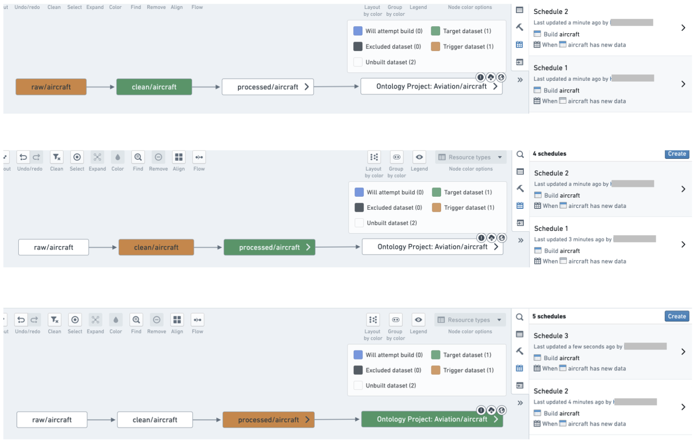
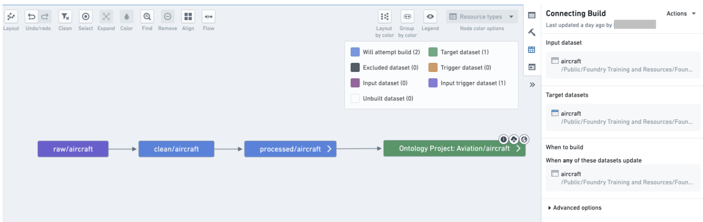
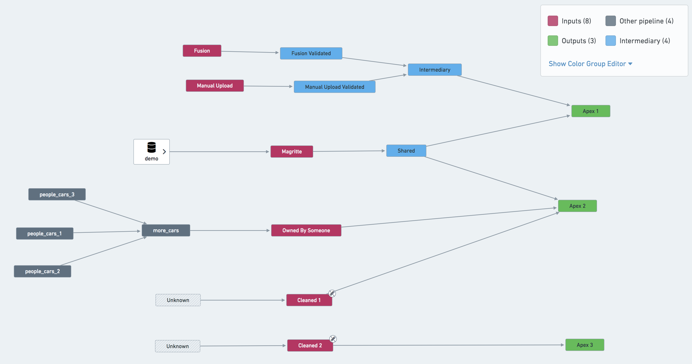

<!-- source: https://palantir.com/docs/foundry/building-pipelines/scheduling-best-practices/ · mirrored 2026-08-18 from Palantir Foundry docs -->

# Scheduling best practices

To ensure schedules of production pipelines can easily be managed, we have developed a set of scheduling guidelines. Use this page to manage the schedules for which you are responsible.

* Each dataset should only be built by one schedule.
  * You can see the number of schedules on each dataset in a Data Lineage graph by selecting **Schedule count** in the node color dropdown.
* You must have one **force build** schedule for each raw Data Connection sync.
  * There should be no force builds on other schedules. Force builds should only be used with Data Connection syncs.
* Try to avoid **full builds** and use **connecting builds** instead.
* Your schedule should only build datasets that you own; your schedule should not build datasets that you do not own.
* Trashed datasets should not be built by your schedule. Use the [Upgrade Assistant](/docs/foundry/upgrade-assistant/platform-changes/) to investigate and remedy your schedules that contain trashed resources.
* Add retries to your schedule (we recommend three retries with an interval between one and three minutes).
* Avoid having multiple schedules on each step of the pipeline; rather, combine datasets into logical schedules.

## Examples

A pipeline with unnecessary schedules that should be combined into one schedule:

Combine datasets into a logical schedule using a connecting build:

Use the guidance below to set up an effective system of schedules for your pipelines.

## Best practices

### One schedule per pipeline

In most cases, you should only have one schedule per pipeline. In fact, each dataset in your pipeline should only have one scheduled build associated with it. Having a dataset built by two different schedules can lead to queuing and slow down both schedules. Keep your set of schedules simple and uncluttered to clarify the responsibilities of each schedule and make debugging easier if a build fails on a given dataset. It may also help with pipeline maintenance; you only have one place to check or modify when you want to configure the pipeline.

An exception could be made for pipelines that run in multiple sequential steps; some of these examples are described below:

1. If a pipeline has multiple terminal nodes, you may consider separate schedules for each node. In the example pipeline shown below, the most natural approach is to set up three schedules: defined on `Apex 1`, `Apex 2` and `Apex 3`. However, it may also be beneficial to create a schedule on `Shared` and treat this dataset as an input to other pipelines.
2. If your pipeline makes use of validation tables, you may need separate schedules for them.
3. Refer to [stability recommendations](/docs/foundry/maintaining-pipelines/stability-recommendations/) for more information on how to effectively handle complex pipelines like these.

### Project-scoped schedules

All schedules should be Project-scoped when possible so that a schedule's ability to run successfully does not depend on the permissions of a single user (the schedule owner). Otherwise, the schedule owner's permissions could change and prevent the schedule's datasets from building. This is particularly important because ownership of the schedule could change after a schedule edit, since the last user to modify a schedule becomes the schedule's owner.

There are some instances where it is not possible to Project scope schedules:

* Transforms where permissions are severed
* Contour jobs
* Fusion syncs

### One owner per schedule for user-scoped schedules

For schedules that cannot be Project-scoped, it is preferable that a single user owns all schedules on a given pipeline. This user is often a “service user” (a special user account not tied to a single person). Alternatively, the single owner could be a team lead with responsibility for all modifications to schedules in the Project.

Having a single user owning the schedules on a pipeline reduces complexity and protects a schedule from being adversely affected by changes in user permissions or team composition.

As mentioned above, it is important to note that the last user to modify a schedule becomes the schedule's owner. If multiple user profiles are managing a schedule and access rights across your team are not uniform, you may end up with permission errors that are difficult to trace if you do not account for ownership changes.

:::callout{theme="neutral"}
In addition to helping with permissions consistency, a single owner also makes it easier to track relevant builds in the Builds application, where you can filter all builds on “Started by”.
:::

### Using retries

Use retries when configuring your schedule. Retries are part of a job; if a job fails with an exception that can be retried, the build orchestration layer will relaunch a new attempt of the same job without failing the build.

We recommend configuring schedules for at least three retries, with at least one minute between retries. This allows the platform to automatically intercept jobs that would be failing and re-trigger them within the same build. The additional gap of one minute gives the platform a chance to recover from transient problems that caused the job to fail the first time.

There are some cases where you might not want to enable retries on your job. For example, pipelines with very tight Service Level Agreements (SLAs) where you want to be alerted as soon as there’s a failure, or transforms that have a non-idempotent side effect. However, note that even if you do not enable retries in your schedule configuration, jobs may still be retried as part of [adjudication](/docs/foundry/transforms-common/transforms-versions/#runtime-versioning).

### No multi-dataset force builds

Schedules can enable a “force-build” option, where all datasets in the schedule will be built, regardless of their staleness. This option is very useful for Data Connection syncs, since those are always up to date in the platform and thus will never build as part of a scheduled build unless force build is used. However, we discourage having a multi-dataset schedule with the force build option for any derived datasets, since this can be costly in terms of resource usage. Instead, split your schedules so that datasets that must be force-built are in their own schedules.

### What to include and what to exclude in a schedule

Be explicit about what is included in your schedule. Explicitly ignore datasets that sit outside your pipeline. Build resolution can be complex, but being explicit about what is included provides more transparency than being implicit.

* In our example pipeline screenshot below, `Owned By Someone` should be ignored from a schedule defined on `Apex 2`. The same applies for `Cleaned 1` and `Cleaned 2` — triggering a job on either of them would immediately cause the build to fail due to lack of permissions.

In addition, schedules should not depend on or try to build datasets that are:

* **Currently in the trash:** To remediate existing schedules with trashed resources, use the [Upgrade Assistant](/docs/foundry/upgrade-assistant/platform-changes/) to investigate the schedules you own to either un-trash or exclude the resource(s) in question from the schedule.
* **Produced from Contour:** For schedules to be considered “production ready”, we need to be able to review changes to the pipeline and revert to a previous version if something goes wrong. Contour does not support such workflows, and we discourage users from using them in production pipelines.
* **Produced from Code Workbook and Code Workspaces:** This is less of a strict rule than Contour output datasets, however we discourage the use of Code Workbook and Code Workspaces in production pipelines. Code Workbook and Code Workspaces are excellent for iterating on a solution but are less robust in regard to change management and reverting than Code Repositories. [Learn more about differences between Code Workbook, Code Workspaces, and Code Repositories.](/docs/foundry/code-workbook/code-products-comparison/)

All outputs of the pipeline should be tagged as “targets” in your schedule. Schedules can have one or multiple targets, which are the datasets on which the schedule is installed. Schedules can also have one or multiple outputs, which are the final datasets built by the schedule and not used elsewhere in the build. In most cases, target datasets and output datasets will be the same, but in some cases (especially with multi-output builds), a build may have different target and output datasets. As a general rule, all outputs of a pipeline should be defined as targets.

### Fail fast

Configure the build to fail immediately once a job fails by ticking the **Abort build on failure** checkbox in **Advanced options**). Failing fast will provide you with signal sooner.

### Name schedules

All schedules should have a descriptive name. Schedule names can be very helpful as your pipeline grows in complexity and users over time.

Descriptive schedule names provide information about a schedule's intent to those who interact with a schedule; for instance, those with responsibility for fixing problems involving your schedule in the future.

Naming schedules is particularly important if you have multiple ingestion streams, if you expect other users to fork off any paths in your pipeline, or if you anticipate maintenance responsibility to change over time.
