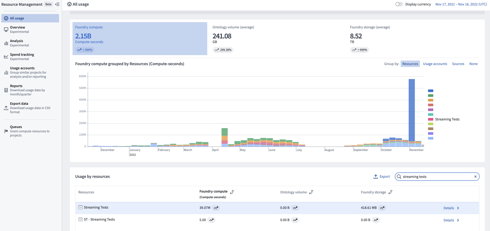

<!-- source: https://palantir.com/docs/foundry/building-pipelines/streaming-compute-usage/ · mirrored 2026-08-18 from Palantir Foundry docs -->

# Compute usage with Foundry Streaming

Foundry Streaming is a high throughput, low latency form of compute that consistently listens for new incoming messages, applies user-defined logic, and pushes them to the next stage in the pipeline.

Foundry streams rely on a distributed parallel worker-based architecture, with parallel workers each having their own resources that are dedicated to their particular streaming job. Stream resource requirements scale with the max throughput of the active stream along with the total number of messages it processes.

## How compute is measured

Streaming compute usage is divided into two types:

* **Live processing compute:** The process of running user-defined transforms on live data. This source type is called “streaming”.

* **Archiving compute:** The process of moving data from the streaming layer to Foundry’s storage layer. Archive compute is a batch process and will appear as a “transform”.

:::callout{theme="neutral"}
Note that when paying for Foundry usage, the default `streaming_usage_rate` is `0.5`. This is the rate at which user-defined transforms run on live data. If you have an enterprise contract with Palantir, contact your Palantir representative before proceeding with compute usage calculations.
:::

The live processing compute of a stream in Foundry is measured by the number of compute-seconds it uses over its full duration in wall-clock time. Therefore, using more computational resources (e.g. vCPUs, memory, parallelization) in a streaming job increases the cost of the job. The longer a job runs, the more compute it uses. Since streams are designed to run persistently to continuously process data, a stream will continue using compute until it is ended by the user.

Streams are statically allocated; they will use a constant number of compute-seconds per wall-clock second while the stream is running. Streams are also often tuned to meet peak demand, meaning compute usage from the stream is unaffected by variable data volume. Streams use compute-seconds even if no data is moving through the stream.

Stream usage can be calculated as the sum of total seconds used by a single job manager and many task managers. Note that each parallel worker will have identical computational resources.

Job manager compute seconds are calculated in the following way:

* `max(num_vCPU, gib_ram / 7.5) * streaming_usage_rate * stream_duration_seconds`

Task manager compute seconds are calculated in the following way:

* `max(num_vCPU, gib_ram / 7.5) * streaming_usage_rate * stream_duration_seconds * (num_parallel_task_managers + 1)`
* `compute_seconds = job_manager compute_seconds + task_manager_compute_seconds`

Learn more about values used to calculate compute usage, including [memory-to-core ratio](/docs/foundry/resource-management/usage-types/#memory-to-core-ratio).

Archiving jobs are batch processing jobs that run alongside each stream. Archive jobs periodically read from the hot storage layer of the stream and move the data into Foundry storage for robust persistence and historical tracking. As archive jobs do not have the same low latency requirements as the streams themselves, they run on a schedule and only use compute when there is data to be archived.

Archiving job usage is based on a single Spark driver and can be calculated with the following formula:

* `compute_seconds = max(num_vcpu, gib_ram / 7.5) * num_seconds`
  * Archive jobs are small. The archiver always runs with a minimal profile of 1 vCPU and 4 GiB of RAM.

## Investigate Foundry Streaming usage

To view the total usage of streams, first navigate to the [Resource Management application](/docs/foundry/resource-management/overview/). Then, find your stream under the **Usage by resource** section and select **Details** to view usage by individual dataset.

The cost of a stream is attributed to the checkpoint dataset that the stream produces. This dataset serves as the permanent usage record of the processing of that stream. The streaming usage on this dataset falls under the “streaming” category in the Resource Management application.

Each time a stream is ran it will run continuously until stopped by a user. When a user stops a stream, that run will appear under the **History** tab of the dataset. You can investigate the profile of each individual stream to understand the performance and compute usage of historical stream runs.

Each time a historical archive is ran, it publishes its compute metrics in the [Builds application](/docs/foundry/data-integration/application-reference/#builds). Use the Builds application to investigate the resource allocation for each archive that was run.

## Understand drivers of usage

The main driver of usage for a stream is the computational resource footprint of the stream itself. In this case, the compute resources include the number of vCPUs per task manager, the GiB of RAM per partition, and the number of partitions in the stream. These resources are set in the profile of the stream and persist for the duration of the stream.

* Stream resources should be allocated to meet the peak throughput of the incoming stream. If the volume of incoming messages is too high for the computational resources to effectively service, the stream will fall behind.
* To change the resources used by a stream, you must change the resource profile and restart the stream.
* Archive job compute usage scales with the amount of data coming through the stream. Archive jobs read all data since the last archive. If no data has been streamed, then the archive jobs will use zero compute. Archive jobs run every 10 minutes while a stream is active.

## Manage usage with Foundry Streaming

It is important to understand when to choose streaming and when to choose batch for specific workflows. Streaming is designed for workflows that require second-level latency and constant compute. If data can run every few minutes, consider a small micro-batch job which can push the same amount of data as the stream but with a reduced compute-second cost and a significantly higher data latency.

* The size of a stream significantly affects the total compute-seconds used per run. Streams should be configured with enough resources to handle the maximum simultaneous load expected for that stream.
* It is important to choose the size of the stream to ensure that peak load can be served while ensuring it is not over-provisioned. This involves carefully configuring the size of each job (vCPUs and memory) and the total number of task managers for the stream.
* Streams will run until they are stopped. Carefully monitor sources of streaming compute to ensure that streams are only running when needed.

## Calculating usage

The following example shows how compute usage is calculated for a hypothetical stream that runs for 10 minutes. Note that most production streams run continuously.

**Stream profile**

* Job manager vCPUs: 0.5
* Job manager gib\_ram: 1
* Task manager vCPUs: 0.5
* Task manager gib\_ram: 2g
* Parallelism: 2
* gib\_ram: 4
* Duration of stream: 10 minutes (600 seconds)
* streaming\_usage\_rate: 0.5

**Calculation**

* Job manager compute seconds = max(vCPUs, gib\_ram / 7.5 gib\_ram) \* streaming\_usage\_rate \* 600s = max(0.5, 0.133) \* 0.5 \* 600s = 150 compute-seconds
  * Alternatively, 0.25 compute-seconds per second or 900 compute-seconds per hour
* Task manager compute seconds = max(vCPUs, gib\_ram / 7.5 gib\_ram) \* (parallelism + 1) \* streaming\_usage\_rate \* 600s = max(0.5, 0.267) \* 3 \* 0.5 \* 600s = 450 compute-seconds
  * Alternatively, 0.75 compute-seconds per second or 2700 compute-seconds per hour

The total compute usage for this stream running for 10 minutes is 150 job manager compute-seconds and 450 task manager compute-seconds. Learn more about the factors that impact [compute usage in Foundry](/docs/foundry/resource-management/usage-types/).
