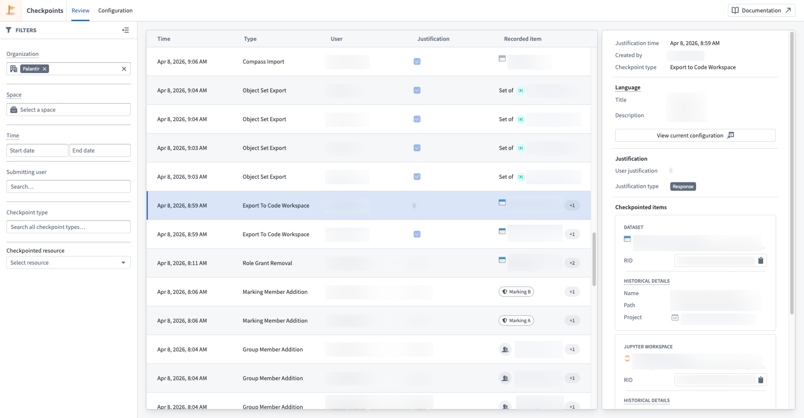
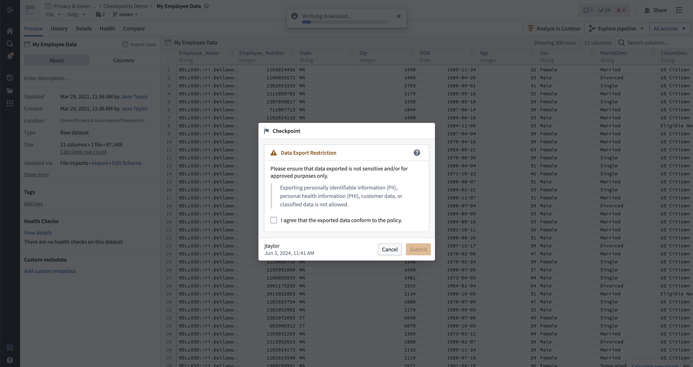

<!-- source: https://palantir.com/docs/foundry/checkpoints/ · mirrored 2026-08-14 from Palantir Foundry docs -->

# Checkpoints

Checkpoints is a [data governance](/docs/foundry/security/data-protection-and-governance/) tool that supports purpose justification and auditability. Checkpoints allows you to interrupt potentially sensitive user interactions with prompts requesting justification for the activity. These justifications can then be reviewed in the platform to ensure adherence to data protection, governance, and compliance policies.

The above screenshot uses notional data.

## What is a checkpoint?

A **checkpoint** is a prompt that asks a user to provide a justification for an interaction in Foundry. The user’s justification is recorded and made available for later review to administrator users in the Checkpoints application. Users can also always review historical justifications for their own interactions in the Checkpoints application.

The above screenshot uses notional data.

The prompt in each checkpoint and the type of justification required is set in a **checkpoint configuration**. Once submitted, each checkpoint produces a **checkpoint record** that contains the contextual data associated with an interaction governed by a checkpoint. This includes the timestamp of the interaction, the user who performed the interaction, the justification provided in the checkpoint, the checkpoint type, and any data (resources, objects, and Markings, for example) associated with the interaction.

## Key features

* **Customize prompts and justifications:** Data protection or compliance policies can vary widely based on organizational needs and use cases. Checkpoints allows for granular configurability to determine who gets shown a checkpoint, for what kinds of interactions, what language the checkpoint contains, and how the user should justify their interaction.
* **Review justifications in real-time:** Data protection and compliance teams or administrators can review checkpoints in Foundry in real-time as users justify their interactions.
* **Deep platform integration for key Foundry interactions:** Checkpoints is integrated into 60+ different interactions in Foundry, which allows for seamless requests for justification at a variety of points in user workflows. This happens both when the interactions are initiated synchronously by a user, or asynchronously via a request in [Approvals](/docs/foundry/approvals/overview/). Checkpoints can be used to remind users of organizational policies, suggest more privacy-protective workflows, or better understand why users are making certain interactions for improved oversight.

## Access the Checkpoints application

The Checkpoints application allows users to configure checkpoints and review checkpoint records. All users can use the Checkpoints application to review checkpoint records that they have submitted. The Checkpoints application can be accessed in the navigation panel in the **Data Governance** category.

Users can also configure checkpoints or review checkpoint records for entire [Organizations](/docs/foundry/checkpoints/configure-checkpoints/#organization-scope) or [spaces](/docs/foundry/checkpoints/configure-checkpoints/#space-scope).
