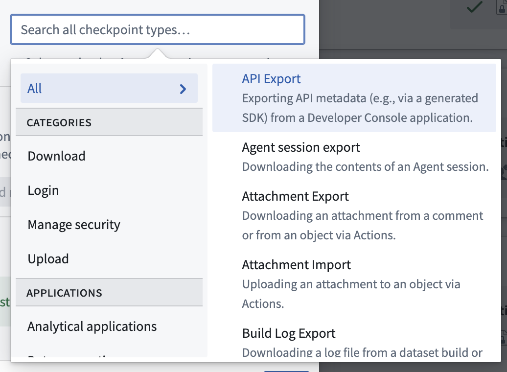
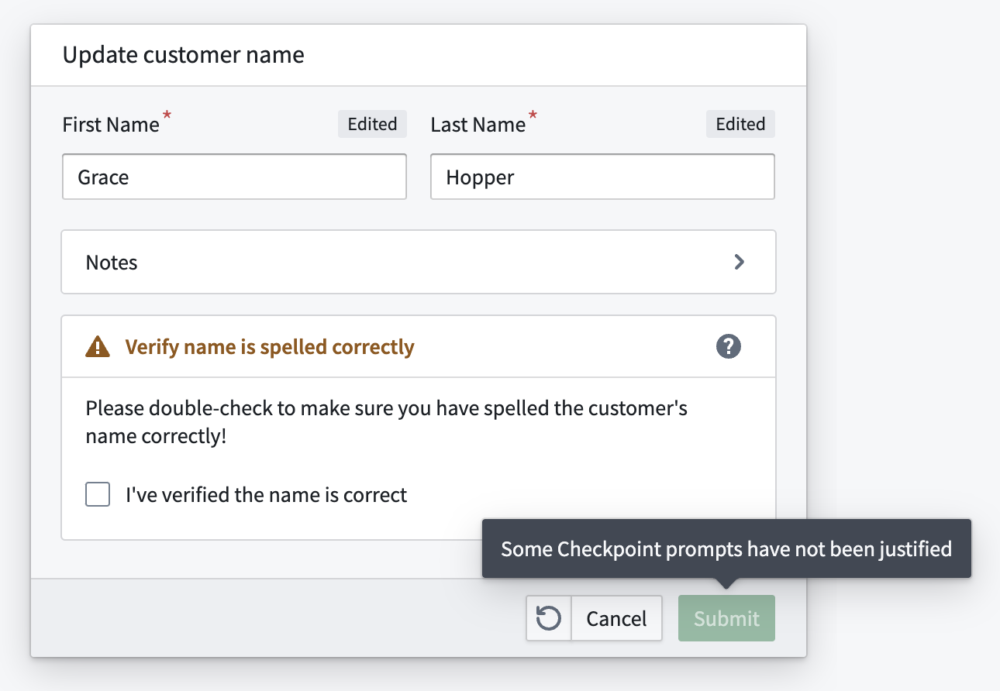

<!-- source: https://palantir.com/docs/foundry/checkpoints/checkpoint-types/ · mirrored 2026-08-14 from Palantir Foundry docs -->

# Checkpoint types

A **checkpoint type** describes a specific type of interaction a user can have with the platform (for example, uploading a dataset or removing a user's access to a Marking).

The checkpoint type selector supports filtering checkpoint types based on their functionality category or related application. Users must select at least one checkpoint type when [configuring checkpoint configurations](/docs/foundry/checkpoints/configure-checkpoints/#configure-checkpoint-conditions); they can also filter [checkpoint configurations](/docs/foundry/checkpoints/core-concepts/#checkpoint-configurations) and [checkpoint records](/docs/foundry/checkpoints/core-concepts/#checkpoint-records) by checkpoint type.

## Available checkpoint types

:::callout{theme="neutral"}
Some checkpoint types are not available on all Foundry instances and are only available if specific applications are enabled in Foundry.
:::

### Download

| Checkpoint type | Description | Related application |
|---|---|---|
| AIP Analyst export | Exporting an [AIP Analyst session](/docs/foundry/aip-analyst/using-aip-analyst/#export-to-pdf). | AIP Analyst |
| AIP Analyst opened | Accessing [AIP Analyst](/docs/foundry/aip-analyst/overview/). | AIP Analyst |
| AIP Analyst widget opened | Accessing the [AIP Analyst widget](/docs/foundry/aip-analyst/workshop-widget/). | AIP Analyst |
| AIP Analyst save analysis | Saving an [AIP Analyst analysis](/docs/foundry/aip-analyst/analysis-resources/). | AIP Analyst |
| API export | Downloading API metadata from a [Developer Console application](/docs/foundry/developer-console/create-application/). | Developer Console |
| API usage metrics export | Downloading API [usage metrics](/docs/foundry/developer-console/application-metrics/) for a Developer Console application. | Developer Console |
| Attachment export | Downloading an attachment from a comment or from an object through an [action](/docs/foundry/action-types/overview/). | Actions |
| Build log export | Downloading a log file from a [dataset build](/docs/foundry/data-integration/application-reference/#builds) or from a FoundryML live deployment. | Builds |
| Chatbot session export | Downloading the contents of a [chatbot](/docs/foundry/chatbot-studio/overview/) session. | Chatbot Studio |
| Code Repository log export | Downloading a log file from [Code Repositories](/docs/foundry/code-repositories/overview/). | Code Repositories |
| Code Workspace log export | Downloading a log file from [Code Workspaces](/docs/foundry/code-workspaces/overview/). | Code Workspaces |
| Compass export | Downloading a file or dataset from Foundry. This checkpoint type includes the download of all datasets, files, and images in [Compass](/docs/foundry/compass/overview/). | Compass |
| Contour dashboard export | Exporting a [Contour](/docs/foundry/contour/overview/) dashboard to PDF. | Contour |
| Contour export | Downloading data from Contour, which will trigger this checkpoint. Exporting data from the Contour pivot table board is not considered a *Contour export* but is instead classified as a *frontend export*. | Contour |
| Custom Widgets enable allow downloads | Enabling the iframe sandbox `allow-downloads` attribute value for a [custom widget in Workshop](/docs/foundry/custom-widgets/overview/). | Workshop |
| Export from Flow Capture | Exporting a [Flow Capture](/docs/foundry/flow-capture/overview/) recording to a `.zip` file. | Flow Capture |
| Export to Code Workspace | Adding data from Foundry to a code workspace. The **Import dataset** button in Code Workspaces will trigger this checkpoint. | Code Workspaces |
| Frontend export | Downloading data rendered in the Foundry frontend, such as downloads from the pivot table board in Contour, [Code Workbook templates](/docs/foundry/code-workbook/templates-overview/), and Foundry Templates. Contact Palantir Support for a complete list of interactions associated with this checkpoint. | Platform |
| Function-backed export | Downloading data from a Workshop module with a [function-backed export](/docs/foundry/workshop/widgets-button-group/#function-backed-export). | Workshop |
| Gaia file export | Exporting data to a file in Gaia. This checkpoint is only enabled if Gaia is available on your Foundry and Gotham enrollment. | Gaia |
| Hivemind export | Exporting data from Hivemind. This checkpoint is only available if Hivemind is enabled. | Hivemind |
| Manage Code Workspace dashboard downloads | Enabling or disabling downloads from Code Workspace dashboards. | Code Workspaces |
| Media set export | Exporting a media item from a [media set](/docs/foundry/media-sets-advanced-formats/media-overview/). | Media Sets |
| Model export | Downloading model weights. | Modeling Objectives |
| Notepad export | Downloading a [Notepad document](/docs/foundry/notepad/overview/). | Notepad |
| Object set export | Downloading an object or object set, or copying it as a string in [Object Explorer](/docs/foundry/object-explorer/overview/) or [Workshop](/docs/foundry/workshop/overview/). | Object Explorer, Workshop |
| Peer Manager job update payload export | Downloading a peering job's payload in [Peer Manager](/docs/foundry/peer-manager/overview/) as an XML file for ingestion by a cross-domain solution. | Peer Manager |
| Peer Manager object type schema export | Downloading object type schemas in Peer Manager as XSD files for use with a cross-domain solution. | Peer Manager |
| Quiver export | Downloading an object or object set as a CSV in [Quiver](/docs/foundry/quiver/overview/) using the **Download as CSV** action. | Quiver |
| Report export | Downloading a report as a PDF/PPT or copying the content of a report as a Markdown file to the clipboard. | Reports |
| Slate export | Downloading data from a [Slate](/docs/foundry/slate/overview/) application. | Slate |
| Sync Matrix file export | Exporting data from a Kairos sync matrix to a file. This checkpoint is only enabled if Kairos is available on your Foundry and Gotham enrollment. | Kairos |
| Upgrade Assistant summary export | Downloading a summary of an [Upgrade Assistant platform change](/docs/foundry/upgrade-assistant/platform-changes/). | Upgrade Assistant |
| User intake submission export | Downloading a file from a [user intake form](/docs/foundry/authentication/intake-forms/) submission. | User intake forms created in Control Panel |

### Upload

| Checkpoint type | Description | Related application |
|---|---|---|
| Attachment import | Uploading an attachment to an object using an [action](/docs/foundry/action-types/overview/). | Actions |
| Compass import | Uploading a file or dataset into the Foundry filesystem. This checkpoint type includes all frontend imports of [Compass](/docs/foundry/compass/overview/) resources and the upload of new data into a dataset through the frontend. | Compass |
| Gaia file import | Uploading a file to Gaia. This checkpoint is only enabled if Gaia is available on your Foundry and Gotham enrollment. | Gaia |
| Import from Code Workspace | Saving data to Foundry from a code workspace. The **Save to dataset** button in [Code Workspaces](/docs/foundry/code-workspaces/overview/) will trigger this checkpoint. | Code Workspaces |
| Media set import | Importing a file to a [media set](/docs/foundry/media-sets-advanced-formats/media-overview/). | Media Sets |
| Notepad media import | Importing media into a [Notepad document](/docs/foundry/notepad/overview/). | Notepad |
| Upload data to Flow Capture | Importing data into [Flow Capture](/docs/foundry/flow-capture/overview/). | Flow Capture |

### Manage security

| Checkpoint type | Description | Related application |
|---|---|---|
| Cipher decrypt | Decrypting data with [Cipher](/docs/foundry/cipher/overview/). This checkpoint is only available if Cipher is enabled. | Cipher |
| Cipher encrypt | Encrypting data with Cipher. This checkpoint is only available if Cipher is enabled. | Cipher |
| Custom Widgets enable camera | Enabling the iframe allow `camera` attribute value for a [custom widget in Workshop](/docs/foundry/custom-widgets/overview/). | Workshop |
| Custom Widgets enable microphone | Enabling the iframe allow `microphone` attribute value for a custom widget in Workshop. | Workshop |
| Group member addition | Adding a user or group as a member of a group. | Groups |
| Group member removal | Removing a user or group as a member of a group. | Groups |
| Group membership expiration update | Updating the expiry of a member of a group, including setting an initial expiry, updating the expiry, or removing it. | Groups |
| Marking member addition | Granting a user or group access to resources protected by a marking. | Markings |
| Marking member removal | Removing a user's or group's access to resources protected by a marking. | Markings |
| Notepad lock data | [Locking data](/docs/foundry/notepad/snapshot-widgets/) on a Notepad widget. | Notepad |
| Project marking authorization addition | Adding a marking to the list of allowed markings in project constraints. | Projects |
| Project marking authorization removal | Removing a marking from the list of allowed markings in project constraints. | Projects |
| Project reference addition | Adding a reference to a project. | Projects |
| Project reference removal | Removing a reference from a project. | Projects |
| Reset two-factor authentication method | Resetting a user's two-factor authentication method [via Platform Settings](/docs/foundry/authentication/multi-factor-auth/). | Platform Settings |
| Role grant addition | Granting a role to a user or group on a project. | Projects |
| Role grant removal | Removing a role from a user or group on a project. | Projects |
| Rotate OAuth client secret | Rotating an [OAuth client secret](/docs/foundry/platform-security-third-party/danger-zone-actions/#rotate-a-client-secret). | Third-party applications |
| Scoped session select | Selecting a scoped session in Gotham. This checkpoint is only available if your enrollment contains Foundry and Gotham with scoped sessions enabled in Gotham. | Gotham |
| Token create | Creating a Multipass token. | Tokens |
| Update group membership expiration config | Updating the configuration of membership expiration of a group. | Groups |

### Login

| Checkpoint type | Description | Related application |
|---|---|---|
| Login | Logging in to Foundry. Login checkpoints also require the checkpoints login asynchronous user manager (AUM) to be enabled in [Control Panel](/docs/foundry/administration/control-panel/). | Platform |

### Other

| Checkpoint type | Description | Related application |
|---|---|---|
| AIP Analyst application load | Opening [AIP Analyst](/docs/foundry/aip-analyst/overview/). | AIP Analyst |
| AIP Analyst save analysis | Saving an AIP Analyst analysis resource. | AIP Analyst |
| Code Repository build | Building in [Code Repositories](/docs/foundry/code-repositories/overview/). | Code Repositories |
| Code Repository merge pull request | Merging a pull request in Code Repositories. | Code Repositories |
| Code Repository modify approval policy | Creating or updating an approval policy in Code Repositories. | Code Repositories |
| Code Workbook build | Building in a [Code Workbook](/docs/foundry/code-workbook/overview/). | Code Workbook |
| Contour create | Creating or duplicating a [Contour](/docs/foundry/contour/overview/) analysis. Creating an analysis from the **New** dropdown menu, the **Analyze** button on a dataset, or by exporting objects to Contour will trigger this checkpoint. Duplicating an analysis from the **Open as duplicate analysis** action on a Contour analysis or through the **File** menu will also trigger this checkpoint. | Contour |
| Create issue | Creating a new [Issue](/docs/foundry/getting-help/issues/). | Issues |
| Data Connection sync bulk create | Bulk-creating JDBC [Data Connection](/docs/foundry/data-connection/overview/) syncs. | Data Connection |
| Data Connection sync create | Creating a new Data Connection sync. | Data Connection |
| Data Connection sync edit | Editing a Data Connection sync. | Data Connection |
| Deploy pipeline | Deploying a new pipeline in [Pipeline Builder](/docs/foundry/pipeline-builder/overview/). | Pipeline Builder |
| Insight load | Loading the [Insight](/docs/foundry/insight/overview/) application. | Insight |
| Object Explorer search | Performing a search in [Object Explorer](/docs/foundry/object-explorer/overview/). | Object Explorer |
| Pipeline Builder archive branches | Archiving branches in Pipeline Builder. | Pipeline Builder |
| Pipeline Builder merge proposal | Merging proposals in Pipeline Builder. | Pipeline Builder |
| Pipeline Builder modify approval policy | Modifying approval policies in Pipeline Builder. | Pipeline Builder |
| Pipeline Builder modify fallback branches | Modifying fallback branches in Pipeline Builder. | Pipeline Builder |
| Record Flow Capture | Starting a [Flow Capture](/docs/foundry/flow-capture/overview/) recording. | Flow Capture |
| Retention policy application | Changing which [retention policy](/docs/foundry/retention/overview/) is applied to a dataset or transaction. | Retention Policies |
| Run build | Running a new [build](/docs/foundry/data-integration/application-reference/#builds). | Builds |
| Schedule create | Creating a [schedule](/docs/foundry/data-integration/schedules/). | Schedules |
| Schedule delete | Deleting a schedule. | Schedules |
| Schedule modify | Modifying a schedule. | Schedules |
| Schedule run | Running a schedule. | Schedules |
| Start walkthrough | Starting a [walkthrough](/docs/foundry/walkthroughs/overview/). | Walkthroughs |
| Submit action | Submitting [actions](/docs/foundry/action-types/overview/) in the platform. Only applies to actions submitted directly by users in the user interface, such as in [Workshop modules](/docs/foundry/workshop/actions-use/), [object views](/docs/foundry/action-types/use-actions/#object-views), [Object Explorer](/docs/foundry/action-types/use-actions/#object-explorer), and [Vertex](/docs/foundry/vertex/overview/) graphs. This does *not* apply to actions that are submitted asynchronously, such as via [Automate](/docs/foundry/automate/overview/) or by means other than the user interface, such as via [API call](/docs/foundry/api/ontologies-v2-resources/actions/apply-action) or the [Ontology SDK](/docs/foundry/ontology-sdk/overview/). | Actions |
| Virtual table automatic registration | Automatically registering a [virtual table](/docs/foundry/data-integration/virtual-tables/). | Virtual tables |
| Virtual table manual registration | Manually registering a virtual table. | Virtual tables |

## Legacy checkpoint types

Checkpoints can no longer be configured for these legacy checkpoint types, but historical checkpoint records of these types are still reviewable.

| Checkpoint type | Description | Related application |
|---|---|---|
| Data Connection source share | Sharing a [Data Connection](/docs/foundry/data-connection/overview/) source or agent. | Data Connection |
| Hubble export | Downloading an object or object set using the **Export as Excel** action in [Object Explorer](/docs/foundry/object-explorer/overview/) or [Workshop](/docs/foundry/workshop/overview/). This checkpoint type has been replaced by **Object set export**, which supports a superset of the functionality of **Hubble export**. All existing **Hubble export** checkpoint configurations have been automatically migrated to **Object set export** checkpoint configurations. | Object Explorer, Workshop |
| Package static dataset | Packaging a static dataset in a [Marketplace](/docs/foundry/marketplace/overview/) product. This checkpoint type has been removed in favor of new default warnings in [DevOps](/docs/foundry/foundry-devops/overview/). Formerly known as **Package product**. | Marketplace |

## Rendering for the Submit action checkpoint type

If an Action form is shown, **Submit action** checkpoint prompts will be rendered as required fields inside the form. If an Action form would not normally be shown for the Action (for example, if the Action is submitted via an [inline edit](/docs/foundry/action-types/inline-edits/)), the **Submit action** prompt will be shown in a separate dialog.

