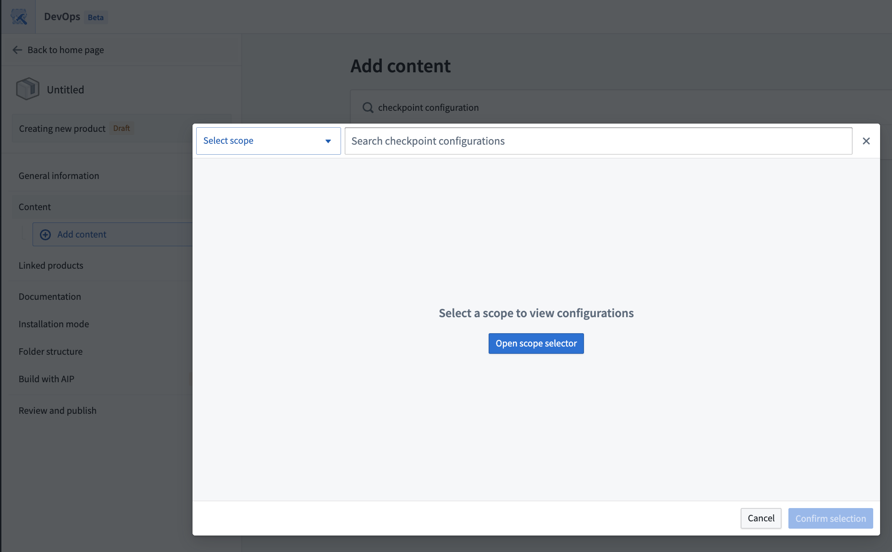
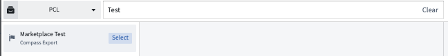

<!-- source: https://palantir.com/docs/foundry/checkpoints/checkpoints-marketplace/ · mirrored 2026-08-14 from Palantir Foundry docs -->

# Add checkpoint configurations to a Marketplace product

Use [Foundry DevOps](/docs/foundry/devops/overview/) to include your checkpoint configurations in [Marketplace products](/docs/foundry/devops/core-concepts/#product) for other users to install and reuse. [Learn how to create a Marketplace product](/docs/foundry/foundry-devops/create-products/) to get started.

## Supported features

Existing checkpoint configurations can generally be included in Marketplace products, but a few limitations apply:

* When a Marketplace product is installed, any checkpoint configurations created by the installation will have a space scope based on the installation location. Checkpoint configurations will also have a location matcher that limits the checkpoint to an input of the installation, another resource included in the installation, or the installation project. Therefore, only checkpoint configurations with checkpoint types that support space scopes and location matchers can be included in a Marketplace product.
* There are various condition matchers that are not enabled for Marketplace products. You can learn more about these conditions in the [checkpoint condition documentation](/docs/foundry/checkpoints/configure-checkpoints/#additional-conditions).
  * Checkpoint configurations that include a condition explicitly limiting checkpoint types to be attributed to a specific user cannot be included in a Marketplace product. This includes conditions where `User submitting checkpoint` was selected and only one user was specified, instead of a group.
  * Checkpoint configurations that include Marking matchers cannot be included in a Marketplace product.
  * Checkpoint configurations that include location matchers that specify spaces cannot be included in a Marketplace product.
* Only checkpoint configurations with a single checkpoint type can be included in Marketplace products. Checkpoint configurations with multiple checkpoint types cannot yet be included in Marketplace products.

## Package checkpoint configurations

1. Navigate to the Marketplace application.
2. Select **DevOps** at the bottom of the page, then **Select store** on the DevOps page. In the **Select your store** dialog choose your store.
   * If you have already chosen a store, you can select the store name in the upper right to open the **Select a store** dialog to choose a different store if needed.
3. To add a checkpoint type to a product, you can create a new product or add a checkpoint type to an existing product.
   * To create a new product, select **+ New product**. Follow the [product creation tutorial](/docs/foundry/foundry-devops/create-products/) for additional guidance.
   * To add checkpoint configurations to an existing product, select the product and then select **Start new version** on the top right.
4. Use the [add outputs](/docs/foundry/foundry-devops/create-products/#add-outputs) feature and select the **Checkpoint configuration** option.
5. Select the appropriate scope to view the available checkpoint configurations.

6. You can choose between existing checkpoint configurations established under the namespace or Organization scope.
   * Select the checkpoint configurations of interest using the **Select** button on the right of listed configurations or on the top right of the configuration details panel.

7. When you have selected all relevant checkpoint configurations, confirm your selection in the bottom right.
8. When you finish editing the Marketplace product, open the **Review and publish** tab and select **Publish**.
