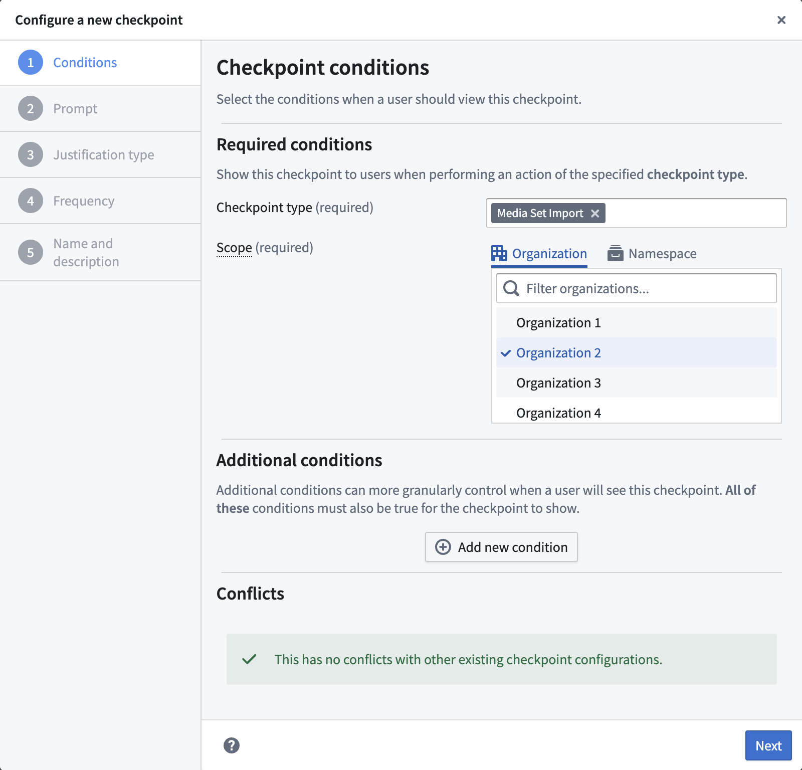
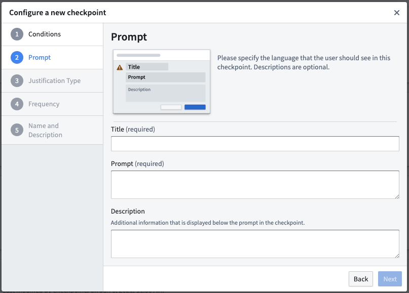
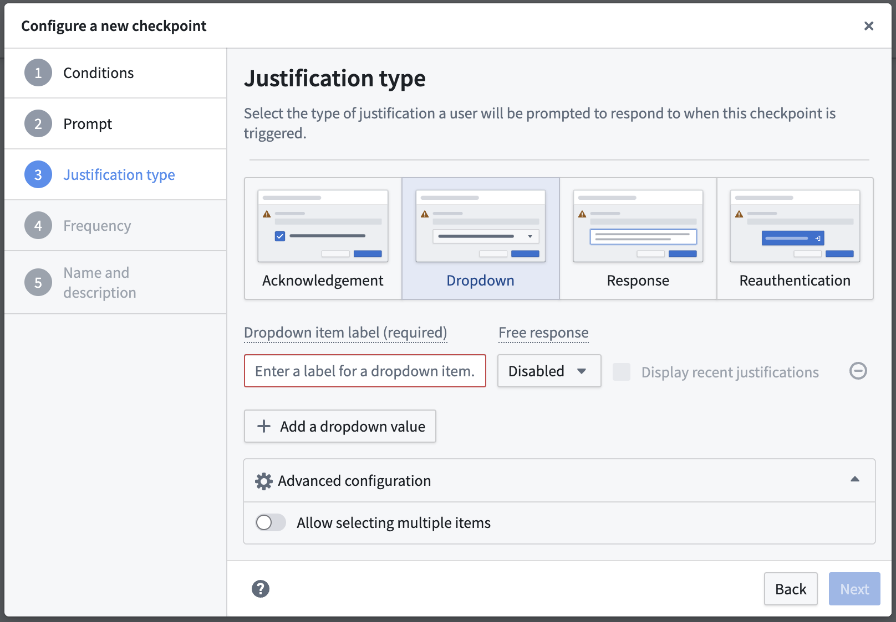
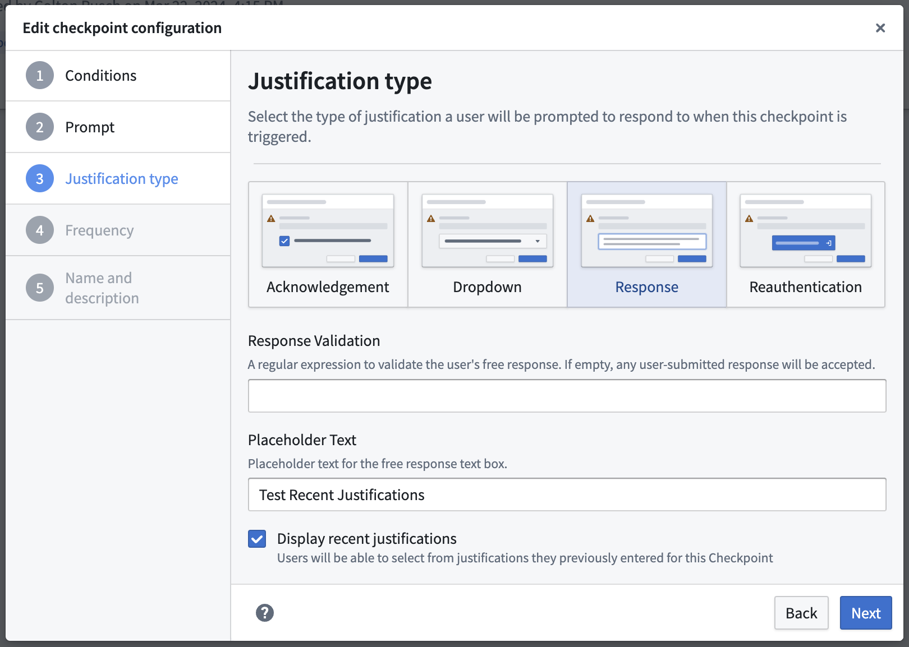
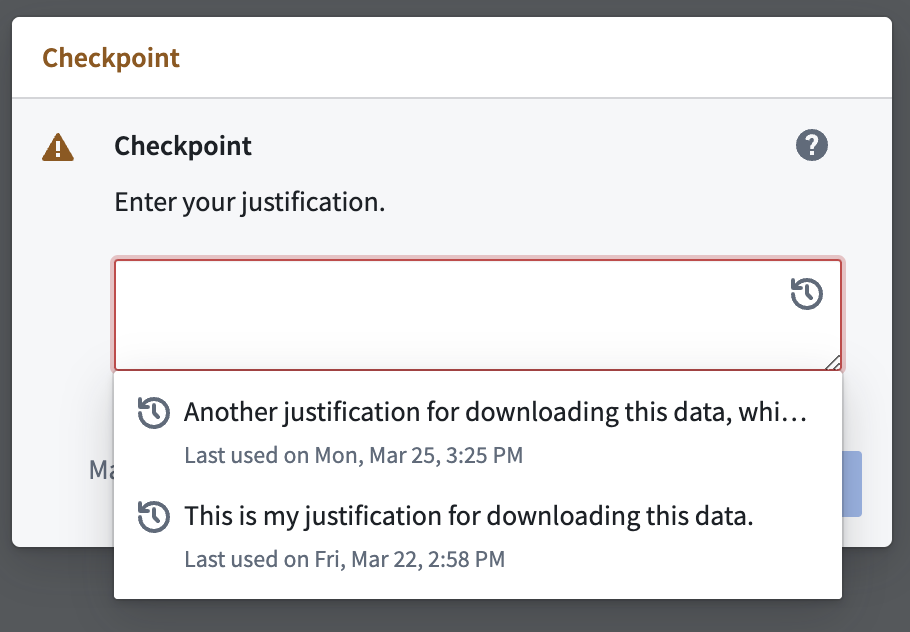
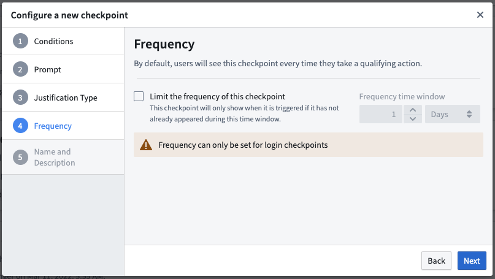
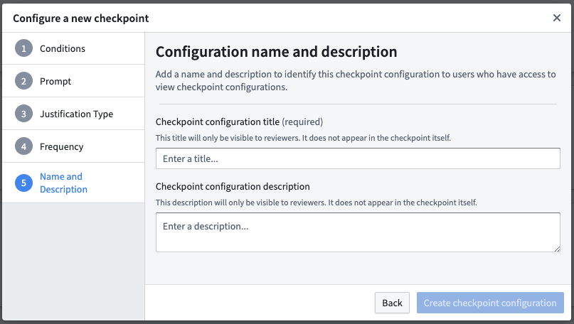

<!-- source: https://palantir.com/docs/foundry/checkpoints/configure-checkpoints/ · mirrored 2026-08-14 from Palantir Foundry docs -->

# Configure checkpoints

Checkpoints allow Foundry administrators to request justifications for a variety of Foundry interactions by creating checkpoint configurations. These instructions will walk you through the following steps of creating a new checkpoint configuration.

## Configure checkpoint conditions

The first step of creating a new checkpoint configuration is to determine the conditions under which a user should see the checkpoint.

### Required conditions

These conditions are required for every checkpoint configuration:

* **Checkpoint type:** Select the type of interaction that should trigger the checkpoint. Users may select multiple checkpoint types.
* **Scope:** Select an [Organization](/docs/foundry/security/orgs-and-spaces/#organizations) or [space](/docs/foundry/security/orgs-and-spaces/#spaces) to determine which user interactions should require the checkpoint.

:::callout{theme="neutral" title="Extra steps for login checkpoints"}
To use the Login checkpoint type, first enable the **Checkpoints Login** Asynchronous User Manager (AUM) in [Control Panel's AUM Section](/docs/foundry/authentication/saml-getting-started/#checkpoints-login).
:::

#### Organization scope

A checkpoint configured with an organization scope will only prompt users who are members of that organization. Checkpoints scoped to an organization will not be shown to users who are [guests of that organization](/docs/foundry/administration/enrollments-and-organizations-access/#guest-access-to-organizations).

To configure a checkpoint scoped to an organization, you will need the **Data governance officer** [role](/docs/foundry/administration/enrollments-and-organizations-permissions/#roles) for that organization in Control Panel.

#### Space scope

A checkpoint configured with a space scope will only prompt users when they are interacting with a resource that is contained within that space, regardless of the user's organization. Some checkpoint types (like **Login**) do not describe interactions that involve resources in spaces, and so these checkpoint types cannot be configured with a space scope.

To configure a checkpoint with a space scope, you will need a [role](/docs/foundry/security/projects-and-roles/#roles) which includes the `Administer resource-scoped checkpoint configurations` [operation](/docs/foundry/platform-security-management/manage-roles/#understanding-roles-and-operations). If you are configuring a checkpoint which uses a location matcher to target a specific resource, you will need the `Owner` role on that resource or the `Space Administrator` role on the space which is serving as scope. If you are configuring a checkpoint which does not include a location matcher, you will need the `Space Administrator` role on the space itself.

### Additional conditions

Some checkpoint types also allow you to add additional conditions to more granularly specify when a checkpoint will appear for a user. These additional conditions allow you to create checkpoints that more specifically target certain interactions in the platform or present a user with multiple checkpoints for a particular interaction.

Different checkpoint types support different sets of condition types. For checkpoint configurations that include multiple checkpoint types, only the condition types common to all of those checkpoint types can be used. The available conditions include:

* **Locations:** A location condition specifies that the user is interacting with a resource at a certain location in the filesystem. Location conditions are optional and can be set at one of several levels of granularity, including on a specific **resource** (a dataset or file, for example), a **Project**, or an entire **space**. For example, you can configure a **Compass export** checkpoint to only be shown when a user tries to export resources within a specific Project.
* **User submitting checkpoint:** A `User submitting checkpoint` condition specifies that the *interacting user* is a certain user or a member of a certain group. For example, you can configure a **Build log export** checkpoint to apply to members of an administration group; only members of that specific group will see the checkpoint when attempting to export a build log.
* **Selected user or group:** A `Selected user or group` condition specifies that a specific user or group was *selected* as part of the interaction. For groups, you can further configure whether the condition should also apply to its member groups. For example, you can configure a **Group member addition** checkpoint to only appear when a user is being added to a sensitive `Administrators` group or one of its member groups.
* **Markings:** A marking condition specifies that the user is interacting with a certain marking or on a resource with that marking. For example, you can configure a **Compass export** checkpoint to only appear when a user attempts to export resources that have a given marking.
* **Action type:** An action type condition specifies that a specific [action type](/docs/foundry/action-types/overview/) is involved in the user interaction. For example, you can use this matcher type to restrict a **Submit action** checkpoint to only apply to submissions of a specific action type.
* **Object set:** An object set condition specifies that the user is interacting with an object set matching specified conditions. For example, you can configure an **Object set export** checkpoint to only be shown when a user tries to export an object set containing an instance of a specific object type. There are several variants of this matcher type:
  * **Object type:** Matches object sets containing at least one instance of the chosen object type.
  * **Type group:** Matches object sets containing at least one instance of an object type in the chosen [object type group](/docs/foundry/object-link-types/type-groups/).
  * **Ontology:** Matches object sets containing at least one object in the chosen Ontology.
  * **Datasource location:** Matches object sets containing at least one instance of an object type backed by a datasource matching the chosen location.
  * **Datasource marking:** Matches object sets containing at least one instance of an object type backed by a datasource marked with the chosen marking.
  * **Saved exploration or list:** Matches when a specific [saved exploration](/docs/foundry/object-explorer/save-explorations/) or [list](/docs/foundry/object-explorer/save-lists/) is exported.

These conditions can optionally be negated:

* **Matchers (`AND`):** If the `AND` option is selected, the checkpoint will show up only if the condition is true. Every new `AND` will further restrict where the checkpoint appears.
* **Exemption matchers (`NOT`):** If the `NOT` option is selected, the checkpoint will only show up if the condition is false.

You can specify only one matcher of each type per checkpoint configuration, but there is no limit on the number of groups, users, resources, or markings you can exempt with exemption matchers.

## Configure checkpoint prompt

The next step is to define the language associated with the checkpoint. This allows you to customize how the checkpoint will appear to a user. For example, the prompt can remind users of policies and best practices for downloading, or let them know that they are attempting a sensitive interaction and that their justification will be reviewable.

* **Checkpoint title (required):** This field will be the title of the checkpoint. Use less than 45 characters to render fully within the checkpoint.
* **Checkpoint prompt (required):** This field contains the prompt for the justification that a user will need to provide in this checkpoint.
* **Checkpoint description:** This field is optional and will appear on the checkpoint in lighter text between the checkpoint prompt and justification.

:::callout{theme="success"}
The checkpoint description and prompt fields support Markdown syntax. You can use Markdown to include rich text formatting, bullet points, or links in the checkpoint.
:::

## Configure checkpoint justification type

Under this section, you will be asked to define how the user should submit their justification. Different justification types offer flexibility around how much information you might want a user to provide before the interaction. There are multiple ways to submit a justification to a checkpoint:

* **Acknowledgment:** This will allow users to submit a justification by checking on a checkbox. Use the **Checkbox Text** field to enter the text that will display next to the checkbox.
* **Response:** This will allow users to submit a justification by entering a free-text response. Use the **Response Validation** field to provide a regular expression to validate users' free-text responses. If left empty, any user-submitted response will be accepted.
* **Dropdown:** This will allow users the possibility to select one or more justifications based on predefined dropdown values. These values can also be complemented by an optional or mandatory free-text response(s). There is no limit to how many dropdown values can be created. If users can select multiple options, the dropdown will be presented as a set of checkboxes to the user.
* **Reauthentication:** This will allow users to submit a justification by reauthenticating with the platform. A checkpoint with a reauthentication justification will prompt users to reauthenticate with the [identity provider](/docs/foundry/authentication/overview/) configured for them in Control Panel. Reauthentication justifications are not available for **Login** or **Scoped session select** [checkpoint types](/docs/foundry/checkpoints/checkpoint-types/).

### Configure recent justifications

For Response and Dropdown justification types, you can optionally choose to **Display recent justifications**. Enabling this option for a given free-text response field will allow users to auto-populate their free-text response by selecting one of their 5 most recently submitted justifications from the past month for this checkpoint configuration.

## Configure checkpoint frequency

:::callout{theme="neutral"}
This step is only available for **Login** checkpoints.
:::

By default, users will see the checkpoint every time they have an interaction that meets all of the configured conditions. Under this section, you can specify how frequently a checkpoint should show up for a user. You can configure the checkpoint to display for a user only after some specified amount of time has passed since the user last saw the same checkpoint.

## Configure checkpoint name and description

In this final section, you will be asked to provide a name and description for this checkpoint configuration. Other users who can create and edit checkpoint configurations will be able to see these details, but users who see and satisfy the checkpoint will not be able to see the name and description.

* **Checkpoint name (required):** This will be the title of the newly created checkpoint configuration, which will appear in the configuration tab in the Checkpoints application.
* **Checkpoint description:** If filled, this field should provide more information about what the checkpoint configuration aims to achieve to raise situational awareness for other reviewers. For example, the description could specify data governance policies that this checkpoint configuration enforces.

