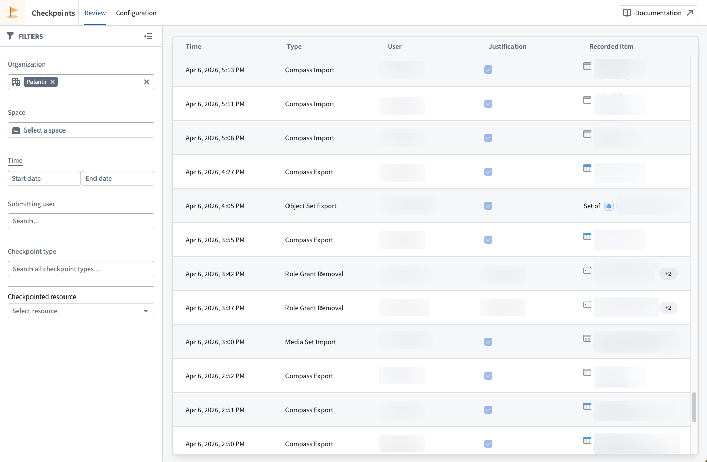

<!-- source: https://palantir.com/docs/foundry/checkpoints/review-checkpoint-records/ · mirrored 2026-08-14 from Palantir Foundry docs -->

# Review checkpoint records

Once created, checkpoint records can be **reviewed** by various users on the platform. Typically, this may include a data protection officer or other data governance users.

The [Checkpoints application](/docs/foundry/checkpoints/overview/#access-the-checkpoints-application) enables users to review [checkpoint records](/docs/foundry/checkpoints/core-concepts/#checkpoint-records) created on the platform.

The **Review** tab of the Checkpoints application presents a table of all records you have permission to view, subject to your current filters. A **Details** panel reveals additional information stored in the record selected in the table. The following information is available for each record:

* The user who created the record.
* The timestamp of when a record was **Created**.
* The [**Checkpoint Type**](/docs/foundry/checkpoints/checkpoint-types/) of the record.
* The **Checkpoint Language**, which includes the **Checkpoint Title**, **Checkpoint Prompt**, and **Checkpoint Description**. These values are inherited from the checkpoint configuration but are static; they always reflect the text shown to a user in the checkpoint and will not be updated if the underlying checkpoint configuration is edited or deleted.
* The **Justification** a user provided.
* **Checkpointed Items** for the interaction: For [checkpoint types](/docs/foundry/checkpoints/checkpoint-types/) that describe an interaction involving a resource or other entity in the platform, references to those resources or entities will be saved in the record. For example, if you attempt to export a resource and submit a checkpoint generated from a configuration of type **Compass export**, then the record will contain a checkpointed item reference to this resource. Likewise, if you submit a checkpoint generated from a configuration of type **Submit action**, then the record will contain a checkpointed item reference to the Action type (including related metadata, like the Action type's Ontology and that Ontology's version at time of submission).
* A **Checkpoint RID** uniquely identifying each record.
* The **Checkpoint Configuration RID** uniquely identifying the checkpoint configuration the checkpoint was generated from.

## Permissions to view records

To view a checkpoint record, you must meet one of the following criteria:

* **Record creator:** You created the checkpoint record.
* **Review records by resource permission:** You have the `Review records by resource` (`checkpoints:review-records`) [operation](/docs/foundry/platform-security-management/manage-roles/#understanding-roles-and-operations) on the checkpointed resource. By default, this operation is not granted to any roles in the default [role sets](/docs/foundry/platform-security-management/manage-roles/#role-sets); you will need to [create](/docs/foundry/platform-security-management/manage-roles/#creating-a-custom-role) or [modify](/docs/foundry/platform-security-management/manage-roles/#editing-the-default-roles) roles to grant this operation.
* **Space Administrator:** You have the `Space Administrator` role on the space containing the checkpointed resource.
* **Organization Administrator:** You have the `Data governance officer` [role](/docs/foundry/administration/enrollments-and-organizations-permissions/#roles) for the organization in Control Panel, which allows you to review checkpoint records submitted by all users in that organization.

Foundry redacts certain resources or users contained in a record if you do not have the necessary permissions to view that item. Additionally, Foundry will not show any records made by users in an [Organization](/docs/foundry/security/orgs-and-spaces/#organizations) that you cannot discover.

## Filtering records

The **Review** tab provides filters to refine which checkpoint records are displayed. You can use all the filters described below in combination:

* **Organization:** Show records created by users in a given [Organization](/docs/foundry/security/orgs-and-spaces/#organizations).
* **Space:** Show records with checkpointed items located in the specified [space](/docs/foundry/security/orgs-and-spaces/#spaces) at the time of record creation.
* **Checkpoint type:** Filter records by their [checkpoint type](/docs/foundry/checkpoints/checkpoint-types/).
* **User:** Filter records based on the submitting user.
* **Checkpointed resource:** Filter records that reference a specific resource as a checkpointed item.
* **Time:** Filter records based on when they were created.
