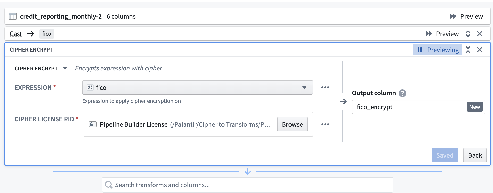
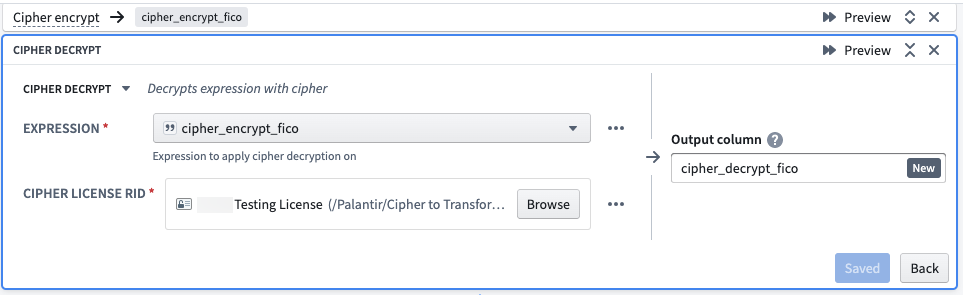
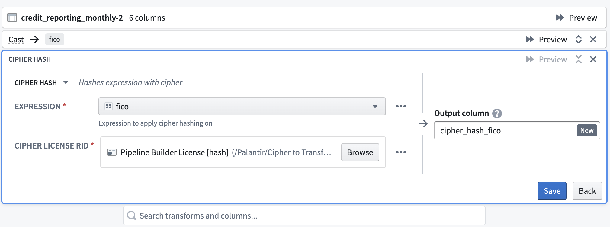
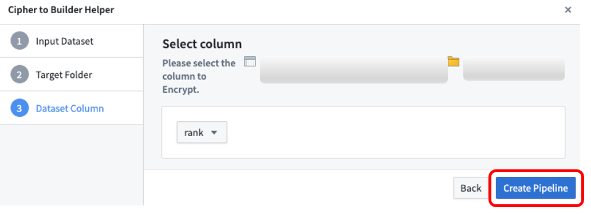
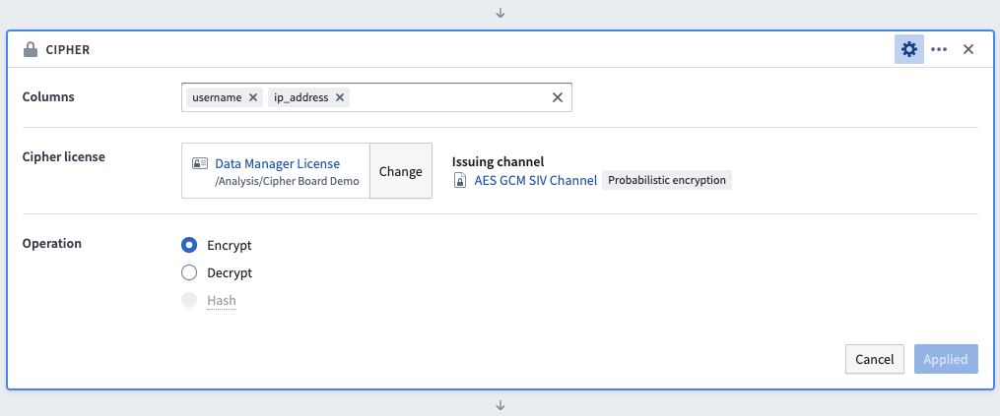
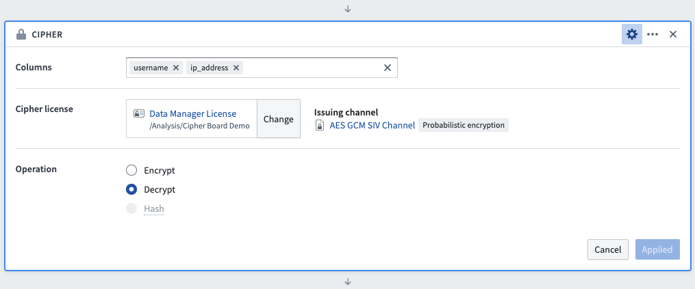
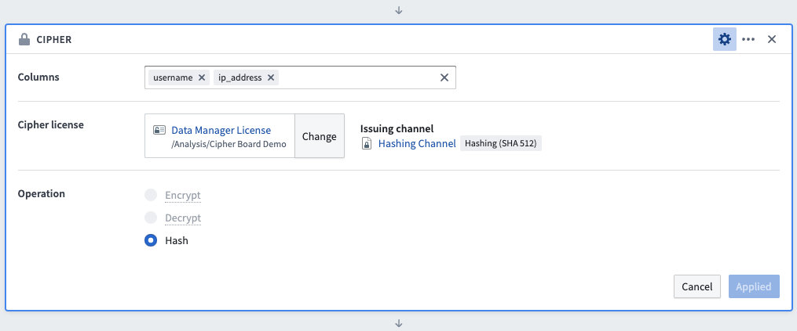

<!-- source: https://palantir.com/docs/foundry/cipher/apply-operations/ · mirrored 2026-08-22 from Palantir Foundry docs -->

# Apply Cipher operations to columns of datasets

Cipher allows you to encrypt, decrypt, and hash full columns of datasets. This is supported in [Pipeline Builder](/docs/foundry/pipeline-builder/datasets-add/), [Contour](/docs/foundry/contour/overview/), and [Python transforms](/docs/foundry/transforms-python/getting-started/).

:::callout{theme="warning"}
When using [Preview in Code Repositories](/docs/foundry/code-repositories/preview-transforms/) or [Preview in Pipeline Builder](/docs/foundry/pipeline-builder/outputs-preview-pipeline/), users will *not* be able to see the real output of Cipher operations. Instead, users in Preview will see the *placeholder value*. It is important to note that data will be encrypted at *build time*. To see the real output of Cipher operations, users should run a build.
:::

## Pipeline Builder

[**Pipeline Builder**](/docs/foundry/pipeline-builder/overview/) is a data integration application that aims to make it easier to perform high-quality data integrations in Foundry. This section demonstrates how to deploy Cipher operations to obfuscate columns of datasets in Pipeline Builder. To run a Cipher operation in Pipeline Builder, users must have access to a Cipher [Data Manager License](/docs/foundry/cipher/getting-started/#data-manager-license) or [Admin License](/docs/foundry/cipher/getting-started/#admin-license).

### Encryption

First, select the Cipher encrypt transform. Then, select an `Expression` (the column to be encrypted). Next, select a Data Manager License with encrypt permission, typically found in the Project folder after previous issuance in the Cipher application. Finally, name the output column.



### Decryption

First, select the Cipher decrypt transform. When selecting an `Expression`, specify a column that has already been encrypted via a Cipher transform. For the Cipher License RID, select a Data Manager License with decrypt permission, typically found in the Project folder after previous issuance in the Cipher application. Note that the License must be part of the same Cipher Channel used to encrypt the relevant column. Finally, name the output column.



### Hashing

Select the Cipher hash transform. For the `Expression`, specify the column to hash. Next, select a Data Manager License with permission to encrypt from a hash Cipher Channel. The License would have been issued in the Cipher application and then saved in a Project folder. Finally, name the output column.



### How to encrypt pipelines with Cipher (Admin and Data Manager Licenses only)

First, open a Cipher License with encrypt permission; licenses are typically found in the Project folder after previous issuance in the Cipher application. Then, select 'Create Pipeline' at the top right.


Select the input dataset to encrypt, then the target folder in which the pipeline will be saved, and then the dataset column you want to encrypt. Note that only `String` columns are available for encryption; if you need to encrypt another column, first cast it to `String`. After selecting **Create Pipeline**, Cipher will automatically generate a new pipeline and encrypt the column you previously selected.



## Contour

[**Contour**](/docs/foundry/contour/overview/) provides a point-and-click user interface to perform data analysis on tables at scale. This section demonstrates how to use Cipher operations to (de)obfuscate columns of datasets in a Contour Analysis. To run a Cipher operation in Contour, users must have access to a Cipher [Data Manager License](/docs/foundry/cipher/getting-started/#data-manager-license) or [Admin License](/docs/foundry/cipher/getting-started/#admin-license). To begin, use the Contour toolbar [search mode](/docs/foundry/contour/boards-add/#search-mode) to add a Cipher board to an analysis.

:::callout{theme="neutral"}
Contour's [table board](/docs/foundry/contour/boards-descriptions/#table) and [table panel](/docs/foundry/contour/boards-descriptions/#table-board-vs-table-panel) can be used to see the result of the Cipher operation.
:::

:::callout{theme="neutral"}
A Contour analysis path that uses a Cipher board cannot be [saved as a dataset](/docs/foundry/contour/datasets-save/).
:::

### Encryption

To use the Cipher board to encrypt data, first select the columns to be encrypted (the order in which the columns are selected has no impact on the operation). Next, select a Data Manager License or Admin License with encrypt permission, typically found in the Project folder after previous issuance in the Cipher application. Select the **Encrypt** operation and save the board. Column values will be updated by this transformation, but column names will remain unmodified.



### Decryption

To use the Cipher board to encrypt data, first select the columns to be decrypted (the order in which the columns are selected has no impact on the operation). Next, select a Data Manager License or Admin License with decrypt permission, typically found in the Project folder after previous issuance in the Cipher application. Select the **Decrypt** operation and save the board. Column values will be updated by this transformation, but column names will remain unmodified.



### Hashing

To use the Cipher board to hash data, first select the columns to be hashed (the order in which the columns are selected has no impact on the operation). Next, select a Data Manager License or Admin License with hashing permission, typically found in the Project folder after previous issuance in the Cipher application. Select the **Hash** operation and save the board. Column values will be updated by this transformation, but column names will remain unmodified.



## Python transforms

:::callout{theme="warning" title="Deprecated methods"}
As of version `0.75.0`, all pre-existing methods in `bellaso-python-lib` have been deprecated in favor of new implementations that increase stability and improve performance. These deprecated methods will be removed in a future release but are still available, and Foundry will display deprecation warnings when they are used.
:::

### Replace deprecated `bellaso-python-lib` methods

If you are still using the deprecated methods in `bellaso-python-lib`, update your code according to the table below, with exceptions identified in the [string-level operations section](#string-level-operations).

| Deprecated method | Replacement |
| --- | --- |
| `encrypt()` | `encrypt_column()` |
| `decrypt()` | `decrypt_column()` |
| `hash()` | `hash_column()` |
| `encrypt_all_matches()` | `encrypt_all_matches_column()` |
| `hash_all_matches()` | `hash_all_matches_column()` |
| `encrypt_image()` | `obfuscate_image()` |
| `decrypt_image()` | `deobfuscate_image()` |

### Set up a repository

Add `bellaso-python-lib` in the `requirements.run` block in `conda_recipe/meta.yml`. You can also do this automatically by adding it in the **Libraries** panel of your [Code Repository environment](/docs/foundry/transforms-python/use-python-libraries/). Note that an [Admin License](/docs/foundry/cipher/getting-started/#admin-license) is necessary to perform Cipher operations in Transforms.

### Encryption

To encrypt a column, you will need to define an `EncrypterInput` in the `@transforms` block. The `EncrypterInput` takes either the RID or the filesystem path to the Cipher License. Note that the Cipher License must have encryption permission.

Example:

```python
from transforms.api import transform, Input, Output
from pyspark.sql.functions import col
from bellaso_python_lib.encryption.encrypter_input import EncrypterInput

@transform(
    encrypter=EncrypterInput("/path/to/cipher/license"),
    output=Output("/path/to/output/dataset"),
    input_dataset=Input("/path/to/input/dataset")
)
def encrypt_column(ctx, input_dataset, output, encrypter):
    encrypted_df = input_dataset.dataframe().withColumn("your_column_name", encrypter.dataframe().encrypt_column(col("your_column_name")))
    output.write_dataframe(encrypted_df)
```

### Decryption

To decrypt a column, you will need to define a `DecrypterInput` in the `@transforms` block. The `DecrypterInput` takes either the RID or the filesystem path to the Cipher License. Note that the Cipher License must have decryption permission.

Example:

```python
from transforms.api import transform, Input, Output
from pyspark.sql.functions import col
from bellaso_python_lib.decryption.decrypter_input import DecrypterInput

@transform(
    decrypter=DecrypterInput("/path/to/cipher/license"),
    output=Output("/path/to/output/dataset"),
    input_dataset=Input("/path/to/input/dataset")
)
def decrypt_column(ctx, input_dataset, output, decrypter):
    decrypted_df = input_dataset.dataframe().withColumn("your_column_name", decrypter.dataframe().decrypt_column(col("your_column_name")))
    output.write_dataframe(decrypted_df)
```

### Hashing

To hash a column, you will need to define an `HasherInput` in the `@transforms` block. The `HasherInput` takes either the RID or the filesystem path to the Cipher License. Note that the Cipher License must have hashing permission.

Example:

```python
from transforms.api import transform, Input, Output
from pyspark.sql.functions import col
from bellaso_python_lib.encryption.hasher_input import HasherInput

@transform(
    hasher=HasherInput("/path/to/cipher/license"),
    output=Output("/path/to/output/dataset"),
    input_dataset=Input("/path/to/input/dataset")
)
def hash_column(ctx, input_dataset, output, hasher):
    hashed_df = input_dataset.dataframe().withColumn("your_column_name", hasher.dataframe().hash_column(col("your_column_name")))
    output.write_dataframe(hashed_df)
```

:::callout{theme="neutral"}
To encrypt or hash data upon ingestion, you can use Cipher's Python library along with [external transforms](/docs/foundry/data-connection/external-transforms/).
:::

### Incremental transforms

To use Cipher in an [incremental transform](/docs/foundry/transforms-python/incremental-overview/), you must list all encrypters, decrypters, and hashers as [snapshot inputs](/docs/foundry/transforms-python/incremental-usage/#snapshot-inputs).

Example:

```python
from transforms.api import transform, incremental, Input, Output
from bellaso_python_lib.encryption.encrypter_input import EncrypterInput
from pyspark.sql.functions import col


@incremental(
    snapshot_inputs=['encrypter']
)
@transform(
    encrypter=EncrypterInput("<YOUR_CIPHER_LICENSE_RID>"),
    output=Output("/path/to/output/dataset")
    input_dataset=Input("/path/to/input/dataset")
)
def encrypt_column(ctx, input_dataset, output, encrypter):
    encrypted_df = input_dataset.dataframe().withColumn("encrypted_column", encrypter.dataframe().encrypt_column(col("<YOUR_COLUMN_NAME>")))
    output.write_dataframe(encrypted_df)
```

### Visual obfuscation

To hash a column, you will need to define an `EncrypterInput` in the `@transforms` block. The `EncrypterInput` takes either the RID or the filesystem path to the Cipher License. Note that the Cipher License must have encryption permission.

Example:

```python
from transforms.mediasets import MediaSetInput, MediaSetOutput
import io
from bellaso_python_lib.encryption.encrypter_input import EncrypterInput
from bellaso_python_lib.types import Coordinate

@transform(
    mediaset_in=MediaSetInput("</path/to/input/media/set"),
    mediaset_out=MediaSetOutput("</path/to/output/media/set"),
    encrypter=EncrypterInput("/path/to/cipher/license"),
    polygons=Input("/path/to/polygon/dataset"),
)
def compute(mediaset_in, mediaset_out, encrypter, polygons, ctx,):

    media_references = mediaset_in.list_media_items_by_path_with_media_reference(
        ctx
    ).collect()  # noqa

    for row in media_references:
        image_file = mediaset_in.get_media_item(row["mediaItemRid"])

        plainview_image = image_file.read()

        # Encrypt a square in the top left of the image, 100 px by 100 px.
        polygon = [Coordinate({"x": 0, "y": 0}), Coordinate({"x": 100, "y": 0}), Coordinate({"x": 100, "y": 100}), Coordinate({"x": 0, "y": 100})]

        polygon_list = [polygon]

        if plainview_image:
            encrypted_image = encrypter.obfuscate_image(plainview_image, polygon_list, ctx)

            mediaset_out.put_media_item(io.BytesIO(encrypted_image), row["path"])

```

### String-level operations

The `bellaso-python-lib` library provides string-level methods that operate on plain Python strings rather than PySpark columns. Use these methods when working in contexts that are incompatible with PySpark [user-defined functions](/docs/foundry/functions/python-functions-builder/), such as inside nested functions or when using `F.transform()` for array columns.

The following string-level methods are available:

| Class | Method | Description |
| --- | --- | --- |
| `TransformsEncrypter` | `encrypt_string(plaintext)` | Encrypt a single string value |
| `TransformsEncrypter` | `encrypt_all_matches_string(plaintext, regex)` | Encrypt all regex matches in a string |
| `TransformsDecrypter` | `decrypt_string(ciphertext)` | Decrypt a single string value |
| `TransformsHasher` | `hash_string(plaintext)` | Hash a single string value |
| `TransformsHasher` | `hash_all_matches_string(plaintext, regex)` | Hash all regex matches in a string |

Example:

```python
from transforms.api import transform, Input, Output
from pyspark.sql import functions as F
from pyspark.sql.functions import col
from bellaso_python_lib.encryption.encrypter_input import EncrypterInput

@transform(
    encrypter=EncrypterInput("/path/to/cipher/license"),
    output=Output("/path/to/output/dataset"),
    input_dataset=Input("/path/to/input/dataset")
)
def encrypt_nested_values(ctx, input_dataset, output, encrypter):
    enc = encrypter.dataframe()
    encrypted_df = input_dataset.dataframe().withColumn(
        "encrypted_array",
        F.transform(col("string_array"), lambda x: F.lit(enc.encrypt_string(x)))
    )
    output.write_dataframe(encrypted_df)
```
