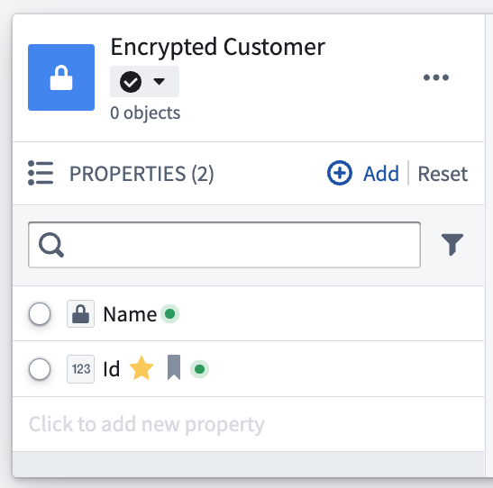

<!-- source: https://palantir.com/docs/foundry/cipher/ciphertext-in-functions-and-actions/ · mirrored 2026-08-22 from Palantir Foundry docs -->

# Use CipherText properties in Functions and Actions

:::callout{theme="neutral"}
Use of Cipher in Functions requires an [Operational User License](/docs/foundry/cipher/getting-started/#operational-user-license). If [checkpoints](/docs/foundry/checkpoints/overview/) are configured for this operation (hashing, encrypting, decrypting), the license must be allowed to [bypass checkpoints](/docs/foundry/cipher/getting-started/#bypass-checkpoints).
:::

Functions code repositories can be used to interact with CipherText object properties, enabling sophisticated logic like bulk encryption or bulk decryption. To get started with Functions, see [this tutorial](/docs/foundry/action-types/function-actions-getting-started/).

For the examples below assume we have an `EncryptedCustomer` object with the following properties:

* An encrypted CipherText `name`
* A unique, unencrypted integer `id`

We will be writing two functions to interact with this object:

* `decryptEncryptedCustomer()` will take in an `EncryptedCustomer` object and return the plaintext name.
* `updateEncryptedName()` will take in an `EncryptedCustomer` object and a `newName` and update the encrypted name of that object to the `newName`.



## Decrypting CipherText Properties in Functions

In this example we decrypt and return the `name` property of an `EncryptedCustomer` object.

```typescript
import { Function, Integer, OntologyEditFunction, Edits } from "@foundry/functions-api";
import { Objects, EncryptedCustomers } from "@foundry/ontology-api";

@Function()
public async decryptEncryptedCustomer(customer: EncryptedCustomers): Promise<string | undefined> {
    return await customer.name?.decryptAsync();
}
```

## Updating CipherText Properties in Functions

In the example below, we update the `name` property of an `EncryptedCustomer` object. Note that the function in this example, like [any function that updates objects](/docs/foundry/functions/api-ontology-edits/), must be annotated with `@OntologyEditFunction()` and `@Edits(EncryptedCustomers)`. Also note that running this function in preview will not actually edit the object.

```typescript
import { Function, Integer, OntologyEditFunction, Edits } from "@foundry/functions-api";
import { Objects, EncryptedCustomers } from "@foundry/ontology-api";

@OntologyEditFunction()
@Edits(EncryptedCustomers)
public async updateEncryptedName(customer: EncryptedCustomers, newName: string): Promise<void> {
    await customer.name?.updateAsync(newName);
}
```
