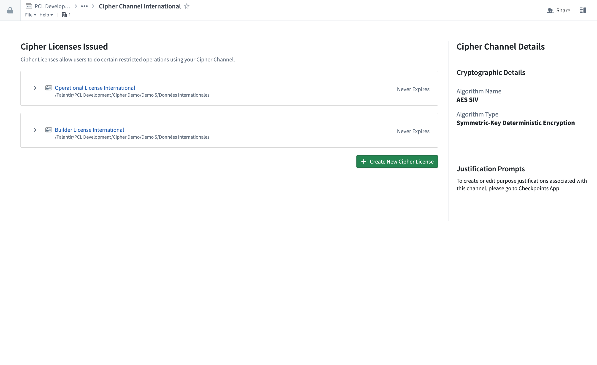
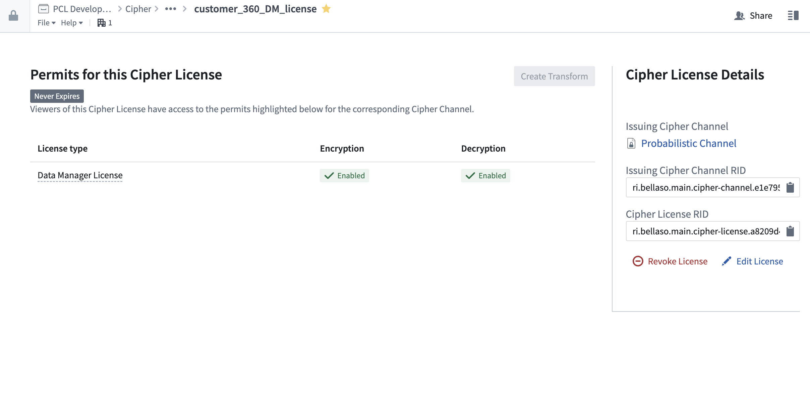

<!-- source: https://palantir.com/docs/foundry/cipher/core-concepts/ · mirrored 2026-08-22 from Palantir Foundry docs -->

# Core concepts

This page provides an introduction to the core concepts of Cipher.

## Channels

A **Cipher Channel** is a Foundry resource that is visible in the filesystem workspace. A Channel serves as the starting point to create your encryption or hashing framework. Channels describe a specific protocol for obfuscating or de-obfuscating values, including either an encryption algorithm, parameters and values for the encryption keys, or a hashing algorithm and secret.

[Learn how to create a Cipher channel.](/docs/foundry/cipher/getting-started/#create-a-cipher-channel)

## Licenses

A **Cipher License** is a Foundry resource accessible in the filesystem workspace that controls permissions to use cryptographic operations defined in a given Cipher Channel. Each License corresponds to exactly one parent Channel. Users with access privileges which allow them to view a License can use all the Channel operations the License allows. Like other Foundry resources, a License can be moved around and shared; however, note that any changes will affect user accessibility for the Channel associated with the License.

[Learn how to issue a Cipher license.](/docs/foundry/cipher/getting-started/#issue-a-license)

## Cipher-encrypted values

Values encrypted with Cipher follow a format known as a *Cipher-encrypted value* which has the following syntax: `CIPHER::<channel-rid>::<encrypted-value>::CIPHER`. This format allows the Cipher service to gather the metadata needed to decrypt the value, providing the user has the right permissions.
