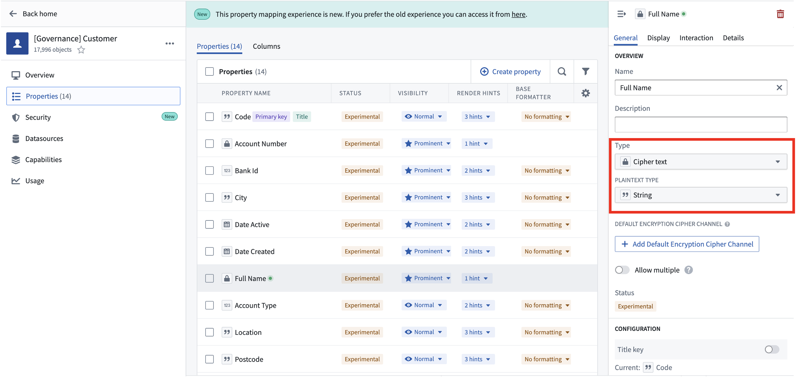
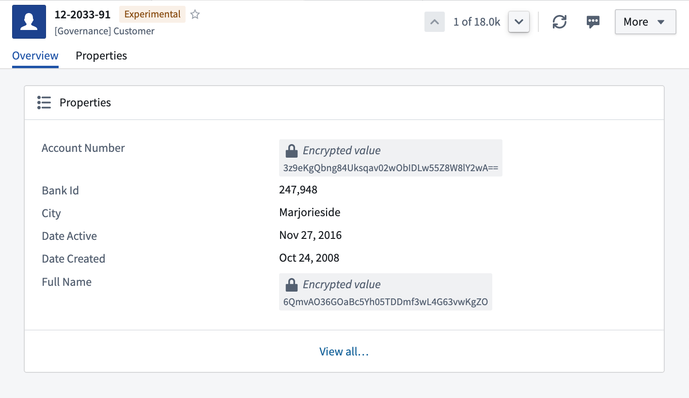

<!-- source: https://palantir.com/docs/foundry/cipher/decrypt-individual-values/ · mirrored 2026-08-22 from Palantir Foundry docs -->

# Decrypt individual values in Foundry applications

## Render encrypted values in objects

Cipher-encrypted property values can be selectively decrypted to be viewable in [Workshop](/docs/foundry/workshop/overview/) and [Object Explorer](/docs/foundry/object-explorer/overview/). Users with access to relevant Cipher Licenses will be able to decrypt the value(s) after filling out a justification prompt.

You must designate this decryption in the **Properties** view of the [Ontology Manager](/docs/foundry/ontology-manager/overview/). For each Cipher-encrypted field, go to the `Property Type` field and select `Cipher text` from the dropdown. You can also choose the `Plaintext Type` to capture the data type pre-encryption, and specify a `Default Encryption Cipher Channel` to use for encrypting edits to initially empty or unencrypted fields.

Properties marked as CipherText will be rendered with the `Encrypted Value` renderer. This will allow each value to be rendered and selectable in most Foundry frontends, including [Workshop](/docs/foundry/workshop/overview/) and [Object Explorer](/docs/foundry/object-explorer/overview/).

If you would like to allow users to update the encrypted values, for example, to correct typos, we recommend using the `updateAsync` function and hooking it to an [action](/docs/foundry/cipher/ciphertext-in-functions-and-actions/).

To allow for in-line edits, add the `cipher: editable` type class to the property. This method is not typically recommended as it requires your object to be stored in Object Storage v1 and to allow for edits through API calls. Users will need the appropriate license(s) with encryption capabilities to edit values.

Previously, string properties were rendered with the `Encrypted Value` renderer by using the `RID Renderer` option in the `Value Formatting` section of the Ontology App. We recommend you use the `CipherText` property type instead.
