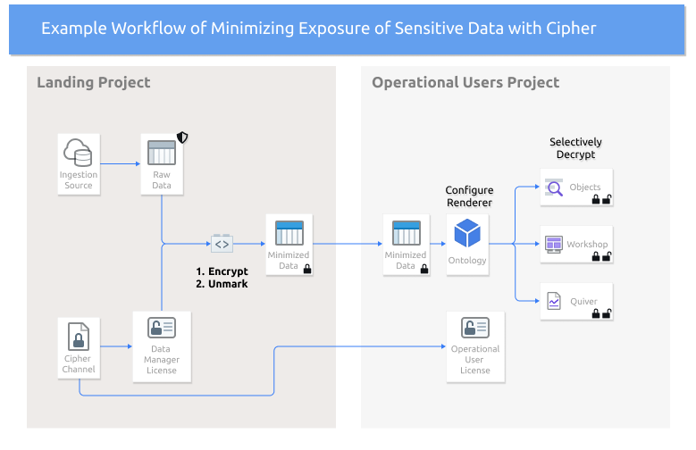

<!-- source: https://palantir.com/docs/foundry/cipher/example-use-case/ · mirrored 2026-08-22 from Palantir Foundry docs -->

# Example Cipher use case

One common use case for Cipher is to encrypt sensitive data by default, but allow operational users with legitimate purposes to selectively decrypt specific fields when they need it with an audit trail of actions.

In the example diagram below, sensitive data lands in a Foundry dataset with a security [Marking](/docs/foundry/security/markings/) applied. The steps outline how to use Cipher to obfuscate data before sharing, and enabling only targeted decryptions for operational users.

## Steps to reproduce

1. [Create a Cipher Channel](/docs/foundry/cipher/getting-started/#create-a-cipher-channel) in your landing Project.
2. [Issue an Admin License](/docs/foundry/cipher/getting-started/#admin-license) and grant access to it to a relevant admin user.
3. [Obfuscate sensitive columns via Transforms](/docs/foundry/cipher/apply-operations/#python-transforms) and [unmark](/docs/foundry/building-pipelines/remove-inherited-markings/#remove-inherited-markings-and-organizations) the minimized dataset.
4. Reference the minimized dataset in the Project to which operational users have access.
5. [Issue a decrypt Operational User License](/docs/foundry/cipher/getting-started/#operational-user-license) and move it to the Project for operational users.
6. Set up your [Ontology](/docs/foundry/ontology/overview/) and [enable rendering of encrypted values](/docs/foundry/cipher/decrypt-individual-values/#render-encrypted-values-in-objects).
