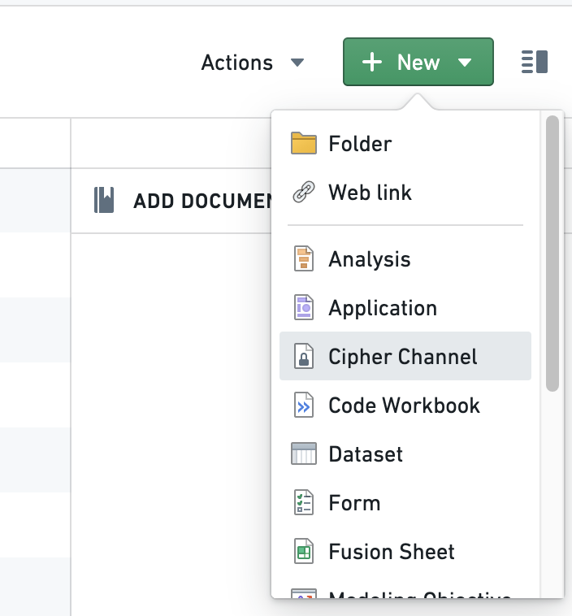
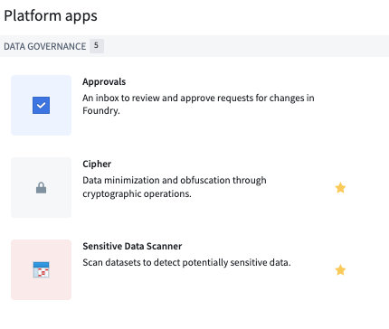
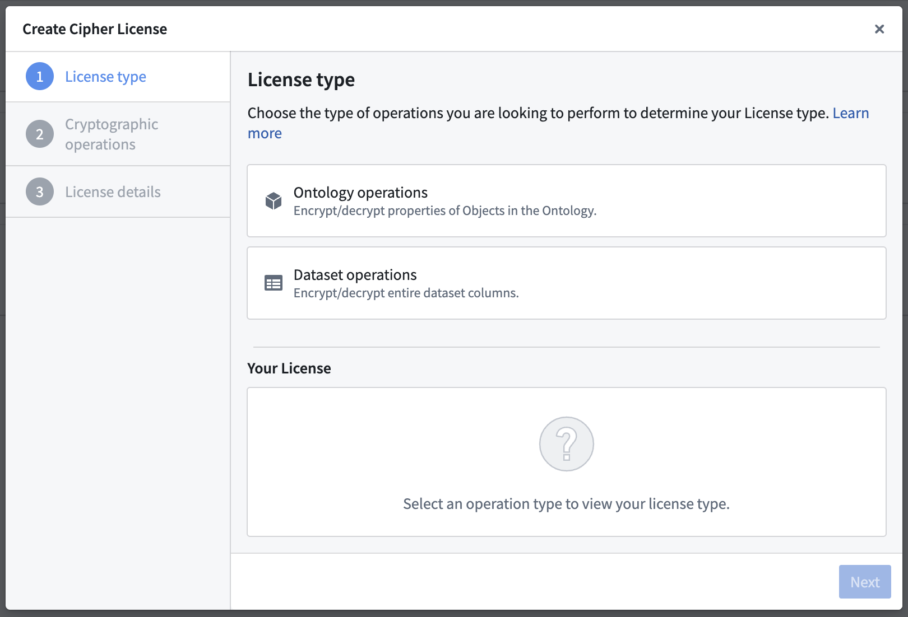
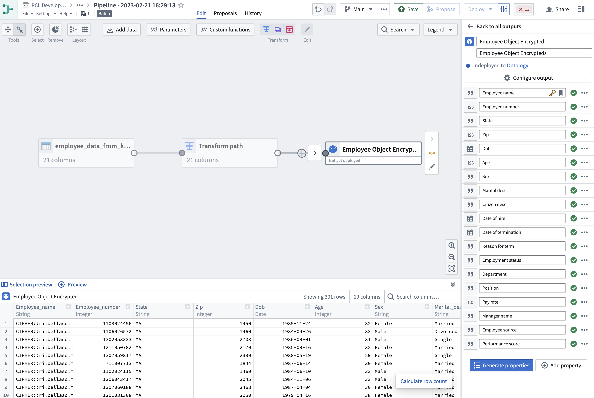
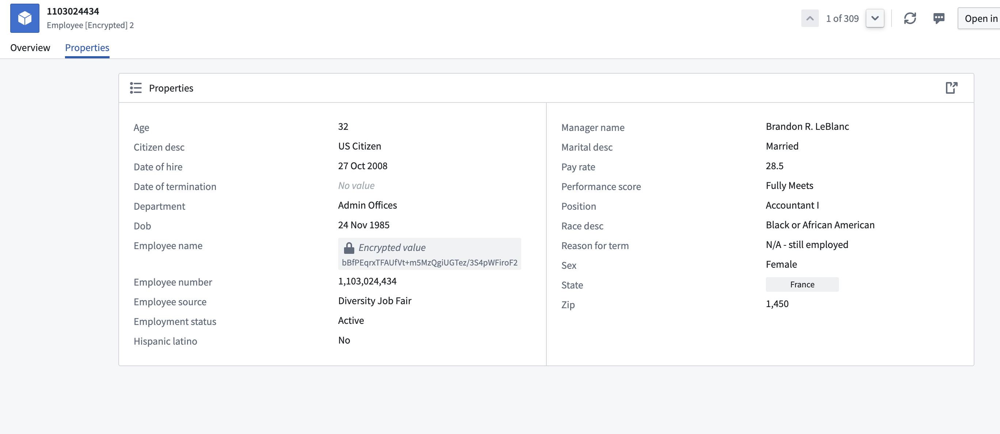
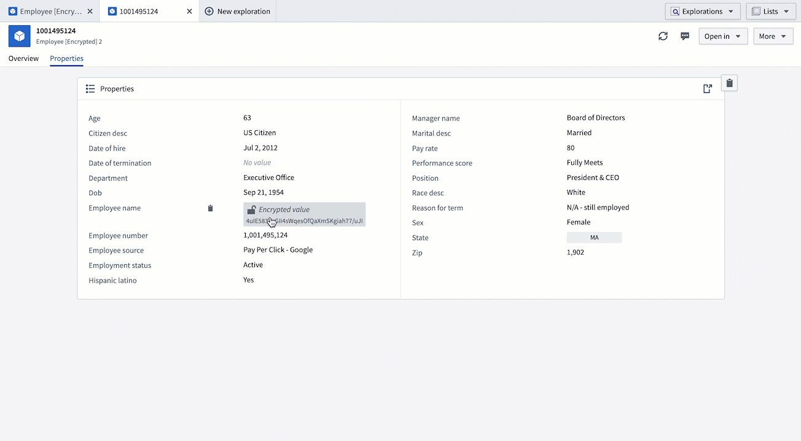

<!-- source: https://palantir.com/docs/foundry/cipher/getting-started/ · mirrored 2026-08-22 from Palantir Foundry docs -->

# Getting started

This guide includes the following sections:

* [Create a Cipher Channel](#create-a-cipher-channel)
* [Issue a License](#issue-a-license)
* [Walkthrough Guide](#walkthrough-guide)

## Create a Cipher Channel

When creating a Cipher Channel you will first be asked to choose a cryptographic algorithm before creating a secret. There are two ways to create a new Cipher Channel:

### Option 1: Create a Cipher Channel through the platform filesystem

Navigate to the Project of your choice and create a new Cipher Channel by selecting **+ New** > **Cipher Channel**. Select the algorithm of your choice; we recommend AES\_SIV (AES-256-SIV) to perform joins on encrypted values.

:::callout{theme="neutral"}
If you do not have the ability to create a Cipher Channel in your Foundry filesystem, contact your Palantir representative for assistance.
:::

### Option 2: Create a Cipher Channel through the Cipher application

Navigate to the left side of the panel and look for Cipher under **Platform Apps** > **Data Governance**, and follow the same instructions as under Option 1.

### How to choose your cryptographic algorithm

The on-screen guide will walk you through the process of creating a Cipher Channel with your desired protocols. The following are additional details that may assist you in deciding which configuration to choose from for your use case:

* **Algorithm:** Cipher currently supports the following algorithms:
  * Text-based: AES\_GCM\_SIV Probabilistic Encryption Algorithm, AES\_SIV (AES-256-SIV) Deterministic Encryption Algorithm, SHA-256 Hashing Algorithm (with a pepper), and SHA-512 Hashing Algorithm (with a pepper).
  * Image-based: [Visual Obfuscation Image Scrambling](/docs/foundry/cipher/visual-obfuscation/).

The key difference between hashing and encryption is that **encrypted** values can be decrypted if a user has proper permissions, while **hashed** values cannot be de-obfuscated or re-identified through a cryptographic operation. If your use case requires re-identification, we recommend using encryption.

The key difference between probabilistic and deterministic encryption is the following:

* **Probabilistic encryption:** The same input will always lead to a different output.
* **Deterministic encryption:** The same input will always lead to the same output.
* **Hashing:** Always deterministic.

The Visual Obfuscation Image Scrambling algorithm is deterministic and reversible.

Some considerations that should be taken into account when choosing between deterministic and probabilistic algorithms are:

* If you need to perform joins or aggregations on encrypted data, you need a deterministic algorithm.
* If the data you want to encrypt has low cardinality or well-known statistical distribution, you may want to choose a probabilistic algorithm in order to limit the risk of dictionary or statistical attacks against the encrypted data.

### How to Configure your Cryptosystem Keys

The on-screen guide will walk you through the process of configuring your cryptosystem. Depending on which cryptographic algorithm you previously chose, you will have different secret formats to choose from to protect your sensitive data.

* **Secrets:**
  * **Encryption:** There are two key retrieval methods that allow you to derive a key from your secret:
    * Stretching key derivation (Recommended): The Cipher service will derive a key from your secret by applying a method that traditionally strengthens the key. Note that you can randomly generate a secret by clicking on the key button.
    * Single key: This methodology does not include derivation functions. We recommend using this if you already have a well-designed AES\_SIV key that you would like to use as the key itself. This should be inputted as a base64-encoded string of length 64.
  * **Hashing:** Hash secret creation:
    * We recommend creating a hash secret yourself by running a command in your terminal (minimum 14 characters and randomly generated).
    * Alternatively, you can randomly generate a secret by clicking on the key button.
  * **Visual Obfuscation:** Image scrambling seed:
    * Provide a long, random number that will be used as a seed to generate the sequence to rearrange and modify the pixels in the image.

Clicking on **Create cipher channel** will conclude the Cipher Channel creation process.

## Issue a License

To issue Cipher Licenses, navigate to a Cipher Channel and click on the **Create New Cipher License** button.

:::callout{theme="warning"}
To grant a user access to the operations permitted by a Cipher License, give them View access to the License.
:::

You can choose between three types of Licenses:

* [Operational User License](#operational-user-license)
* [Data Manager License](#data-manager-license)
* [Admin License](#admin-license)

|  | Operational User License | Data Manager License | Admin License |
| --- | --- | --- | --- |
| Auditable at the cell level | ✅ | ❌ | ❌ |
| Can enforce a rate limit | ✅ | ❌ | ❌ |
| Used to encrypt/decrypt [entire columns](/docs/foundry/cipher/apply-operations/) | ❌ | ✅ | ✅ |
| Effectively grants access to cryptographic keys | ❌ | ❌ | ⚠️ |
| **Usable in** |  |  |  |
| Object Layer (Workshop, Object Explorer, ...) | ✅ | ❌ | ❌ |
| Functions (see [bypassing checkpoints](#bypass-checkpoints)) | ✅ | ❌ | ❌ |
| Pipeline Builder | ❌ | ✅ | ✅ |
| Contour | ❌ | ✅ | ✅ |
| Code Authoring | ❌ | ❌ | ✅ |

### Operational User License

An **Operational User License** (formerly "Frontend License") enables Foundry users to encrypt or decrypt individual values.

The two configurable permissions for Operational User Licenses are:

* **Encryption/hashing of individual values:** Single-value encryption or hashing through the Foundry applications. You can set a rate limit counter for this operation.
* **Decryption of individual values:** Single-value decryption through the Foundry applications. You can set a rate limit counter for this operation. This configuration can be helpful to allow users to view specific encrypted values through frontends such as [Workshop and Object Explorer](/docs/foundry/cipher/decrypt-individual-values/).

:::callout{theme="neutral"}
A rate limit is an optional configuration which indicates the number of single-value cryptographic operations an individual is allowed in the configured time. Should a user exceed the limit, they will be blocked until the period resets.
:::

:::callout{theme="neutral"}
Operations performed using an Operational User License are fully auditable.
:::

#### Bypass checkpoints

Allowing a license to bypass [checkpoints](/docs/foundry/checkpoints/overview/) means the license can be used in places where checkpoints cannot be shown, such as [Functions](/docs/foundry/cipher/ciphertext-in-functions-and-actions/) or a direct API call. Use of this license is still auditable at the cell level and rate-limited.

### Data Manager License

A **Data Manager License** (formerly "High Trust License") enables Foundry users to encrypt or decrypt **entire columns of datasets** using tools such as Pipeline Builder and Contour. This configuration can be helpful for users who benefit from point-and-click tools, as well as users with strict security concerns. Learn more about [using Cipher in Pipeline Builder](/docs/foundry/cipher/apply-operations/#pipeline-builder).

The two configurable permissions for Data Manager Licenses are:

* **Column-level encryption/hashing:** Encrypting or hashing of dataset columns through tools such as Pipeline Builder and Contour.
* **Column-level decryption:** Decrypting of dataset columns through tools such as Pipeline Builder and Contour.

### Admin License

An **Admin License** (formerly "Transforms License") enables Foundry users to encrypt or decrypt entire columns of datasets in Code Repositories and grants them access to the cryptographic keys.

:::callout{theme="warning"}
Allowing operations in Transforms effectively grants users access to the cryptographic keys. Ensure that access to this License is only granted to users with elevated permissions.
:::

The two configurable permissions for Admin Licenses are:

* **Encryption/hashing Admin:** Encryption or hashing of dataset columns in Code Repositories and encryption key access.
* **Decryption Admin:** Decryption of dataset columns in Code Repositories and decryption key access.

## Walkthrough Guide

Once you have familiarized yourself with the steps above, refer to this tutorial to walk you through the process on how to use the Cipher application to perform encryption actions.

:::callout{theme="neutral"}
This tutorial uses notional employee data. All information shared in this documentation such as but not limited to images and accompanying datasets are notional.
:::

### Steps to reproduce

Before you begin, download the [notional employee dataset](/docs/resources/foundry/cipher/employee_data.csv) and [upload it to Foundry](/docs/foundry/compass/manually-upload-data/).

1. **[Create a Cipher Channel](#create-a-cipher-channel)** in your landing Project.
2. **[Create a Data Manager License](#data-manager-license)** with an encryption permit.
3. **Encrypt the sensitive column with Pipeline Builder:** Create a new pipeline and select **+ New** > **Pipeline** in the upper-right corner to import the employee dataset to Pipeline Builder. Then, choose the `Cipher encrypt` transform using the Data Manager License you just created and apply it on the `Employee_name` column of the dataset. The column should now be encrypted. Once encryption is complete, you can add an `Object type` pipeline output with your dataset and use `Employee_number` as the primary key and title. (Learn more about [Pipeline Builder](/docs/foundry/pipeline-builder/overview/))

4. **Add Object Output:** Navigate to **Output settings** on the rotary icon under `Pipeline outputs`. Select the `Target ontology` and the `Output folder` and **Save**. Upon accessing any object within this dataset, you will notice the set of values you previously encrypted is now rendered inaccessible and cannot be viewed. The next step will provide instructions on how to decrypt these values.

5. **Create an Operational User License:** Return to your Cipher Channel and create a new [Operational User License](#operational-user-license) with a decryption permit. This license will allow you to perform decryptions on objects. Performing the same actions as above, you should now be able to decrypt the value of the object.

