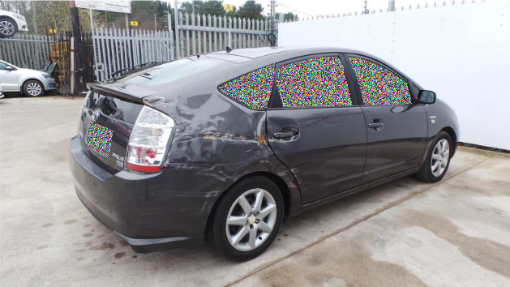
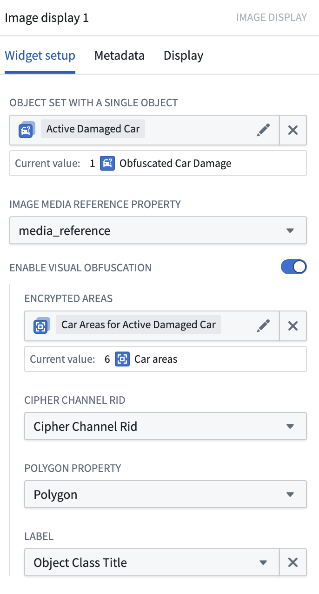
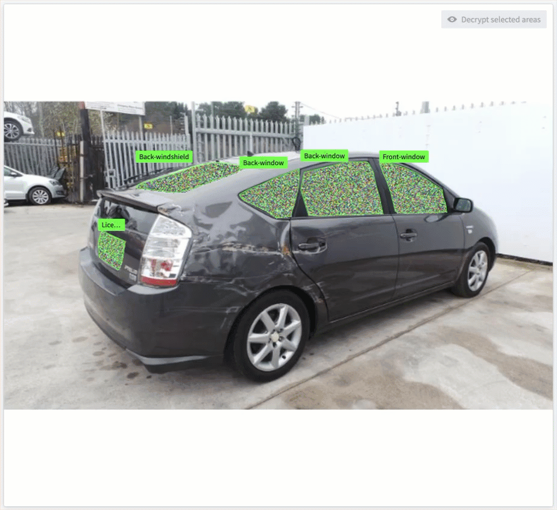

<!-- source: https://palantir.com/docs/foundry/cipher/visual-obfuscation/ · mirrored 2026-08-22 from Palantir Foundry docs -->

# Use Cipher for visual obfuscation

The **Visual Obfuscation** algorithm in Cipher is used to obfuscate portions of images. A user with access to an appropriate Cipher license can view the original image data by using a decryption Cipher license.

Cipher obfuscates the image by using the Cipher Channel's image scrambling seed to scramble the RGB values of the pixels in a polygon. This operation is commutative and reversible. Thus, on the image with the scrambled values, Cipher will apply the reversed scramble to recover the original values of the pixels. This is not just an overlay; the pixels themselves are manipulated.

*This image is an example where Cipher is applied atop the ["Car Parts and Car Damages" dataset ↗](https://www.kaggle.com/datasets/humansintheloop/car-parts-and-car-damages) provided by "Humans in the Loop" under a CC0 license.*

## Steps to reproduce

1. Set up relevant Cipher resources.
   1. [Create a Cipher Channel](/docs/foundry/cipher/getting-started/#create-a-cipher-channel) with a **Visual obfuscation** algorithm.
   2. [Issue an Admin License](/docs/foundry/cipher/getting-started/#admin-license) which **allows encryption**. Grant a relevant admin user access to this license.
      * Note: Visual obfuscation is currently only supported in Code Repositories, so you will need to **Grant cryptographic key access** on this license.
   3. [Issue an Operational User License](/docs/foundry/cipher/getting-started/#operational-user-license) which **allows decryption**. Grant operational users access to this license.

2. Set up your data.
   1. [Import your images into a Media Set](/docs/foundry/media-sets-advanced-formats/importing-media/).
      * Note: Visual obfuscation currently only supports PNG images. PNG is a lossless format; therefore, encryption and decryption will not leave compression artifacts.
   2. Create an output Media Set with a PNG image type.

3. Visually obfuscate your images.
   1. [Set up a Python transform with a media set input and a media set output](/docs/foundry/transforms-python/media-sets/#use-media-sets-with-python-transforms).
   2. [Obfuscate image areas with transforms](/docs/foundry/cipher/apply-operations/#visual-obfuscation).

4. \[Beta] Interact with the encrypted image using the Image Display widget in Workshop.
   1. Back your obfuscated images into an [Ontology](/docs/foundry/ontology/overview/) object using Pipeline Builder.
   2. Back your polygons into another Ontology object with this schema (or an equivalent schema):
      * **polygonId:** Primary key
      * **imagePath:** string; Foreign key to link to the obfuscated images.
      * **cipherChannelRid:** string; RID of the Cipher Channel used to encrypt this polygon. The format should follow this structure: `ri.bellaso.main.cipher-channel.<uuid>`
      * **polygon:** string; Polygon, represented as a list of coordinates, json-serialized. Example: `[[0,0][100,0][100,100][0,100]]`.
      * **label:** string (optional); Label for the polygon.
   3. Link the polygons to the obfuscated images as a many-to-one link.
   4. In a Workshop application, set up the image display widget with the polygon objects.
   5. Select desired areas and choose **Decrypt selected areas** to view the original image.

