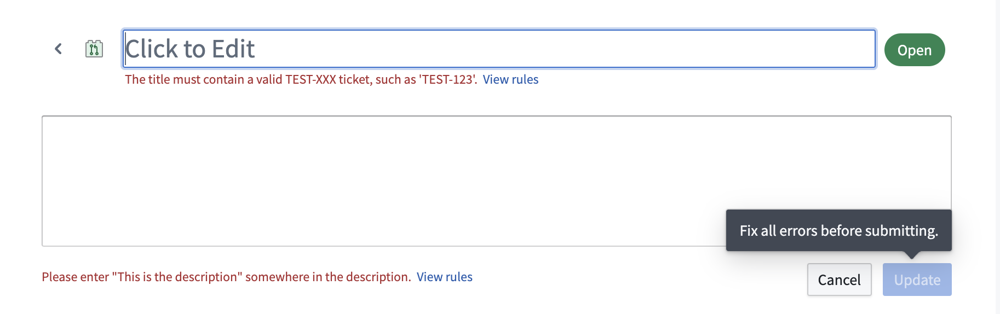

<!-- source: https://palantir.com/docs/foundry/code-repositories/advanced-settings/ · mirrored 2026-08-14 from Palantir Foundry docs -->

# Advanced repository settings

Most Code Repositories settings can be found in the [**Settings** tab](/docs/foundry/code-repositories/admin-overview/). Some additional values are configured using the `repoSettings.json` file at the repository root. If the file does not exist, you can create a file named `repoSettings.json` at the repository root.

## Custom tag name validation

To enforce that all newly created tags in a repository follow a specific naming scheme in addition to the default constraints enforced by Code Repositories, you may configure a custom regular expression and an error message that is displayed to users if the regex is not satisfied. For example:

```json
"tagNameValidation": {
    "regex": "^(0|[1-9]\\d*)\\.(0|[1-9]\\d*)\\.(0|[1-9]\\d*)(-rc\\d+)?$",
    "errorMessage": "Tag name must have the format x.x.x or x.x.x-rcx"
}
```

:::callout{theme="neutral"}
If you set a value for `tagNameValidation`, you must configure **both** a `regex` and an `errorMessage`.
:::

## Pull request description template

To help maintain best practices when opening new pull requests, you can configure a description template that will be used to pre-populate the `Description` field when creating a pull request:

```json
"prDescriptionTemplate": "First line of the description template\nAnd another line with instructions"
```

## Output dataset path for new transforms

By default, the templates for new transforms files use the file path as the initial output dataset path. For example, for a Python transform `/path/to/your/repository/transforms-python/src/myproject/datasets/name_of_file`. You can change this to a more convenient location, such as a specific folder in your project, by configuring an `outputPathPrefix`:

```json
"outputPathPrefix": "/My/Custom/Prefix"
```

With the above setting, the output dataset path will be set to `/My/Custom/Prefix/name_of_file` instead.

## Pull request validation rules



You can enforce rules for pull requests within a repository by adding `prValidation` entries to your `repoSettings.json` file. When a pull request is created, it will be validated against the `repoSettings.json` file on the base branch.

A pull request validation rule consists of a regular expression, a list of pull request fields to match the expression against, and an error message to render when a field does not comply with the rule.

## Example: `repoSettings.json`

```json
{ 
    "tagNameValidation": {
        "regex": "^(0|[1-9]\\d*)\\.(0|[1-9]\\d*)\\.(0|[1-9]\\d*)(-rc\\d+)?$",
        "errorMessage": "Tag name must have the format x.x.x or x.x.x-rcx"
    },
    "prDescriptionTemplate": "First line of the description template\nAnd another line with instructions",
    "outputPathPrefix": "/My/Custom/Prefix",
    "prValidation": [
        {
            "regex": "TEST-\\d{3}",
            "fields": ["title", "branchName"],
            "errorMessage": "This field must contain a valid TEST-XXX ticket, such as 'TEST-123'."
        },
        {
            "regex": "This is the description",
            "fields": ["description"],
            "errorMessage": "Please enter 'This is the description' somewhere in the description."
        }
    ]
}
```
