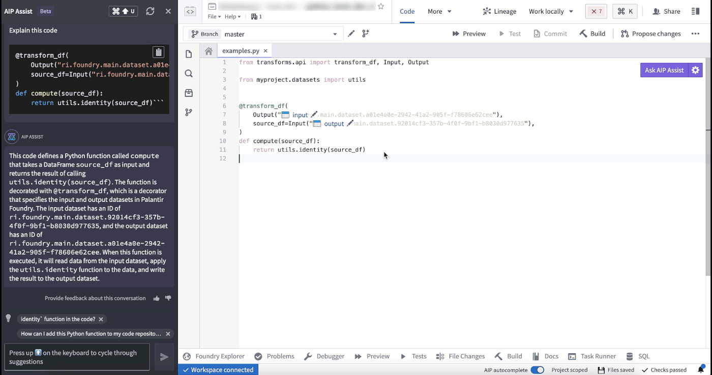
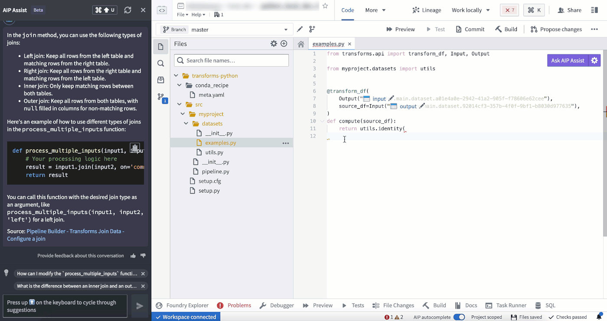
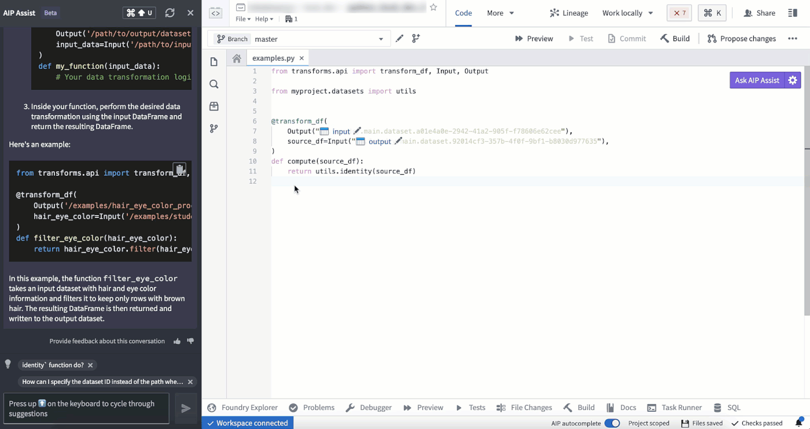
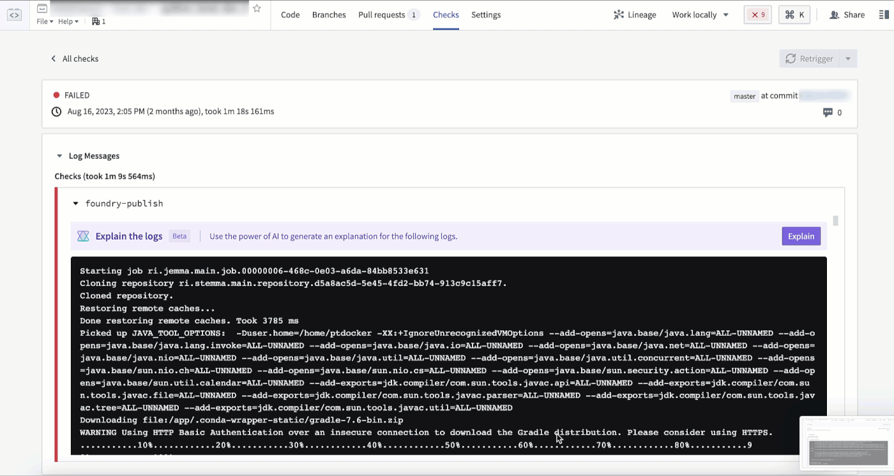
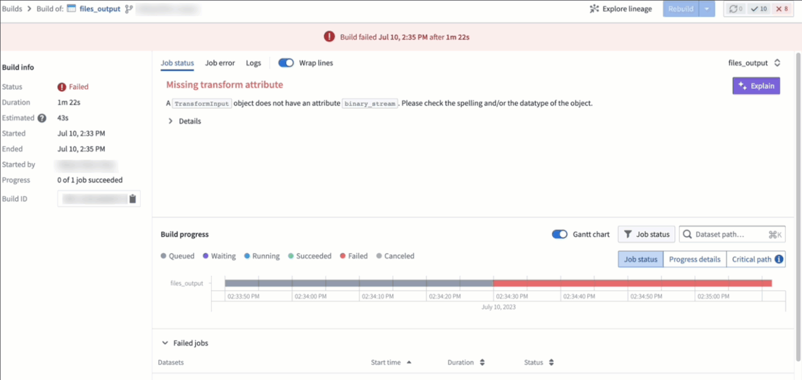
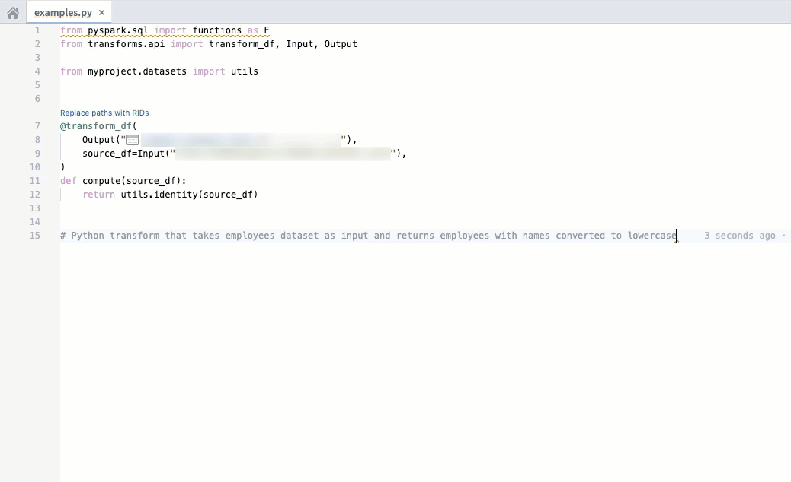

<!-- source: https://palantir.com/docs/foundry/code-repositories/aip-features/ · mirrored 2026-08-14 from Palantir Foundry docs -->

# AIP features in Code Repositories

The following is a list of AIP-powered features in Code Repositories.

## AIP Assist

Access AIP Assist features through the **Ask AIP Assist** option, through the editor's right-select menu, or through options inline and enhance your code comprehension using AIP Assist.

The AIP Assist features in Code Repositories can be configured by navigating to **Ask AIP Assist > Configure AIP Settings > AIP features**.

### Code explanation

You can now use AIP in Code Repositories to explain the purpose of code snippets or entire files.

### Find bugs

Use AIP in Code Repositories to check and debug your code.

### Translate

AIP in Code Repositories can convert your code to various languages such as Python, SQL, Mesa, or Java.

### Context-aware attachments

Context-aware attachments allow users to attach code snippets, files, and repositories to conversations with AIP Assist. These attachments provide context that enriches AIP Assist knowledge and enables more accurate responses to code-specific questions. You can attach supported resources via the AIP Assist sidebar or from the **Ask AIP Assist** dropdown.

Code snippets can also be attached by highlighting the desired code, right-clicking, and selecting **Attach to AIP Assist** from the context menu or directly by using the inline code assistance options that appear above the selected code.

### Inline code assistance \[Beta]

:::callout{theme="neutral" title="Beta"}
Inline code assistance is in the [beta](/docs/foundry/platform-overview/development-life-cycle/) phase of development and may not be available on your enrollment. Functionality may change during active development.
:::

Code Repositories now features inline code assistance when a code snippet is highlighted. The **Explain**, **Find bugs**, and **Ask a question** options are displayed above the selected code snippet to enable users to access targeted help from AIP Assist directly from code.

This feature can be disabled by opening the **Ask AIP Assist** dropdown menu in the top right corner of the editor and selecting **Configure AIP Settings**. In the **AIP features** section, you can configure the **Show AIP Assist actions above selected code** option and other AIP features to suit your needs.

You can also access these AIP Assist features from the **Ask AIP Assist** dropdown menu or by right-clicking a highlighted code snippet and selecting one of the available AIP Assist options from the context menu.

## AI error enhancer

The AI error enhancer provides comprehensive error explanations and suggested code changes where available, along with access to source documents for further information. This feature is available in the Foundry apps listed below:

### Code Repositories

In Code Repositories, the feature is shown in the **Checks** and **Preview** section.

### Builds

In Builds, this feature is found in the **Job status menu**.

## Code autocomplete

:::callout{theme="neutral"}
The feature is currently exclusive to Python repositories.
:::

Code autocomplete can help you generate code toward your objective by parsing your currently-opened file to automatically provide the relevant autogenerated code.

* To accept the suggestion, press `tab`.
* To ignore the suggestion, press `esc`, or start typing something else.

Code autocomplete can be toggled on or off directly in the editor status bar at the bottom of the window or by navigating to **Settings (purple cog icon) > Preferences > AIP Features**.

***

Note: AIP feature availability is subject to change and may differ between customers.
