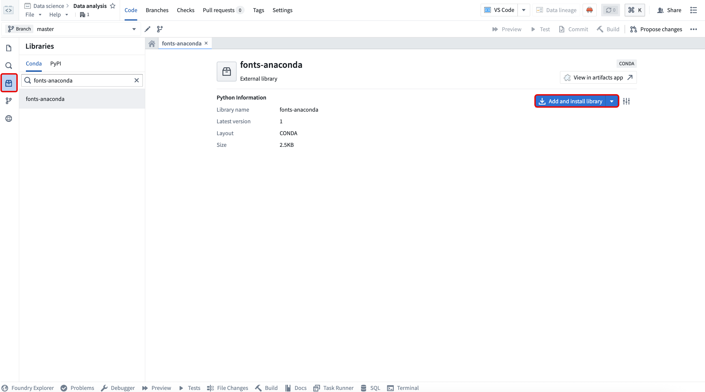
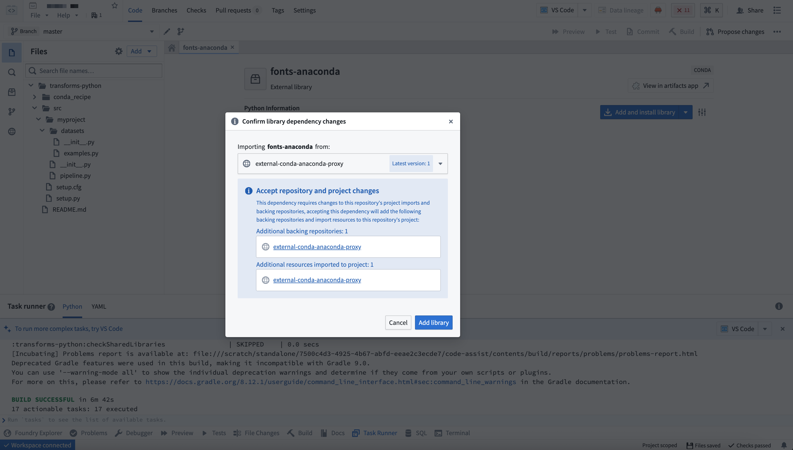
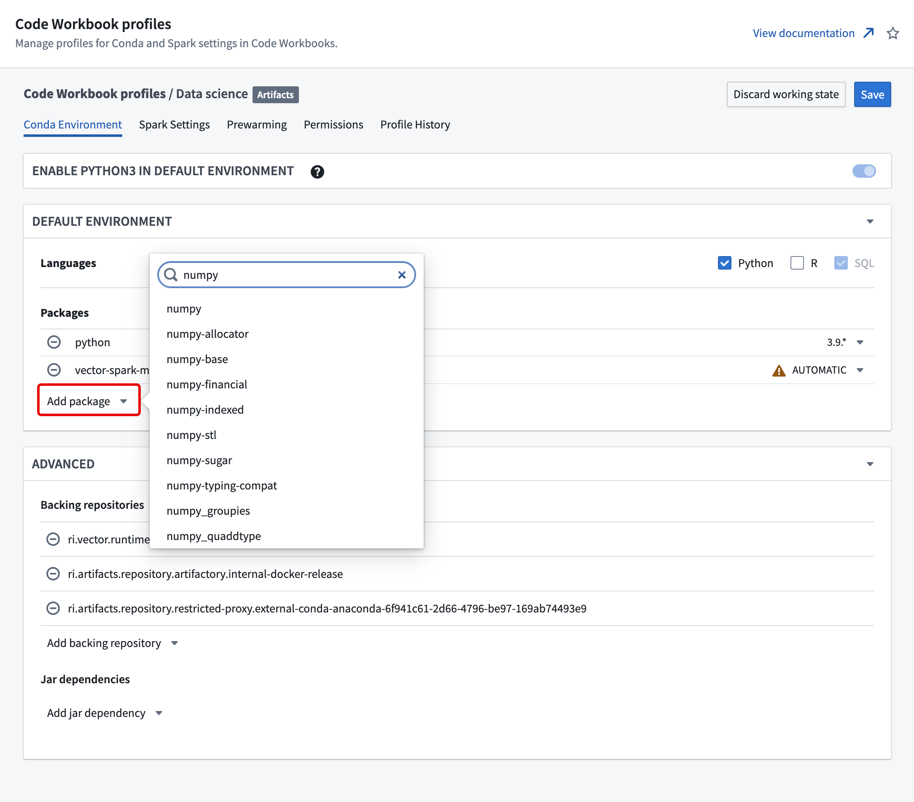

<!-- source: https://palantir.com/docs/foundry/code-repositories/anaconda/ · mirrored 2026-08-16 from Palantir Foundry docs -->

# Use Anaconda in Foundry

You can use Anaconda's comprehensive Conda packages directly through Code Repositories and Code Workbooks, enabling access to enterprise-grade data science capabilities that streamline workflows and accelerate analytics and AI development.

:::callout{theme="warning"}
Anaconda access is generally available across Foundry enrollments with no license cost through June 29, 2027. After that date, workflows, builds, and pipelines using Anaconda require a separate customer-procured license. All use of Anaconda's core offerings in Foundry must comply with their [Embedded End User License Agreement ↗](https://www.anaconda.com/legal/terms/embedded). Palantir shares the following usage information with Anaconda:

* The number of Foundry enrollments where Anaconda is in use.
* The Foundry deployment type, such as on-premises or cloud.
   

Contact Palantir Support with any questions about the availability or licensing of Anaconda on your enrollment.
:::

By accessing Conda packages in Code Repositories or Code Workbooks, you can:

* Use Anaconda's secure enterprise-maintained package collection without leaving Foundry.
* Build sophisticated AI, ML, and analytics applications with trusted, security-vetted libraries.
* Leverage specialized data science tooling within Foundry's governed environment.

## Getting started

In Code Repositories, Conda packages from Anaconda repositories are available in the **Libraries** side panel. Search for and select the package before choosing **Add and install library**.

Foundry automatically configures the necessary backing repository.

In Code Workbooks, navigate to the Conda environment tab in your workbook profile and select **Add package** to search for and add Anaconda packages.

Test the Conda environment within your workbook *before* saving profile changes to ensure dependencies resolve correctly. When you save changes to the Conda environment, Foundry prompts you to acknowledge that you have tested the configuration.
