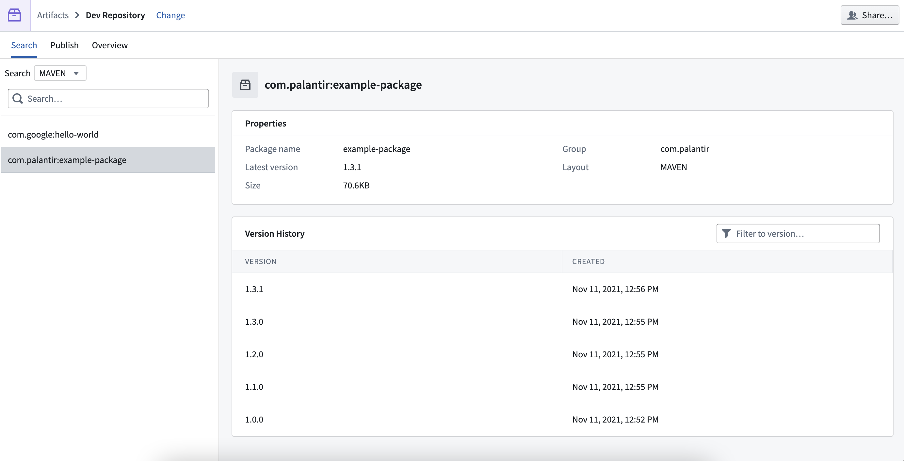
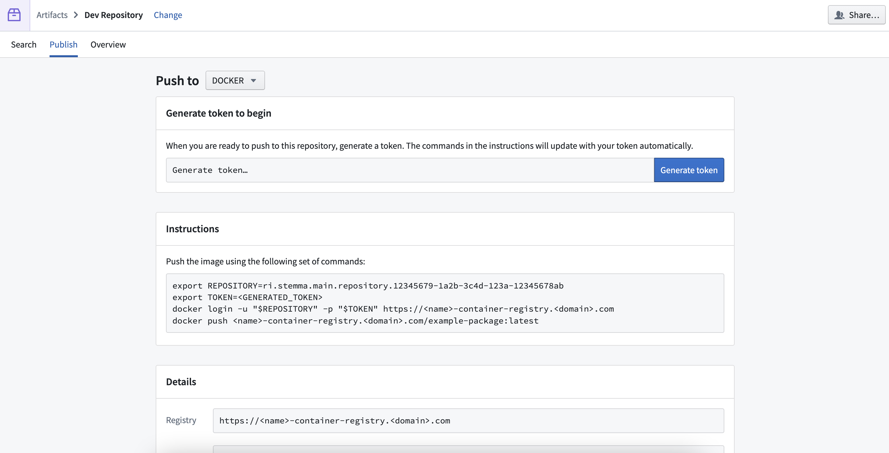
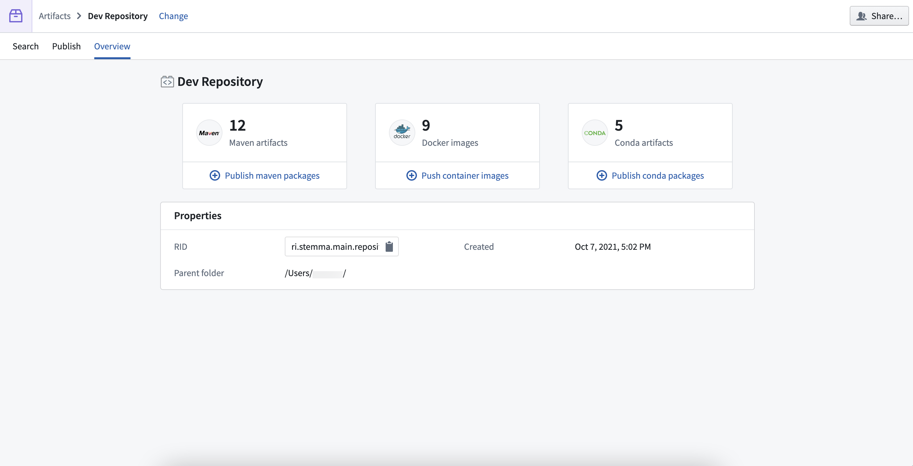

<!-- source: https://palantir.com/docs/foundry/code-repositories/artifact-repositories-nav/ · mirrored 2026-08-14 from Palantir Foundry docs -->

# Navigation

Before working with Artifacts, we recommend familiarizing yourself with the Artifact Repository interface.

There are three tabs at the top of the Artifact Repositories interface:

* Search
* Publish
* Overview

## Search

Search for Artifacts in your Artifact repository using the dropdown menu and search bar. Select a search result to view metadata such as version history, size, and creation date.

## Publish

[Publish Artifacts](/docs/foundry/code-repositories/publish-artifact/) to your Artifact repository by generating a token and following step-by-step instructions in the **Instructions** section of the page.

## Overview

View a summary of all the Artifacts in your Artifact repository, including metadata like its resource ID (RID), creation date, and parent folder in your filesystem.
