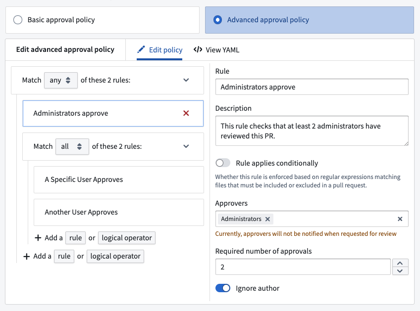
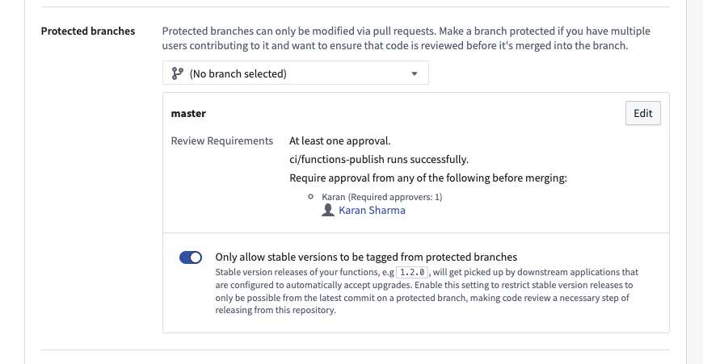

<!-- source: https://palantir.com/docs/foundry/code-repositories/branch-settings/ · mirrored 2026-08-14 from Palantir Foundry docs -->

# Branch settings

This page will walk you through the various branch settings in Code Repositories:

* [Setting the default branch](#default-branch)
* [Selecting pull-request merge modes](#merge-modes)
* [Protecting branches](#protected-branches)
* [Configuring branch fallbacks](#fallback-branches)

## Default branch

In Code Repositories with more than one branch, a default branch can be configured as the base branch. By default, all pull requests and commits will be made against that branch unless chosen otherwise. Usually, the default branch is the `master` branch.

You can choose the main branch of your Code Repository by navigating to `Settings > Branches > Default branch`.

## Merge modes

There are several strategies to merge code changes proposed in a pull request. In the Settings tab you can select one or more merge-modes to be available to code authors in the pull request page.

* **Squash and merge** - Squash-and-merge mode will create a single commit to the target branch incorporating all the changes that the pull request introduces. This will result in a more condensed commit-history on the default branch.
* **Merge** - When you use *Merge* in a pull request, all the individual commits created on the branch will be added to the target branch alongside a merge-commit. Note that in the target branch commit history, all the individual commits will appear with their original timestamp, signaling the time they were created on the development branch.
* **Merge with fast-forward** - When there is a direct path from the target branch to your branch (there are no additional changes on the target branch), merge-with-fast-forward advances the target branch to the front of the development branch and combines their commit history.

All the selected merge modes will appear as options in the pull request page. If “Squash-and-merge” mode is selected, it will appear as the main option, with the other selected modes available in a menu.

## Protected branches

When there are multiple authors contributing to the same code repository, or when the repository backs critical data assets, you can protect your branch to achieve a greater level of governance and defense against unintentional changes. A protected branch can only be modified via a pull request and must satisfy a pre-defined set of requirements.

:::callout{theme="neutral"}
By default, only the Code Repository’s owners can change the branch protection settings, while both Owners and Editors can merge pull requests to protected branches. Regardless of permissions, all code authors need to abide to the protected branch policy.
:::

You can set the following requirements in the branch settings panel:

* [Require ci/foundry-publish to run successfully](#require-cifoundry-publish-to-run-successfully)
* [Require code reviews](#require-code-reviews)
* [Require specific reviewers](#require-specific-reviewers)
* [Require security approval](#require-security-approval)
* [Restrict stable version tags (Functions repositories only)](#restrict-stable-version-tags)

### Require ci/foundry-publish to run successfully

In order to publish changes to your data, the continuous integration process `ci/foundry-publish` must run and finish successfully. There are no guarantees that changes will take effect if you merge changes before it finishes successfully so it is highly recommended to make this a requirement for your protected branch.

### Require code reviews

One benefit of protecting critical branches is the ability to receive a collaborator’s review on code changes before merging them to a production environment. Anyone with permissions to merge changes can submit a review on a pull request (by default: Owners and Editors of a repository).

You can enforce the following review policies:

* **Require no rejections before merging** - This will block the pull request from merging if at least one of the reviewers rejected the code changes.
* **Require at least one approval before merging** - This will ensure the code is reviewed and approved before changes are merged.

### Require specific reviewers

You can require approval from a specific user or group before pull requests can be merged. To satisfy the Group requirement, at least one member of the group needs to approve the pull request. Note that on its own, this policy allows rejections as long as an approval was received. For example, if one member of a group rejected the changes and another member approved, the approval will supersede the rejection unless "Require no rejections" policy applies.

:::callout{theme="warning" title="Warning"}
Requiring users/groups approval does **not** give them permission to review the pull request. Always assure that required reviewers also have access to the Code Repository.
:::

### Configure advanced approval policies

Advanced pull request approval policies determine the users and groups required for review based on the files modified in a pull request. In the branch settings of a protected branch, select **Edit**, then **Advanced approval policy** to start configuring a policy.

The **Edit policy** tab provides a form-based editor. The advanced approval policy groups logical operators of a rule, such as `ALL` or `ANY`. Select a rule to provide metadata, such as the name or description of the rule. Toggle on **Rule applies conditionally** to only apply this rule if the files modified in a pull request match some regular expression. For example, in the typical folder structure for a Python transform, `["transforms-python/src/myproject/datasets/.*\\.py"]` will match all Python files within the datasets folder.

Within the **View YAML** tab, you can directly modify, copy, and paste the YAML representation of the policy. This can be useful for making bulk edits to a policy, such as finding and replacing a search term.

### Require security approval

To stop propagating [security Markings](/docs/foundry/security/markings/) on a branch, the branch must be protected. Once security changes are enabled on a repository, it will automatically and immutably require security checks and approval (if necessary) before merging a pull request. Read more about [removing inherited Markings](/docs/foundry/building-pipelines/remove-inherited-markings/).

### Restrict stable version tags

In Functions repositories, you can enforce restrictions on the release of stable versions of your Functions. Once at least one protected branch has been configured for the repository, an additional toggle will be available to **Only allow stable versions to be tagged from protected branches**.

If **Only allow stable versions to be tagged from protected branches** is enabled, tagging from feature branches (non-protected branches) of the repository will block users from being able to submit a stable Semantic Version string. For example, `1.2.3` is a stable Semantic Version, whereas `1.2.3-rc1` denotes a prerelease version that will be allowed from feature branches.

Applications that invoke your Functions may be configured to reference a *version range*; for example, a Workshop module might call a Function `foo` at versions `>=1.2.3 <2.0.0`, so if you release version `1.3.0`, the Workshop module will now invoke this version (`1.3.0`).

To prevent unexpected behavior from new versions, we recommend that code changes go through review and testing before they are released in a new stable version. The **Only allow stable versions to be tagged from protected branches** toggle ensures that all changes must be reviewed before being released in a stable version, since changes must go through code review before they can merge into a protected branch.

Since version ranges ignore prerelease versions, you can publish a prerelease version like `1.3.0-test` to prevent downstream applications from invoking the new release. Enabling the **Only allow stable versions to be tagged from protected branches** toggle allows prerelease versions to be released from feature branches, so that versions can be tested in downstream applications without causing issues in production.

## Unprotect branches

Owners can unprotect branches from Code Repository settings. However, branches with active security changes, like [stopped propagation of markings](/docs/foundry/building-pipelines/remove-inherited-markings/#remove-inherited-markings-and-organizations), cannot be unprotected until the branch is free of security changes. To unprotect a branch with active security changes, the changes should be removed through a pull request. The branch can then be unprotected from Code Repository settings.

## Fallback branches

Code Repositories allow you to build datasets on any branch and view the affect your transforms have on the data. If an input dataset to your transform has not been built on the current branch, an attempt will be made to locate a built version from a list of fallback branches instead. The default branch will automatically be set as the fallback branch unless configured otherwise. You can set different fallback branches to each branch and have more than one fallback if needed.

:::callout{theme="neutral"}
This configuration only applies to builds and actions taken in the Code Repository on which it is set. It has no effect on other Foundry applications or builds triggered outside of the repository (for example, using a scheduled build).
:::

You can also configure a [Pipeline Builder](/docs/foundry/pipeline-builder/branches-overview/) branch with the same name as a Code Repositories branch so that Pipeline Builder transforms read input datasets from that matching branch. Pipeline Builder supports [fallback branch configuration](/docs/foundry/pipeline-builder/branches-fallback-branches/) as well, allowing you to control which branch is used when an input dataset has not been built on the current branch.
