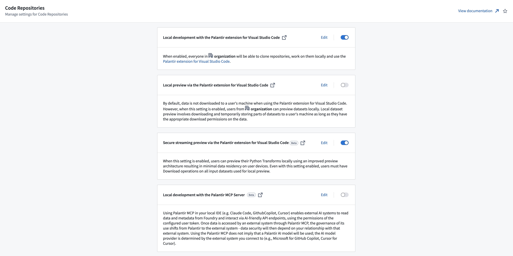

<!-- source: https://palantir.com/docs/foundry/code-repositories/configure-repositories-in-control-panel/ · mirrored 2026-08-14 from Palantir Foundry docs -->

# Configure Code Repositories settings in Control Panel

You can configure many Organization-wide Code Repositories settings within [Control Panel](/docs/foundry/administration/control-panel/). To modify these settings, you will need the `User Experience Administrator` [role](/docs/foundry/security/projects-and-roles/#roles).

## Available settings

* **Local development with the Palantir extension for Visual Studio Code:** When enabled, users from your organization will be able to clone code repositories and work on them locally using the [Palantir extension for VS Code](/docs/foundry/palantir-extension-for-visual-studio-code/overview/). This setting is enabled by default.
* **Local preview through the Palantir extension for Visual Studio Code:** When this setting is enabled, users from your organization can preview datasets locally. Local dataset preview involves downloading and temporarily storing parts of datasets to a user's machine. This setting is disabled by default. This setting is deprecated and is superseded by secure streaming preview via the Palantir extension for Visual Studio Code.
* **Secure streaming preview via the Palantir extension for Visual Studio Code:** When this setting is enabled, users from your organization can preview datasets locally using the [secure streaming](/docs/foundry/palantir-extension-for-visual-studio-code/security-considerations/#data-lifecycle-during-local-preview) preview implementation. Local dataset preview involves streaming parts of datasets to the system memory of a user's machine. This setting is enabled by default. This setting does not yet take effect and it will become effective after a platform intervention.
* **Local development with the Palantir MCP Server:** Using Palantir MCP in your local IDE, such as Claude Code, GitHub Copilot, or Cursor, enables external AI systems to read data and metadata from Foundry and interact via AI-friendly API endpoints, using the permissions of the configured user token. Once data is accessed by an external system through Palantir MCP, the governance of its use shifts from Palantir to the external system. Data security will depend on your relationship with that external system. Using the Palantir MCP does not imply that a Palantir AI model will be used; the AI model provider is determined by the external system you connect to (for example, Microsoft for GitHub Copilot, Cursor for Cursor).

:::callout{theme="warning"}
To preview locally, users must be allowed to do so through the above local preview settings and have `Download` operations on the previewed inputs. These are privileged operations that allow users to download entire datasets locally, and should be granted with caution. In cases where users cannot be granted this permission, the VS Code developer experience is still available through [Code Workspaces](/docs/foundry/vs-code/overview/), which guarantees stricter data control. For more details, see the [security considerations](/docs/foundry/palantir-extension-for-visual-studio-code/security-considerations/) for local preview.
:::

You can learn more about local development, [previewing and debugging Python transforms](/docs/foundry/transforms-common/local-preview/), and using the [Palantir extension](/docs/foundry/palantir-extension-for-visual-studio-code/overview/) in our documentation.
