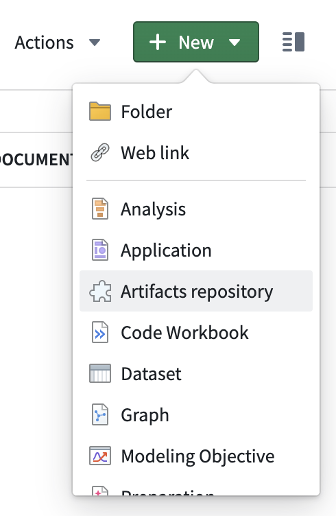

<!-- source: https://palantir.com/docs/foundry/code-repositories/create-artifact-repository/ · mirrored 2026-08-14 from Palantir Foundry docs -->

# Create an Artifact repository

Before you can begin publishing and managing Artifacts, you need to create an Artifact repository that you will use to store them.

To create an Artifact repository, first navigate to a Project where you would like the Artifact repository to be saved.

Then, select **New** and choose **Artifact Repository**.

After creating your Artifact repository, start [publishing Artifacts](/docs/foundry/code-repositories/publish-artifact/).
