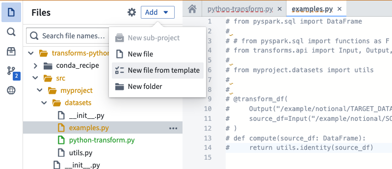
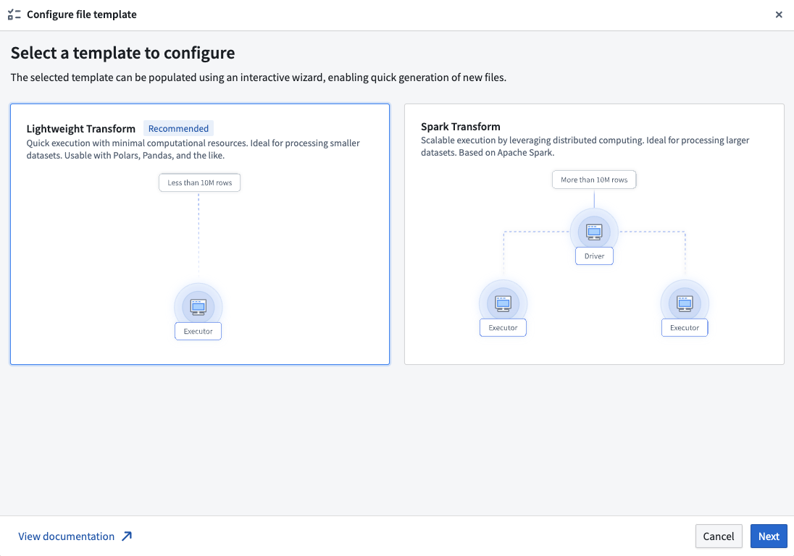
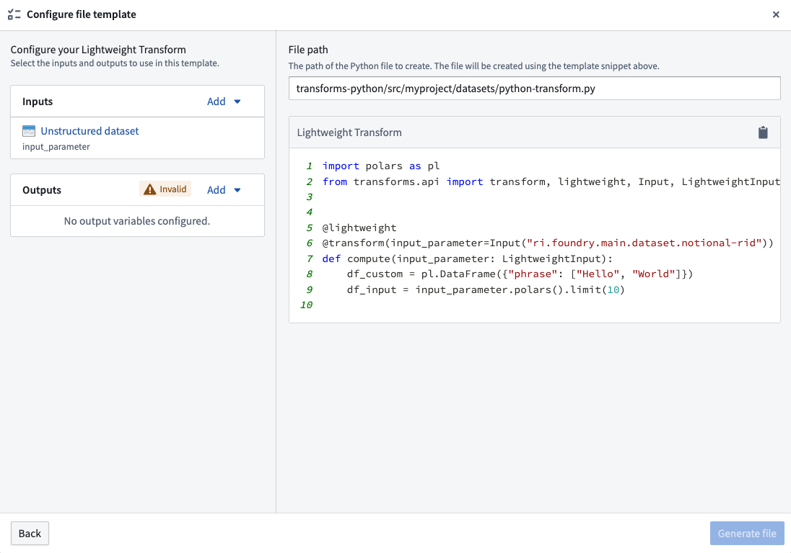

<!-- source: https://palantir.com/docs/foundry/code-repositories/create-transforms/ · mirrored 2026-08-14 from Palantir Foundry docs -->

# Create transforms

Transforms can be created in Code Repositories using the file template configuration wizard. This wizard enables you to select a transform type and then bootstrap a minimal example by providing values for the variables required by the transform, such as input or output datasets.

To get started using the wizard, create new Python transforms repository. The wizard will be automatically opened. In existing repositories, the wizard can be opened by selecting **Add** and then **New file from template** in the Files side panel.

After opening the wizard, you will be prompted to select a template. Each template represents a transform type. Illustrations and descriptions are provided to help contrast the different options and identify the correct choice for your use-case. Available templates include:

* **Lightweight transforms:** Generally recommended for transforms that operate on datasets of less than 10 million rows.
* **Spark transforms:** Leverage distributed computing to enable better performance for transforms on datasets of more than 10 million rows.

After choosing a template, select **Next** to open the template configuration page. Here, you can configure your template by supplying the required values and selecting resources from across Foundry. This page displays a live preview of your transform based on the current configuration; modifying any input or output variables will update the preview. Your configuration is automatically validated at this stage, and any errors must be addressed before the transform can be created.

Common validation errors include:

* **Using resources from different projects:** Input and output resources must be contained within the same project as the repository.
* **Duplicate parameter names:** All parameter names in your transform must be unique.
* **Not providing required parameters:** Some templates require at least one input or output variable. Provide a valid variable value to resolve this error.

Once your configuration is valid, you will be able to create your transform by selecting **Generate file**. This will create a new file in your repository with the contents shown in the preview of the configuration page. If the template requires specific backing dependencies or libraries, these will be automatically configured so that your transform runs correctly.
