<!-- source: https://palantir.com/docs/foundry/code-repositories/debug-transforms/ · mirrored 2026-08-14 from Palantir Foundry docs -->

# Debug transforms

Use the debugger tool in Code Repositories to examine your data transformation behavior while it runs. Set breakpoints to pause the execution of the transform in order to examine variables, view dataframes, and understand functions and libraries.

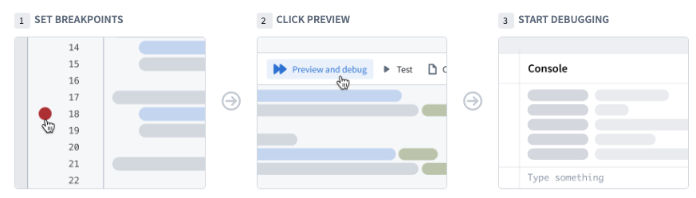

:::callout
The debugger is only available for [Python](/docs/foundry/transforms-python/debugging/).
:::

## Setting breakpoints

To use the debugger, you need to set *breakpoints*. Breakpoints signal to the debugger the points where it should pause the execution of the code and allow you to interact with variables and dataframes.

You can set a breakpoint by clicking on the faded red dot in the margins of each line of code. The debugger suspends the execution **before** the marked line runs. You can set multiple breakpoints across several files if needed.

:::callout{theme="neutral"}
The console functionality might be limited when using internal library breakpoints. In these cases the breakpoint is colored in grey and the debugger offers to either ignore the breakpoint or use limited console functionality.
:::

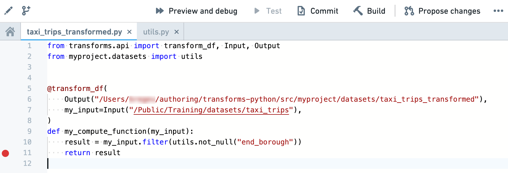

## Running the debugger

After adding breakpoints in your code, click on **Preview and debug** in the code editor actions bar. The debugger panel opens and pauses on the first breakpoint it encounters. The left bar of the debugger allows you to navigate the code, remove breakpoints, and finish/stop the debugging session.

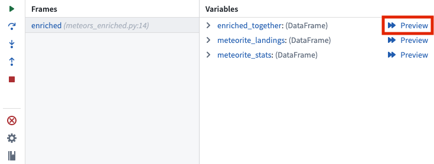

You can enable the ability to navigate internal libraries. Locate the **Internal libraries debugging is disabled** section, and select **Enable internal libraries debugging**.

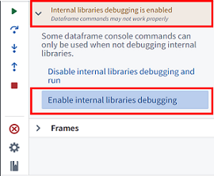

As you navigate in the code, the editor highlights the line of code to be executed next. Use the following buttons to advance the debugger:

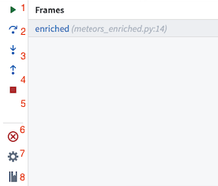

1. **Resume execution:** Continue execution until completion or until paused by the next breakpoint.
2. **Step over:** Execute the line of code without stepping into internal functions.
3. **Step into:** Navigate into internal functions if they exist in that line of code.
4. **Step out:** Navigate out of an internal function and advance the debugger.
5. **Stop execution:** Stop the debugger completely.
6. **Remove breakpoints:** Remove all breakpoints from the repository and run the preview without pausing the execution.
7. **Settings:** Toggle the debugger on/off (without clearing the breakpoints).
8. **Documentation:** Open the documentation for additional details.

## Previewing dataframes

When running the debugger, you can also preview an intermediate dataframe at each breakpoint. To do this, select **Preview** in the variables view:

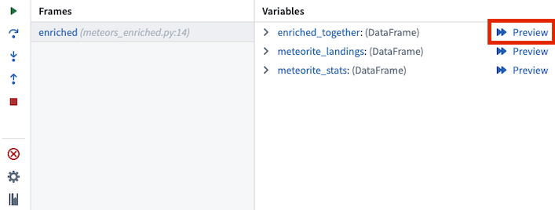

Selecting **Preview** will open a debugger preview panel for the selected dataframe:

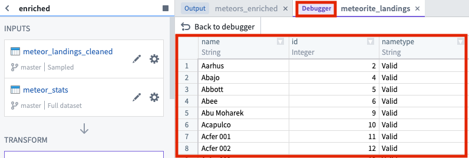

To return to the debugger, select **Back to debugger**:

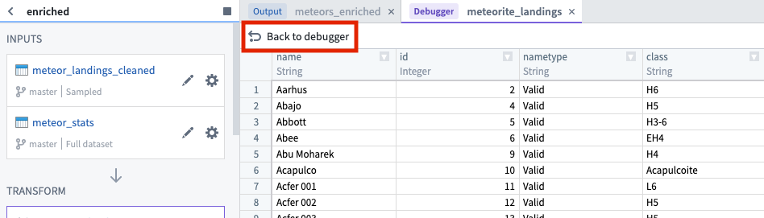

## Examining variables

While the debugger is running you can examine the variables and data at the exact point of code execution.

### Frames

Frames represent the functions in which the debugger is active or breakpoints exist. Each frame indicates the name of the function followed by the name of the file and the line number in which the function is written.

Select a frame to examine the variables within that frame and run console commands against it.

### Variables

The *variables* section shows the values stored in both local and global variables while the transform is executed.

:::callout{theme="neutral"}
Dataframe values are based on the preview sample and may not represent the full dataset. Use them to understand and debug your code but not as an indication for the transform output.
:::

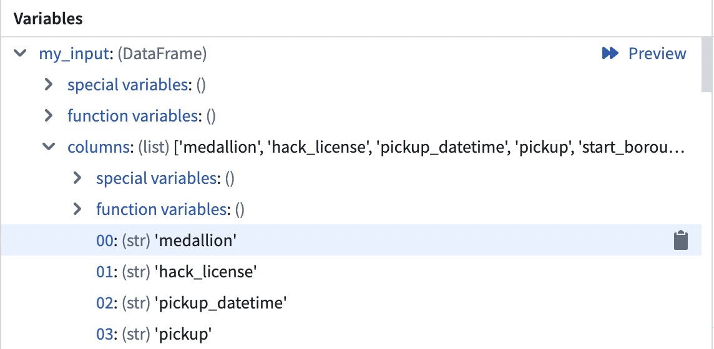

### Console

The console allows you to interact with your data using PySpark commands while running the debugger. There are two commonly used patterns in the console:

* Running commands against dataframes and variables directly in the command line at the bottom of the console tab while initiating commands with the Enter or Return key.
* Calling the `print` function in the transform code to send indicative information to the console.

:::callout{theme="neutral"}
Notice that the console runs against the selected frame. Trying to execute commands on variables local to a different frame will result in a NameError.
:::

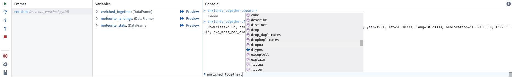

## Configuring the debugger

Toggle the debugger functionality on and off by navigating to the debugger tab and clicking on the settings cog. Turn the debugger off if you want to run previews without stopping on breakpoints.

:::callout{theme="neutral"}
While the debugger configuration applies to the entire repository, there might be languages in the repository that are not supported by it. If a language is not supported by the debugger, previews will continue to function normally regardless of the debugger setting.
:::

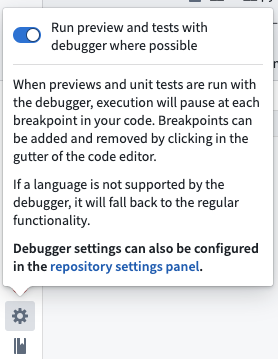

You can also configure the debugger in the **Settings** tab under **Preferences** > **Debugger**.

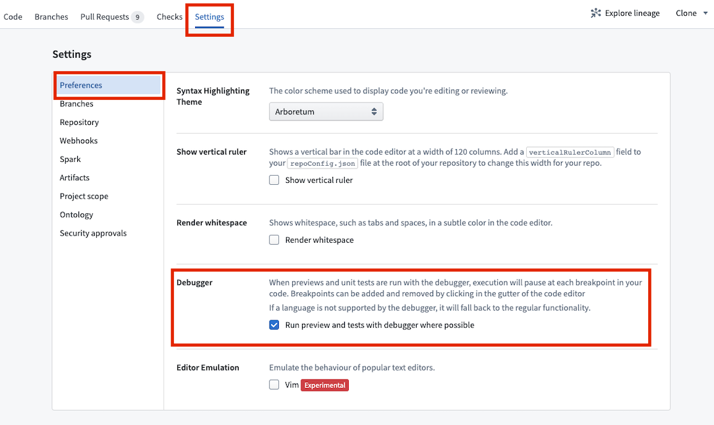
