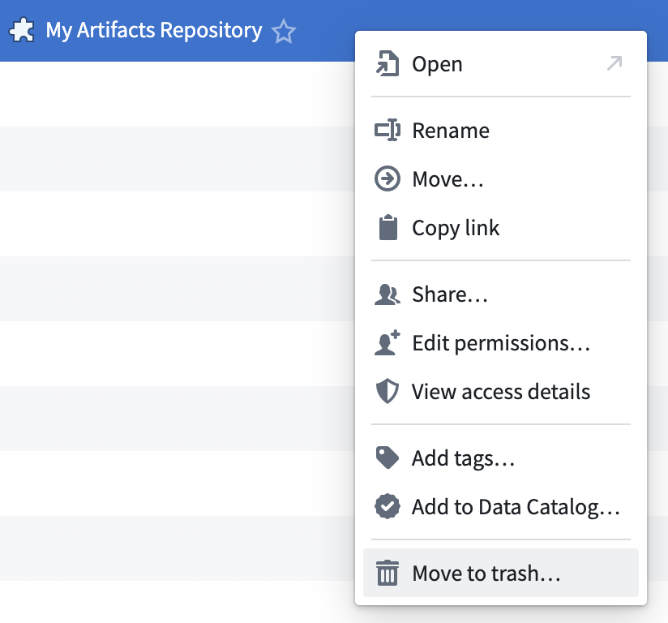
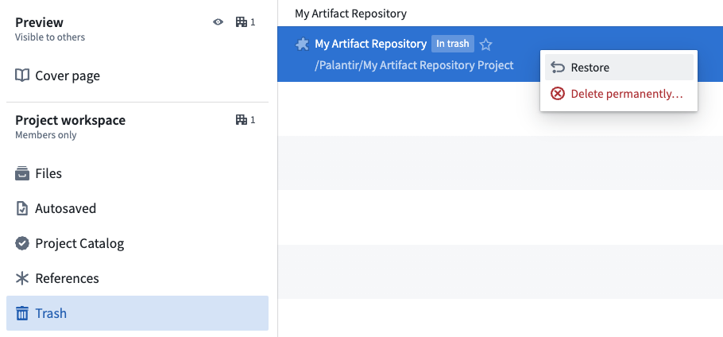

<!-- source: https://palantir.com/docs/foundry/code-repositories/delete-artifact-repository/ · mirrored 2026-08-14 from Palantir Foundry docs -->

# Delete an Artifact repository

:::callout{theme="danger"}
Deleting an Artifact repository will remove all Artifacts contained within the Artifact repository. This is considered a breaking change and all consumers of the deleted Artifacts will be impacted. Take care when deleting Artifact repositories.
:::

To delete an Artifact Repository, first navigate to the Project that contains the Artifact Repository. Then, right-click on the Artifact Repository and choose **Move to trash**.

To permanently delete an Artifact Repository, navigate to the **Trash** tab within the Project. Right-click on the Artifact Repository and select **Delete permanently**. This action cannot be undone.

It may be possible to restore an Artifact Repository. First, navigate to the **Trash** tab within the Project. Then, right-click on the Artifact Repository and select **Restore**. If you do not see the **Trash** tab, be sure you are in the Project overview rather than a folder within the Project.

Learn more about [deleting and restoring files in Foundry](/docs/foundry/compass/use-project-navigation-panel/#trash).
