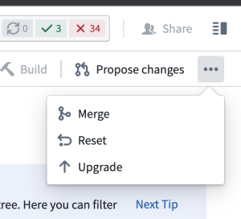

<!-- source: https://palantir.com/docs/foundry/code-repositories/faq/ · mirrored 2026-08-14 from Palantir Foundry docs -->

# Code Repositories FAQ

The following are some frequently asked questions about Code Repositories.

For general information, view the [Code Repositories documentation](/docs/foundry/code-repositories/overview/).

* [Can I publish a Python package from the latest commit on a branch without requiring tagging?](#can-i-publish-a-python-package-from-the-latest-commit-on-a-branch-without-requiring-tagging)
* [How do I restore previously deleted code in my code repository?](#how-do-i-restore-previously-deleted-code-in-my-code-repository)
* [Can I duplicate my code repository?](#can-i-duplicate-my-code-repository)
* [How do I know if I need to upgrade my branch?](#how-do-i-know-if-i-need-to-upgrade-my-branch)
* [Can my transform dynamically select inputs and outputs whenever a build starts?](#can-my-transform-dynamically-select-inputs-and-outputs-whenever-a-build-starts)
* [In Code Preview, code works but builds fail](#in-code-preview-code-works-but-builds-fail)
* [Code running in Code Workbook but not in Code Repositories](#code-running-in-code-workbook-but-not-in-code-repositories)
* [Checks are failing due to a missing Python library, in a code repository where that library was previously working](#checks-are-failing-due-to-a-missing-python-library-in-a-code-repository-where-that-library-was-previously-working)

***

## Can I publish a Python package from the latest commit on a branch without requiring tagging?

Yes. You can publish the latest commit of a Python package by modifying your package's root `build.gradle` file to publish the branch. For example, to publish the latest commit on the master branch, modify the `build.gradle` file as follows:

```python
condaLibraryPublish.onlyIf { versionDetails().branchName == "master" }
```

[Return to top](#code-repositories-faq)

***

## How do I restore previously deleted code in my code repository?

If these transforms were built into a dataset, you can use the **Compare** feature of the resulting Dataset Preview to view the code at that time. From there, you can copy-paste the relevant transforms. Alternatively, you can navigate to **Branches** in your code repository, open the specific branch, and review the full history of changes there.

[Return to top](#code-repositories-faq)

***

## Can I duplicate my code repository?

There is no built-in capability to copy code repositories in the platform. You can however, clone the repository to your machine and then push that code to a new code repository. If you do this, remember to add all the inputs as references to the new project. [Learn how to clone a repository](/docs/foundry/transforms-java/local-development/).

[Return to top](#code-repositories-faq)

***

## How do I know if I need to upgrade my branch?

You can confirm your code repository is up-to-date by selecting *...* in the top-right corner of the code repository and confirming whether **Upgrade** appears as an option. If the **Upgrade** option is not available, then the repository is already up-to-date.



[Return to top](#code-repositories-faq)

***

## Can my transform dynamically select inputs and outputs whenever a build starts?

This is not supported. Continuous integration (CI) checks define the set of inputs and outputs whenever a new commit is added in the code repository.

[Return to top](#code-repositories-faq)

***

## In Code Preview, code works but builds fail

Your Code Preview succeeds but your build fails. Code Previews run on a subset of data, which likely means there are data values not in the subset breaking your code when the full build runs.

To troubleshoot, perform the following steps:

1. Examine the build error from the failed build. Look for lines starting with “Caused by” and read them carefully. Sometimes they will mention explicit lines of code in your transformation file.
2. Try [upgrading your code repository](/docs/foundry/code-repositories/repository-upgrades/). To do this, in the top right corner of your repository, select **... > Upgrade**. This will create a PR to upgrade your branch. Be sure to merge in the upgrade PR so that your branch actually gets upgraded. You can upgrade any branch, but merging the upgrade commit into a protected branch requires a review and approval.

[Return to top](#code-repositories-faq)

***

## Code running in Code Workbook but not in Code Repositories

Sometimes, porting code from a code workbook to a code repository will not work without modifying the code to run in a code repository.

To troubleshoot, perform the following steps:

1. Have you verified your transform decorator is correct? That is, `@transform` vs. `@transform_df`?
2. Have you verified your inputs are all declared and passed as inputs to your compute function?
3. Are the names of your dataframes the same as your workbook?  Is your code repository actually returning the dataframe?
4. Check that the libraries being used in the code workbook code are also available in the code repository.
5. Verify the inputs and branches to the code workbook cell are in fact the same datasets used in the code repository.

Review our FAQ on [builds and checks errors](/docs/foundry/health-checks/builds-checks-faq/) for more detail.

[Return to top](#code-repositories-faq)

***

## Checks are failing due to a missing Python library, in a code repository where that library was previously working

Sometimes, a repository that has been working starts encountering a problem where repository checks begin failing with an error indicating that Conda packages could not be obtained. This may be a `PackageNotFoundError`, or a `MD5MismatchError` due to a Conda cache getting corrupted.

To troubleshoot, perform the following steps:

1. In most cases, the Conda cache can be unstuck by simply creating a new commit in your code repository. Open the repository and make any change (even just an empty new line), and press **Commit**.
2. If the symptoms still appear after performing a new line commit, it is possible that the Conda cache has made a higher-level cache also become corrupt. The following steps will clear your code repository's Gradle cache.
3. In your code repository, press the settings (cog wheel) icon, and enable **Hidden files**.
4. Locate `conda-versions.run.linux-64.lock` in your Python subproject, delete it, and press **Commit**.
5. If the symptoms still appear after clearing both of these caches, contact Palantir Support.

[Return to top](#code-repositories-faq)
