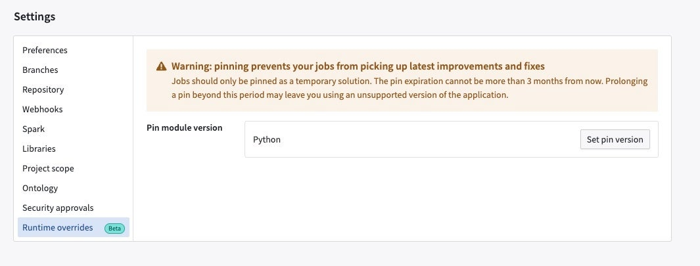
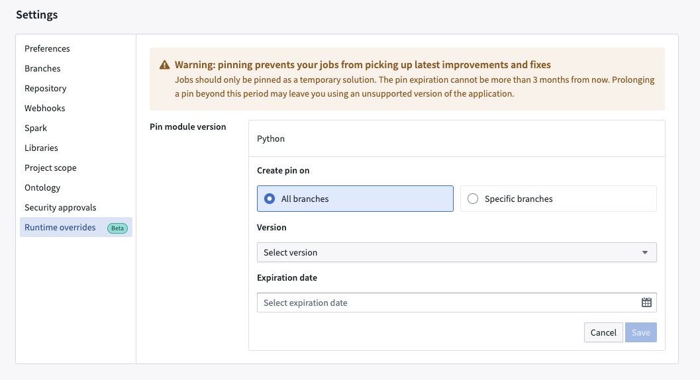
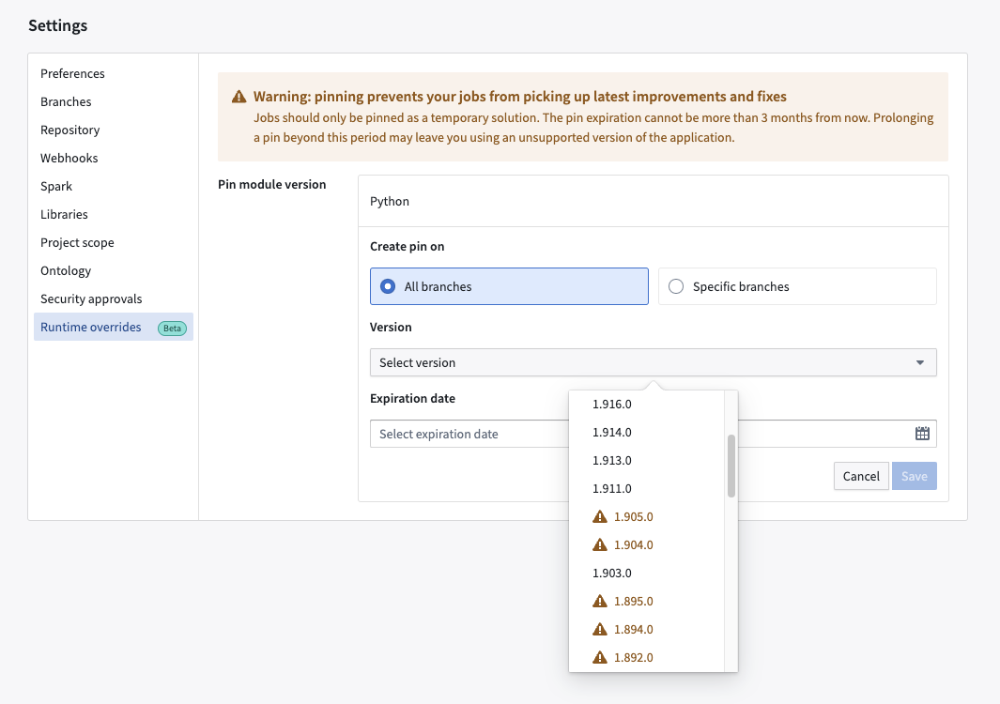
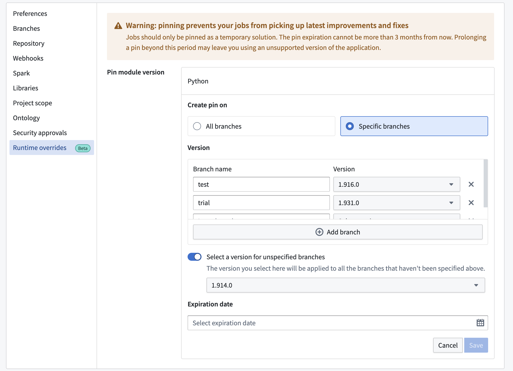
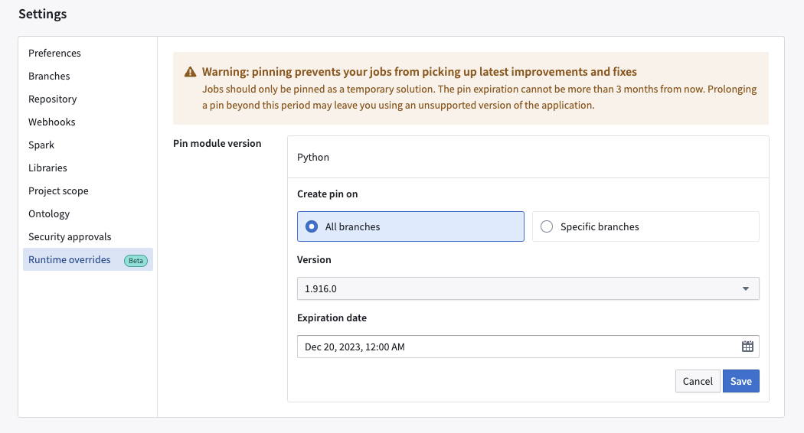
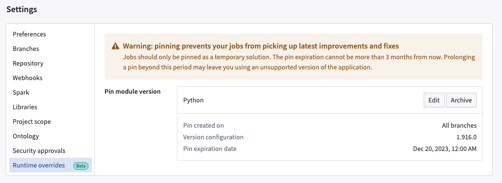
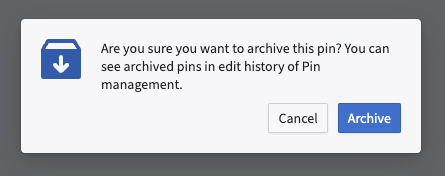
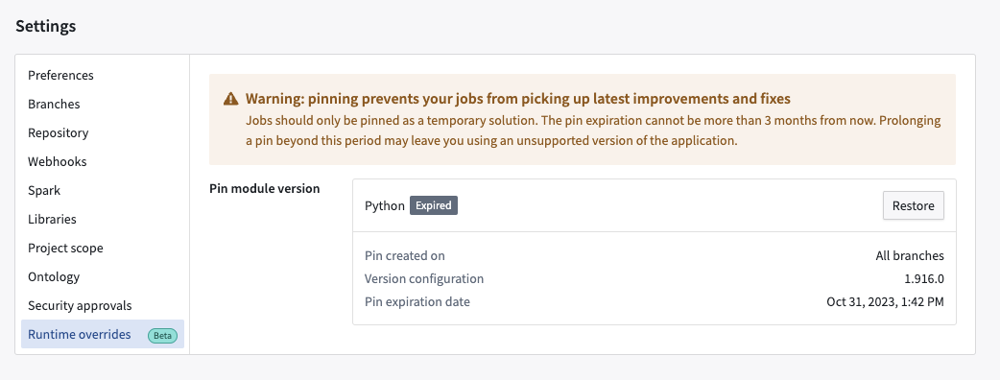
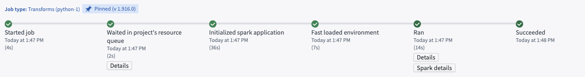

<!-- source: https://palantir.com/docs/foundry/code-repositories/module-pinning/ · mirrored 2026-08-14 from Palantir Foundry docs -->

# Pin Spark modules in-platform

Code Repositories allows you to pin a Spark module for a repository. This enforces the usage of a specific version of Spark. You can pin a Spark module for both new and existing builds.

:::Callout{theme="neutral"}
We recommend that you always use the newest version of Spark for the most up-to-date performance and security features. Pinning a Spark module should be a temporary measure.
:::

## How to pin a Spark module

Navigate to the **Settings** tab in Code Repositories, then select **Runtime overrides**.

### Create a pin

From the **Runtime overrides** tab, select **Set pin**.

You can create pins on all branches or on specific branches. You can select a Spark module version (for each module type available in the given repository) you want to pin and also specify an expiration date. The expiration date cannot be more than 90 days beyond the current date. The pin expires at the end of the 90-day period or the expiration date you specify, whichever is earlier. After the expiration date, your builds may fail.

#### Create a pin on all branches

First specify the Spark version you want to pin and the expiration date.

:::callout{theme="neutral"}
Unstable and non-recommended versions have a warning sign prefixed as we do not recommend using them unless absolutely necessary.
:::

When you are finished, select **Save** to set the pin.

#### Create a pin on specific branches

You can pin versions for each branch. You can also select versions for unspecified branches.

When you are finished, select **Save** to set the pin. In the below sample screenshot, we create a pin on all branches for version 1.916.0, which is set to expire on December 20, 2023 at 12:00 AM.

After setting the pin, you can view a confirmation that the pin was created.

## Edit existing pins

Selecting **Edit** lets you modify a pin. You can change the branch, version, and expiration date using the same workflow for creating a pin. Selecting **Archive** will remove the pin and add the `Expired` label to the pins you previously set.

You can select **Restore** to re-create the pins you archived.

## View your pin

On the **Build Preview > view details** page, you can view the version you pinned for the repository.

## Use pins to control transforms versions in Code Repositories CI

When running continuous integration (CI) for a build in Code Repositories, a version of the [transforms library](/docs/foundry/api-reference/transforms-python-library/api-overview/) is chosen based on the current version of the repository template. If a pin is applied, CI will instead use the pin's version of the library if it is higher than the minimum version declared by the template. Users can leverage pins for faster access to new versions of the API and new features for code assist and [local development](/docs/foundry/transforms-python/local-development/).

## FAQ

### 1. Why does the pin expire in 90 days? Why can I not use it for longer periods?

We recommend that you always use the newest version of Spark. Not doing so means that you may be missing out on performance and security fixes and improvements which may have adverse impact on your builds.

That said, we understand that there may be specific use-cases that make pinning necessary and therefore offering this functionality with the caveat that it should be used on a temporary basis. Prior to the expiration date, we recommend that you make changes required on your end to be compatible with the newest version of Spark.

### 2. Can I get notifications via the UI when my pin is about to expire?

This feature is in development.

### 3. Can I pin individual builds via the Job Tracker UI?

This feature is in development.

### 4. Do I have to upgrade or make changes on my side to use this feature?

No upgrades or actions are needed from your side.

### 5. Is this feature available for new builds, or can I apply it to existing builds?

You can use this feature for both new and existing builds.

### 6. What happens if my job is already pinned in cdconfig?

The in-platform pin will always take precedence.
