<!-- source: https://palantir.com/docs/foundry/code-repositories/navigation/ · mirrored 2026-08-14 from Palantir Foundry docs -->

# Navigation

There are five different tabs that you can select at the top of the Code Repositories interface:

1. [Code tab](#code-tab)
2. [Branches tab](#branches-tab)
3. [Pull requests tab](#pull-requests-tab)
4. [Checks tab](#checks-tab)
5. [Settings tab](#settings-tab)

## Code tab

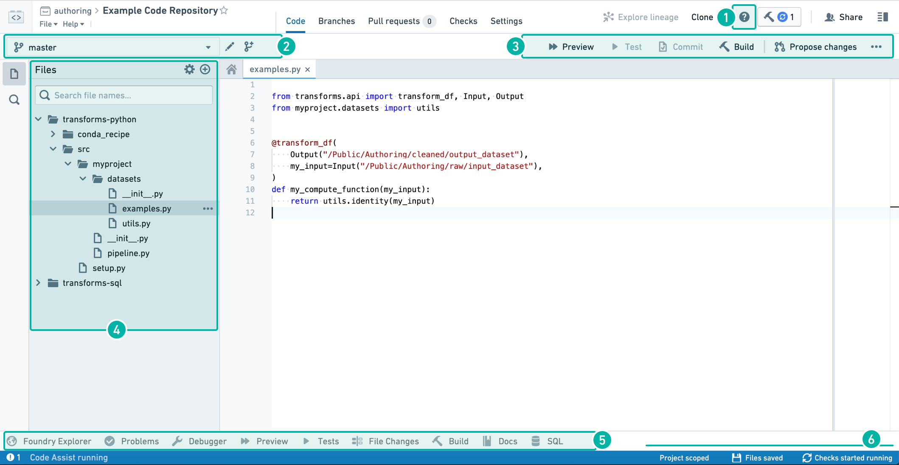

1. [In-App Help](#in-app-help)
2. [Branch Options](#branch-options)
3. [Code Editor Options](#code-editor-options)
4. [File Editor](#file-editor)
5. [Helper Panels](#helper-panels)
6. [Status bar](#status-bar)

### In-App help

In the **Code** tab, you can click the  button to start a step-by-step walkthrough that guides you through the core functionalities available in your Code Repository. The in-app help is currently only available in the **Code** view.

To expose keyboard shortcuts via the command palette, use the F1 key in Windows or Fn+F1 on macOS:

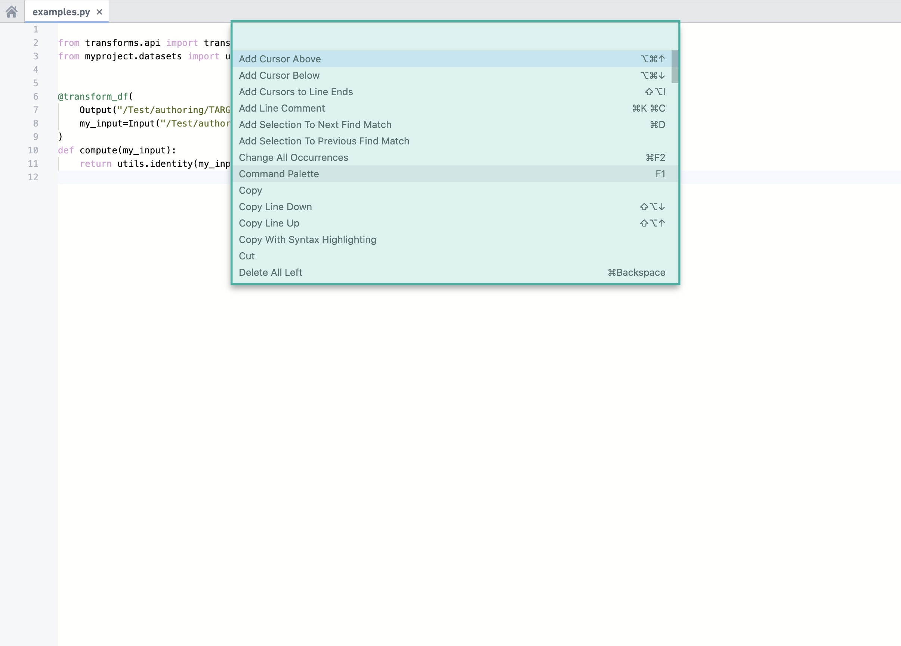

### Branch options

Use the dropdown branch menu to select one of your existing sandbox branches to work in. Alternatively, click the 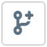 icon to create a new sandbox branch which contains a copy of the code on an existing branch. To edit code in your repository, you must work in a sandbox branch — protected branches cannot be directly edited.

You can choose between a **Code Repositories branch** and, for supported repository types, a **Global branch**. Global branches are supported in **Python Transforms** and **TypeScript v1** repositories, and can contain changes across multiple Palantir applications. [Learn more about global branches](/docs/foundry/global-branching/overview/).

Global branches must be based on the main branch of the repository, while Code Repositories branches can be based on any branch.

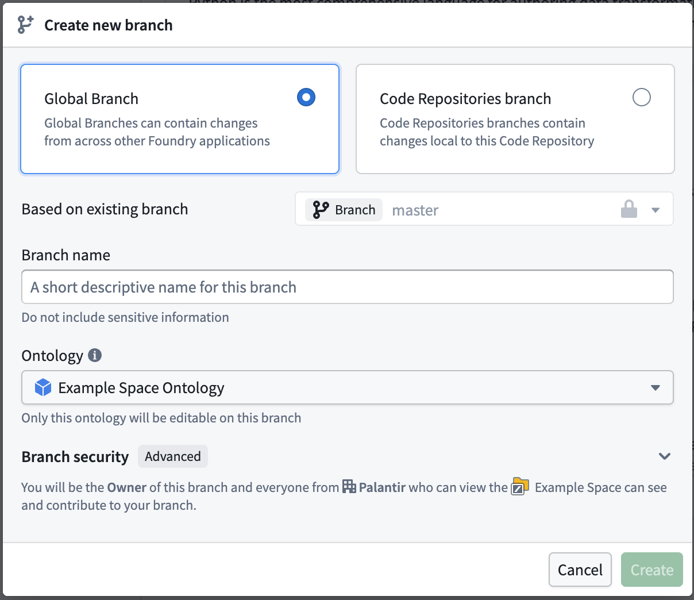

### Code editor options

As you write and edit code in your repository, you can do the following:

* Click the 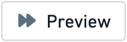 button to run the Transform on a sample of the input datasets. This is a quick way to preview your code changes on real data.
* Click the 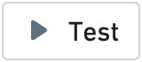 button to run all unit tests defined in the current file. See [Python Tests](/docs/foundry/transforms-python/unit-tests/) or [Java Tests](/docs/foundry/transforms-java/unit-tests/) for information about how to add unit tests to your repository.
* Click the 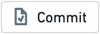 button to commit any changes in your sandbox branch. Once you commit changes, automatic checks run on your code.
* If you select a dataset source file (a file that defines a transformation, see e.g. [Python Transforms](/docs/foundry/transforms-python/transforms/)), you can click the 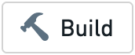 button to build a new version of your output dataset after running automatic checks on your code. Clicking the button will trigger a build on *all output datasets of the current file*; if the current file does not generate any datasets, no build is triggered.
* Click the 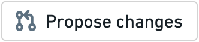 button to create a new *Pull request* containing your changes. This allows others to review and comment on your code before merging it into the main code.
* Click on the **...** button to access several additional actions:
  * **Merge:** Merge another branch into your current branch.
  * **Reset:** Reset the contents of all files to match the latest commit on your remote branch. This will clear any changes that have not yet been committed on your branch.
  * **Upgrade:** Upgrade your branch to the latest language versions.

### File editor

Click the  icon to create a new file, folder, or sub-project. Select the “New sub-project” option if you want to add another language-specific sub-project to your Code Repository.

### Helper panels

**Foundry Explorer Helper**

The **Foundry Explorer** helper is a file navigation interface that lets you quickly browse all files and folders. Once you select a specific dataset, you can click “Open” to view the full dataset.

**Problems Helper**

The **Problems** helper tells you about any issues detected in your code. Click on a specific issue listed here to open up the problematic code.

**Debugger Helper**

The **Debugger** allows you to examine your transform behavior while it runs (see [Debug Transforms](/docs/foundry/code-repositories/debug-transforms/)).

**Preview Helper**

The **Preview** helper lets you run your code on a limited sample of the input datasets to quickly preview the code without committing your changes (see [Preview Transforms](/docs/foundry/code-repositories/preview-transforms/)).

**Tests Helper**

When your repository contains unit tests (see [Python Tests](/docs/foundry/transforms-python/unit-tests/) and [Java Tests](/docs/foundry/transforms-java/unit-tests/)), the **Tests Helper** lets you run those tests and displays their results.

**File Changes Helper**

The **File Changes** helper can be used to view any uncommitted changes to the current file, as well as compare previous versions of the file.

**Build Helper**

The **Build** helper lets you trigger dataset builds and view the progress for your builds. Once you select a dataset source file, you can click the build button to build a new version of your output dataset as well as run automatic checks on your code. You can then view the progress of the running tasks in the **Build** helper.

:::callout{theme="neutral"}
Clicking the **Build** button at the top right corner of the Code Repositories interface is equivalent to triggering a build from the **Build** helper.
:::

**Docs Helper**

The **Docs** helper contains references for the available languages that you can write code in. For more detailed language-specific documentation that isn’t available in the in-product documentation, refer to the [supported languages](/docs/foundry/building-pipelines/supported-languages/).

**SQL Scratchpad**

The **SQL** helper lets you quickly test out SQL queries. Write a SQL query and click  to preview the results of your query. You can also test out an existing query you’ve written in your repository by selecting the appropriate `.sql` file and clicking .

To view queries marked as favorites, go to the  tab. To view a history of queries ran in the **SQL** helper, go to the  tab.

:::callout{theme="neutral"}
To access a specific branch of an input dataset in SQL Scratchpad, you prepend the name of the branch to the query: e.g. `` SELECT * FROM `branch_A`.`/path/to/dataset` ``. If no branch is specified it will default to `master`.
:::

### Status bar

The status bar provides information on the state of the environment and checks results. Information you can find in the status bar includes:

* **Code Assist state** - Code Assist is essential for detecting problems in your code and running previews. You can write code without Code Assist, but will need it to be up and running to complete your work. Hover over the Code Assist status you can get details on the initialization progress. If Code Assist fails to initialize, raise a support request.
* **Problems** - When problems are detected in your code, an indication appears on the left side of the status bar. Click on the indication to open the Problems helper.
* **Checks status** - The checks status is displayed on the right side of the status bar. More details of checks are in the [Checks tab](#checks-tab).
* **File saving** - After any change, the file saving status displays when the automatic save progress.

## Branches tab

:::callout{theme="neutral"}
This section summarizes how to create new branches and create new Pull requests in the **Branches** tab. These functionalities are also available in the [Code tab](#code-tab).
:::

In the **Branches** tab, you can see a list of branches existing in your Code Repository — this includes your own branches as well as other users’ branches. Click the  button to create a new sandbox branch which contains a copy of the code on a specific branch.

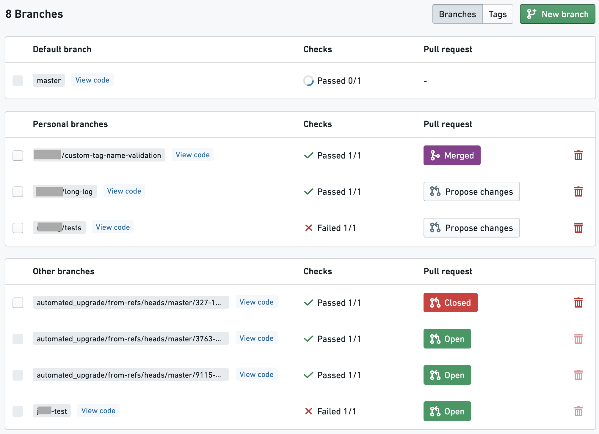

Each listed branch contains a summary with the following available functionalities:

* The “Checks” column indicates whether or not the automatic code checks have passed for a branch.
* The “Pull request” column tells you about any existing *Pull requests* in a branch and lets you create new *Pull requests*.
  To create a new *Pull request* that contains the changes on a branch, click the “Propose changes” button. This will create a new *Pull request* for merging your changes into the *master* branch by default. If you want to merge your changes into a branch other than *master*, select a different branch from the dropdown menu.
  If you don’t see the button to create a new *Pull request*, it means that a *Pull request* already exists for a branch. Click on the “Open” / “Closed” / “Merged” button to open the full *Pull request*.
* Click “View code” next to a branch name to view the code on that branch.
* To delete a branch, click the  icon. **You should not delete any branches that you did not create. This can result in lost work for others.**

### Tags

The branches tab also lets you access a list of **tags**, which are like immutable branches. A tag can be used to mark a significant version of the code for future reference by giving it a version number or name. To create a new tag, navigate to the tags section of the branches tab and click the "New Tag" button. A tag can be created from the current version of a branch, or from any arbitrary commit.

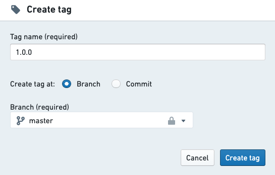

:::callout{theme="neutral"}
To enforce that all tag names follow a specific naming convention, you can add a `tagNameValidation` configuration block to a file called `repoSettings.json` at the root of the repository, e.g.: "tagNameValidation": { "regex": "^(0|\[1-9]\\\d\*)\\\\.(0|\[1-9]\\\d\*)\\\\.(0|\[1-9]\\\d\*)(-rc\\\d+)?$", "errorMessage": "Tag name must have the format x.x.x or x.x.x-rcx." }
:::

For more information about the recommended git development workflow, refer to the [Developer Best Practices](/docs/foundry/building-pipelines/development-best-practices/).

## Pull requests tab

:::callout{theme="neutral"}
This section summarizes how to create new Pull requests in the **Pull requests** tab. This functionality is also available in the [Code tab](#code-tab).
:::

In the **Pull requests** tab, you can find information about *Pull requests* in your Code Repository. A *Pull request* lets users view a history of the changes on your branch and review your code on a line-by-line basis before merging your changes. Any time you want to merge the changes on your branch into the main code, you should create a new *Pull request*.

Click the 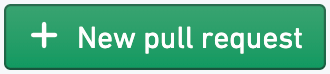  button to create a new *Pull request*. By default, the new *Pull request* created will merge your changes into the main branch of your repository (this is usually the *master* branch). Select which branch you want to base your new *Pull request* off of.

### Filtering pull requests

You can switch between a list of open and closed *Pull requests* by clicking the "Open" / "Closed" button at the top of the pull requests list, and use the search bar to further filter the list based on title or author.

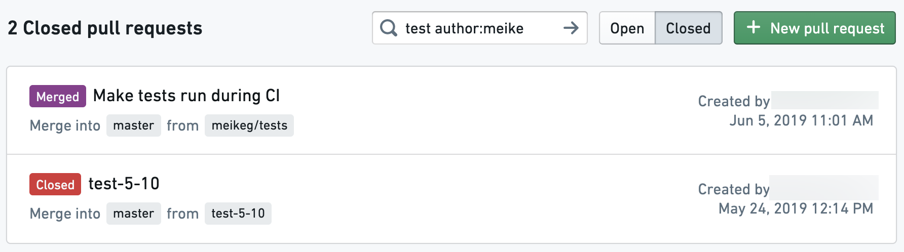

### Reviewing pull requests

Click on one of the *Pull requests* to review the proposed code changes line-by-line and add comments. Depending on the repository settings, each *Pull request* may require at least one approving review before they can be merged.

When reviewing changes to Transforms code, you can also check [how these changes affect your datasets](/docs/foundry/code-repositories/analyze-impact/).

## Checks tab

In the **Checks** tab, you can view a summary of running and completed checks on each branch. Use the dropdown branch menu to select a different branch. Click on a specific check to view more detailed information.

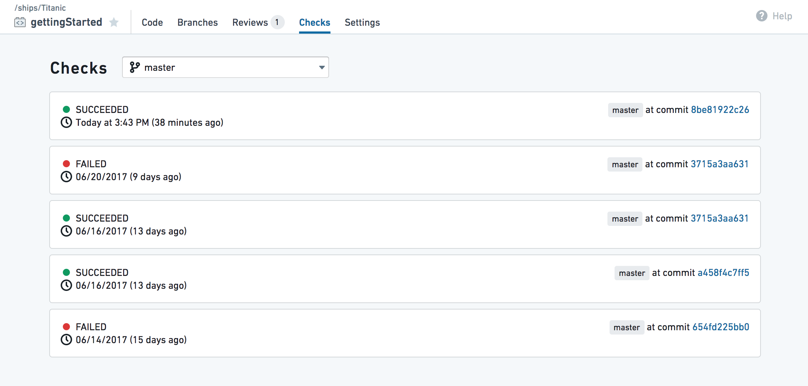

The Checks tab will also include the output of any unit tests that have been defined for your repo. You can define unit tests for [Python](/docs/foundry/transforms-python/unit-tests/) and [Java](/docs/foundry/transforms-java/unit-tests/).

:::callout{theme="neutral"}
If AIP is enabled on your stack, the [error enhancer widget](/docs/foundry/code-repositories/aip-features/#ai-error-enhancer) complements the detail view of a failed check to help you better understand and resolve issues that arise.
:::

## Settings tab

In the Settings tab, code authors can configure their personal editor preferences and repository administrators can control the repository's behavior and policies. To learn more about the Settings tab, see [Administering Code Repositories](/docs/foundry/code-repositories/admin-overview/).

:::callout{theme="neutral"}
Most options in the **Settings** tab are aimed for administrators and will be available only to users with the appropriate permissions (by default, repository owners).
:::
