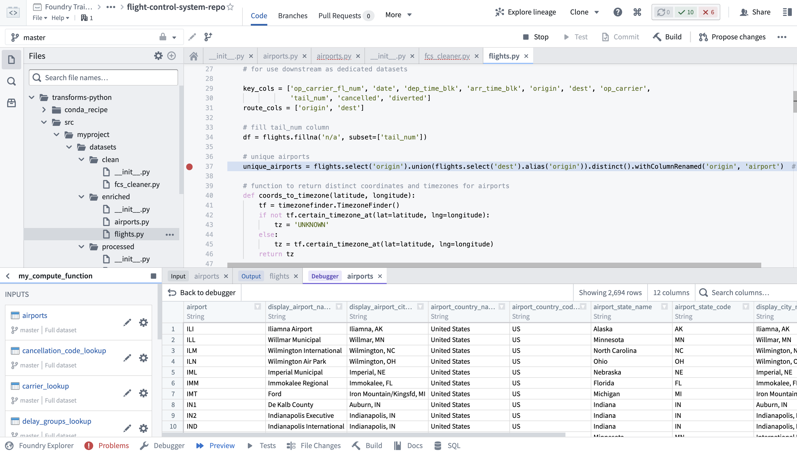

<!-- source: https://palantir.com/docs/foundry/code-repositories/overview/ · mirrored 2026-08-14 from Palantir Foundry docs -->

# Code Repositories

:::callout{theme="neutral"}
To edit and manage your code in a familiar IDE, try [VS Code workspaces](/docs/foundry/vs-code/overview/) and the [Palantir extension for Visual Studio Code](/docs/foundry/vs-code/overview/).
:::

**Code Repositories** provides a web-based integrated development environment (IDE) for writing and collaborating on production-ready code in Foundry. The application provides a user-friendly way to interact with the underlying Git repository, and provides a range of additional features:

* All common Git version control tasks, including branching, committing, and tagging releases can be performed through the web UI
* Repositories have integrated support for code review and collaboration through *pull requests*, including support for highly configurable permissions to ensure the codebase is high-quality
* Every repository type includes integrated features to aid with the code authoring experience, including IntelliSense, code linting and error checking, and rich help dialogs

## Repository types

Code Repositories support creating repositories of many types. The most common repository types are described below.

* **Transforms** repositories support authoring data transformation logic, and include features to enable previewing and debugging transforms. Supported languages include [Python](/docs/foundry/transforms-python/overview/), [Java](/docs/foundry/transforms-java/overview/), and [SQL](/docs/foundry/transforms-sql/overview/)
* [**Functions**](/docs/foundry/functions/overview/) repositories enable writing business logic that can be executed with low latency in an operational context, and include native support for accessing data from the Foundry [Ontology](/docs/foundry/ontology/overview/). The Code Repositories environment supports autocomplete based on Ontology data types, and enables code authors to preview Functions while authoring them. Functions can be written in [TypeScript](/docs/foundry/functions/types-reference/) or [Python](/docs/foundry/functions/python-getting-started/).
* **Model development** is supported in Code Repositories. [Learn more about how to develop models in Code Repositories.](/docs/foundry/integrate-models/model-asset-code-repositories/)
