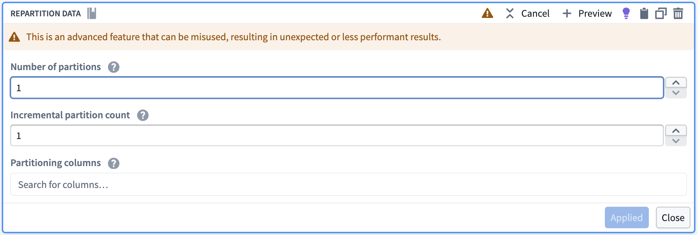
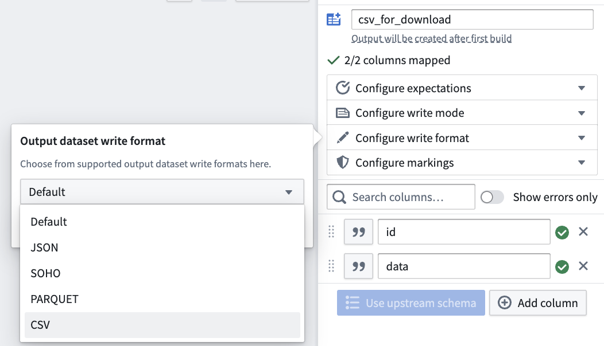
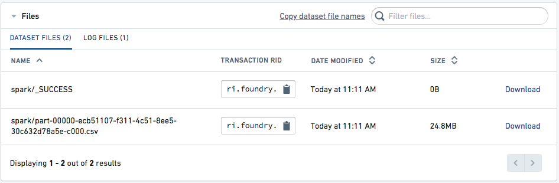

<!-- source: https://palantir.com/docs/foundry/code-repositories/prepare-datasets-download/ · mirrored 2026-08-14 from Palantir Foundry docs -->

# Prepare datasets for download

:::callout{theme="warning"}
The following export process is an advanced workflow and should only be performed if you are unable to download data directly from the Foundry interface using the **Actions** menu or [export data from another Foundry application](/docs/foundry/analytics/exporting-outputs/#data-export).
:::

This guide explains how to prepare a CSV for download using transforms in [Code Repositories](/docs/foundry/code-repositories/overview/) or [Pipeline Builder](/docs/foundry/pipeline-builder/overview/).

## Prepare data

The first step in preparing the CSV for download is to create a filtered and cleaned set of data. We recommend performing the following steps:

1. Ensure the data sample can be exported and follow data export control rules. Specifically, you should verify that the export adheres to the data governance policies of your Organization.
2. Filter the data to be as small as possible to meet the necessary objectives. For optimal performance, the uncompressed size of the data in CSV format should be less than the default HDFS block size (128 MB). To achieve this, you should only select the necessary columns and minimize the number of rows. You can reduce the number of rows by filtering for specific values, or taking a random sample with an arbitrary number of rows (such as 1000). Attempting to create a CSV larger than 128 MB may consume more time and may require additional Spark executor memory to succeed.
3. Change column type to `string`. Since the CSV format lacks a schema (unenforced types and labels for columns), it is recommended to cast all the columns to string. This is especially important for timestamp columns.

The following sample Python (PySpark) code illustrates some of the above principles as applied to a dataset of taxi trips in New York City.

```
def prepare_input(my_input_df):
    from pyspark.sql import functions as F

    filter_column = "vendor_id"
    filter_value = "CMT"
    df_filtered = my_input_df.filter(filter_value == F.col(filter_column))

    approx_number_of_rows = 1000
    sample_percent = float(approx_number_of_rows) / df_filtered.count()

    df_sampled = df_filtered.sample(False, sample_percent, seed=0)

    important_columns = ["medallion", "tip_amount"]

    return df_sampled.select([F.col(c).cast(F.StringType()).alias(c) for c in important_columns])
```

Using similar logic and Spark concepts, you can also implement the preparation in Pipeline Builder or other Spark APIs like SQL or Java.

## Reduce to one partition and set output format

Once the data is prepared for export, you need to repartition or coalesce the data to a single partition so that the output will have one file for download. Then, set the output format to CSV or another supported output format such as JSON, ORC, Parquet, or Avro. The below examples show how to repartition data and set an output format in Pipeline Builder, Python, and SQL.

:::callout{theme="neutral"}
Both `repartition(1)` and `coalesce(1)` reduce data to a single partition, but `coalesce` should be avoided when a filter operation is performed as part of the same transform because `coalesce` collapses upstream tasks, potentially causing the filter operation to run in a non-distributed way.
:::

### Pipeline Builder

First, use the **Repartition data** transform to reduce your data to one partition.



Then, in the pipeline output configuration, configure the write format to CSV (or any other supported format).



### Python

```python
from transforms.api import transform, Input, Output
@transform(
     output=Output("/path/to/python_csv"),
     my_input=Input("/path/to/input")
)
def my_compute_function(output, my_input):
     output.write_dataframe(my_input.dataframe().repartition(1), output_format="csv", options={"header": "true"})
```

### SQL

```
CREATE TABLE `/path/to/sql_csv` USING CSV AS SELECT /*+ REPARTITION(1) */ * FROM `/path/to/input`
```

Review [official Spark documentation ↗](https://spark.apache.org/docs/latest/api/java/org/apache/spark/sql/DataFrameWriter.html) for additional CSV generation options (note that Pipeline Builder only exposes a subset of these options).

:::callout{theme="neutral"}
In the above examples, we reduce to one partition so that the output dataset has exactly one CSV file for download. As a result, the entirety of the data must be able to fit in the memory of one Spark executor, which is why we recommend filtering or sampling the data first. If filtering or sampling the data is not an option, but the data is too large to fit in one executor's memory, you can increase executor memory using an appropriate [Spark profile](/docs/foundry/code-repositories/spark-profiles/). Alternatively, you can use a value other than 1 for the partition count. Using `repartition` with a value greater than 1 will reduce the amount of data that must be held in memory on one executor, but will also entail that the output dataset will have multiple CSV files that need to be downloaded individually instead of one.
:::

## Access the file for download

Once the dataset is built, navigate to the **Details** tab of the dataset page. The CSV should appear as available for download.


