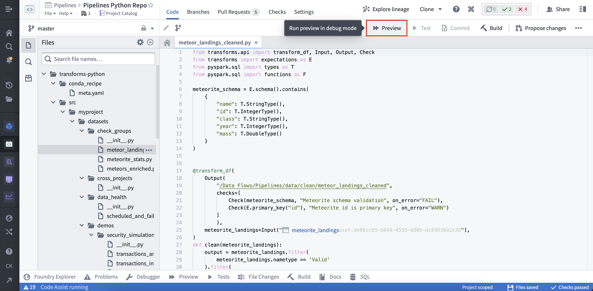
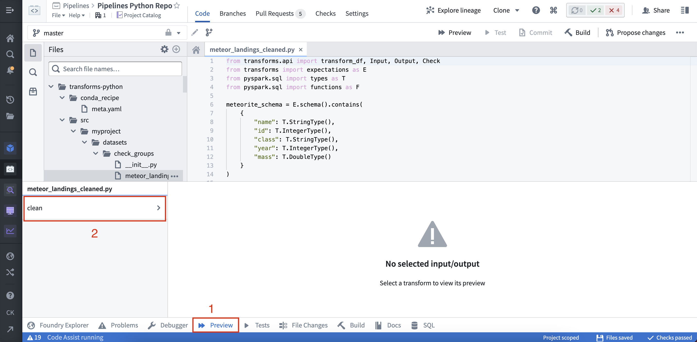
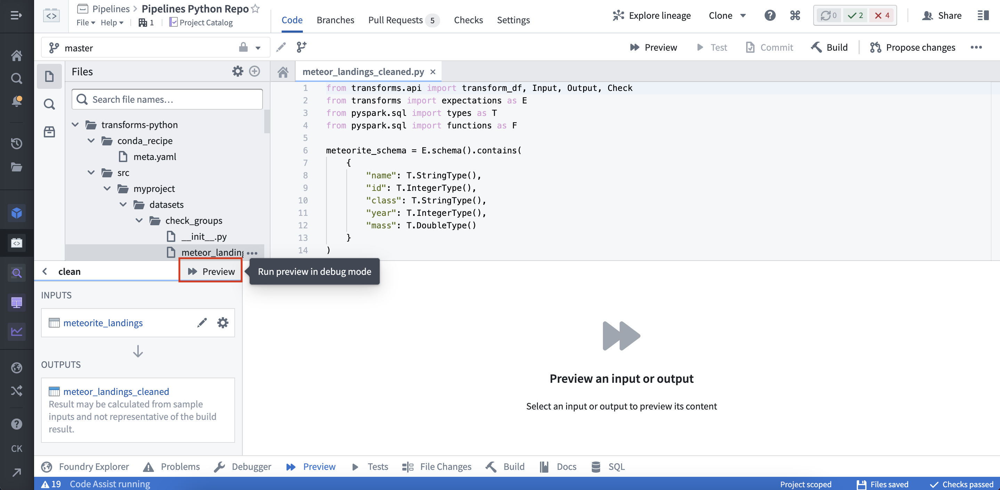
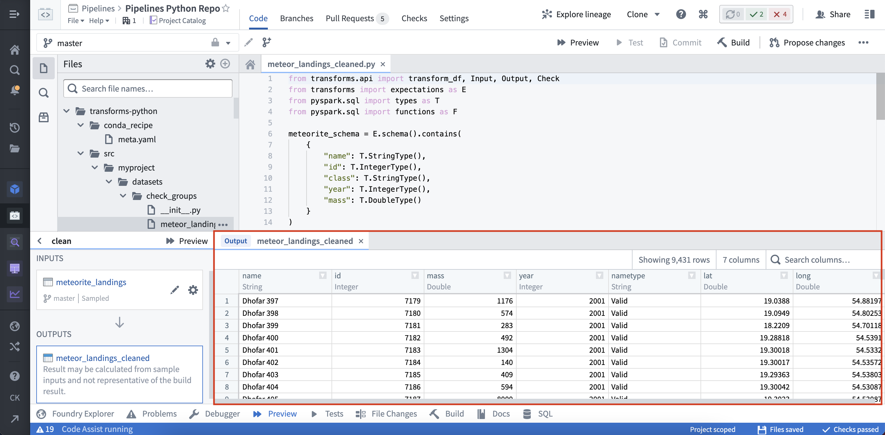
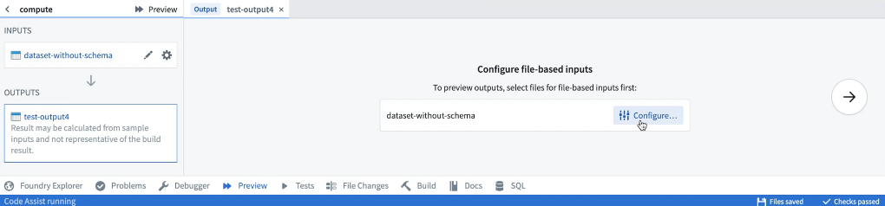
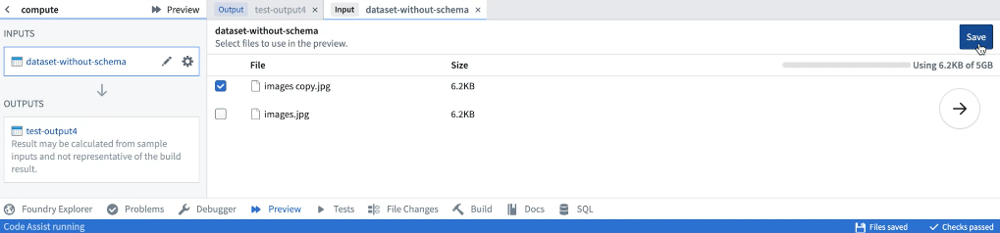
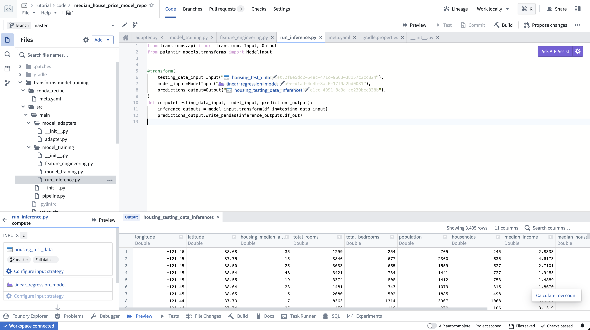

<!-- source: https://palantir.com/docs/foundry/code-repositories/preview-transforms/ · mirrored 2026-08-14 from Palantir Foundry docs -->

# Preview transforms

Use the Preview tool in Code Repositories to run your code on a limited sample of the input datasets to quickly preview the output. Preview produces a sample output without committing changes, running checks, or materializing any datasets in Foundry. Preview can accelerate the development cycle, removing the need to trigger a build to test code changes.

:::callout{theme="success" title="Tip"}
Preview works on all Foundry datasets, including datasets with [files](/docs/foundry/building-pipelines/unstructured-overview/) and [models](/docs/foundry/model-integration/overview/).
:::

## Running Preview

Preview can be triggered from two places within Code Repositories.

(1) By selecting Preview in the code editor options panel:



(2) By selecting Preview in the helper panel:





Once the Preview has executed, the output is displayed:



## Configuring Preview with files

Preview can be used on datasets that contain [unstructured files](/docs/foundry/building-pipelines/unstructured-overview/). When running Preview for the first time on a dataset containing files, you must configure the files that will be used within the sample.





Once the sample files have been selected, they can be reconfigured by selecting the relevant input from the list of inputs. After saving the configuration, Preview will execute the code on the chosen sample of files. When running Preview again, there will be no need to reconfigure input files. Once Preview has executed, you can view the sample output as rows or files. If you have the required permissions, you can also choose to download the output files.

## Configuring Preview with models

### Model Assets

Preview, without the requirement of additional configuration, is supported for [model assets](/docs/foundry/integrate-models/integrate-overview/) that are [trained in Foundry](/docs/foundry/integrate-models/model-asset-code-repositories/) or [backed by pre-trained files](/docs/foundry/integrate-models/model-asset-files/).

[Container backed models](/docs/foundry/integrate-models/container-overview/) and [externally hosted models](/docs/foundry/integrate-models/external-model-connection/) do not currently support preview.



## Previewing transforms created in transforms generator

Transforms created in a [transforms generator](/docs/foundry/transforms-python/pipelines/#transform-generation) share the function's name; to make it easier to select the intended transform for preview, change the `__name__` attribute of generated transforms to produce meaningful names. For example:

```python
from transforms.api import transform_df, Output


def generate_transforms():
    transforms = []
    for output_dataset_name in ["One", "Two", "Three"]:
        @transform_df(
            Output(f"/output/path/{output_dataset_name}"))
        def my_transform(ctx, output_dataset_name=output_dataset_name):
            # by default, generated transforms would be named `my_transform (1)`, `my_transform (2)`...
            cols = ['id', 'value']
            vals = [
                (0, f'{output_dataset_name}'),
                (1, f'{output_dataset_name}'),
                (2, f'{output_dataset_name}')
            ]
            df = ctx.spark_session.createDataFrame(vals, cols)
            return df
        transforms.append(my_transform)
        transforms[-1].__name__ = f'{output_dataset_name}_{transforms[-1].__name__}' # override transform's name
    return transforms


TRANSFORMS = generate_transforms()
```
