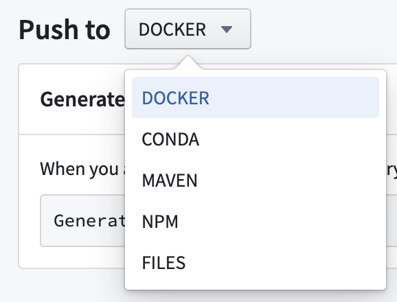
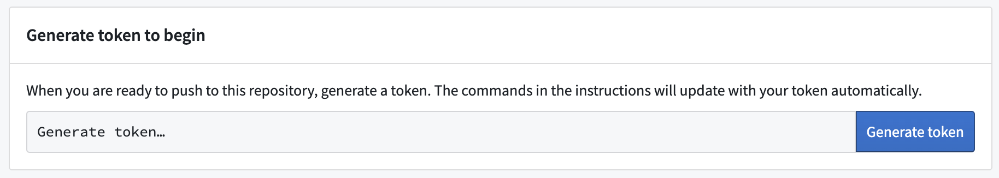
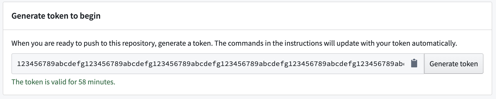
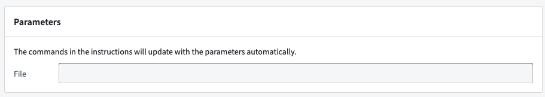
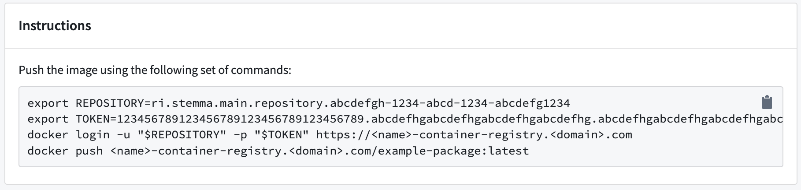
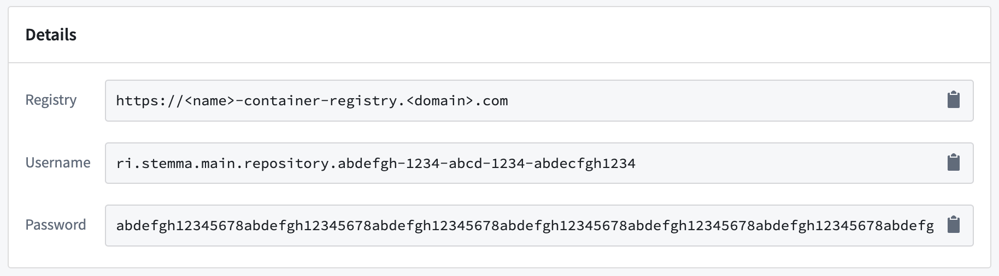

<!-- source: https://palantir.com/docs/foundry/code-repositories/publish-artifact/ · mirrored 2026-08-14 from Palantir Foundry docs -->

# Publish an Artifact

To add an Artifact to an Artifact repository, follow these steps to generate a token and view publish instructions:

1. Navigate to the **Publish** tab in the interface.

2. Select the type of Artifact to publish from the dropdown menu.       

3. Select **Generate token**.   
      

4. View the generated token in the token field. The text under the token field will show for how long the token is valid.   
      

5. (Optional) For some Artifact types, you can update the publishing instructions with parameter commands. Add commands in the field of the **Parameters** section.   
      

6. Run the commands listed in the **Instructions**  section to publish your Artifact.   
      

7. When prompted, provide the additional details listed in the **Details** section.   
      

Now that you know how to publish an Artifact, learn how to [recall Artifacts](/docs/foundry/code-repositories/recall-artifact/).

## Find consumers of a Conda artifact

To identify which repositories consume a specific Conda artifact:

1. Navigate to the **Search** tab in Artifact Repositories.
2. Set the format dropdown to **Conda**.
3. Use the search bar to locate the artifact by name.
4. Select the artifact from the search results to open its version history.
5. Find the specific version you are interested in.
6. Select the arrow to the right of the **Downloads** column.
7. The **\</> Consumers** section lists all repositories consuming that version of the artifact.

:::callout{theme="neutral"}
Consumer tracking is only available for Conda artifacts.
:::
