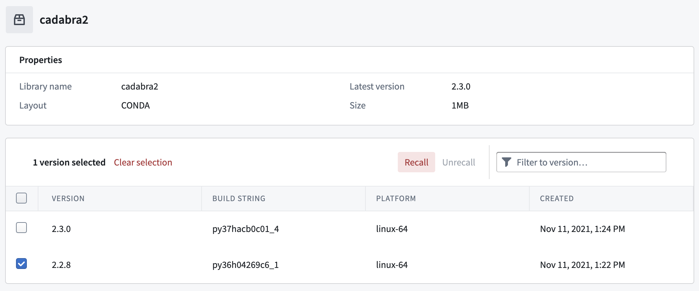
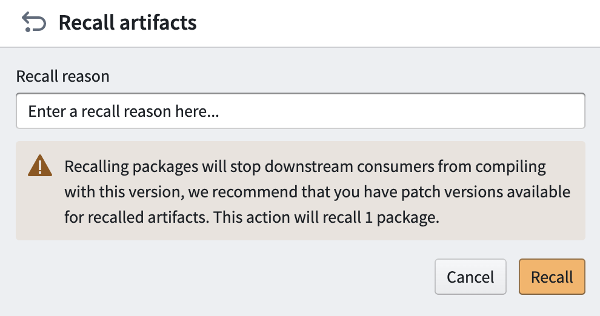
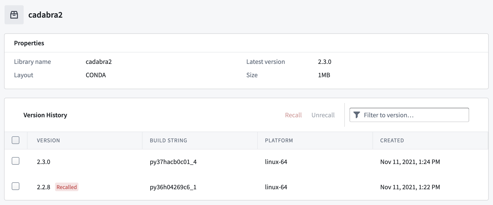
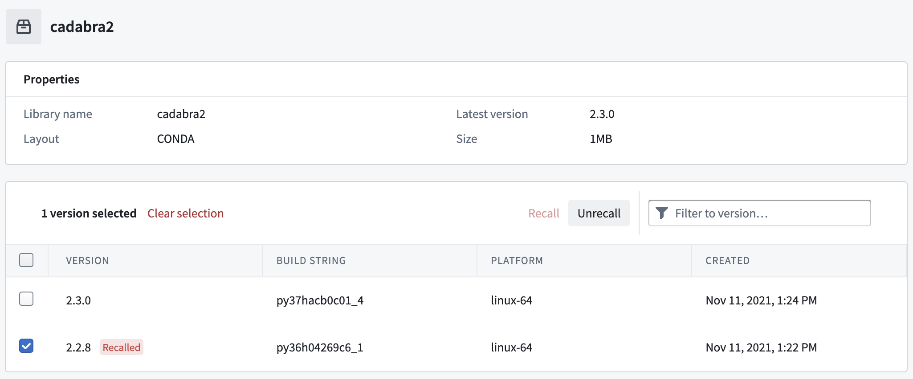

<!-- source: https://palantir.com/docs/foundry/code-repositories/recall-artifact/ · mirrored 2026-08-14 from Palantir Foundry docs -->

# Recall an Artifact

It is possible to recall Conda Artifacts to stop downstream consumers from compiling code with the recalled version. We recommend having patch versions available for recalled Artifacts before starting the recall process.

Follow these steps to recall an Artifact:

1. [Search](/docs/foundry/code-repositories/artifact-repositories-nav/) for the Conda Artifact in your Artifact Repository and select it to view the Version History section in the summary page.

2. Select the version to recall and then choose **Recall**.   
      

3. A **Recall artifacts** pop-up will appear. Enter the reason for recalling the Artifact in the field.       

4. View the Version History again to see that the Artifact is now marked as `Recalled`.   
      

## Unrecall

You can unrecall an Artifact.

To unrecall an Artifact, select the version of a recalled Artifact and click **Unrecall**.

## Delete

Conda Artifacts can be recalled, but it is not possible to delete any Artifacts in an Artifact repository. If you explicitly need to delete an Artifact, you must [delete the Artifact repository](/docs/foundry/code-repositories/delete-artifact-repository/).
