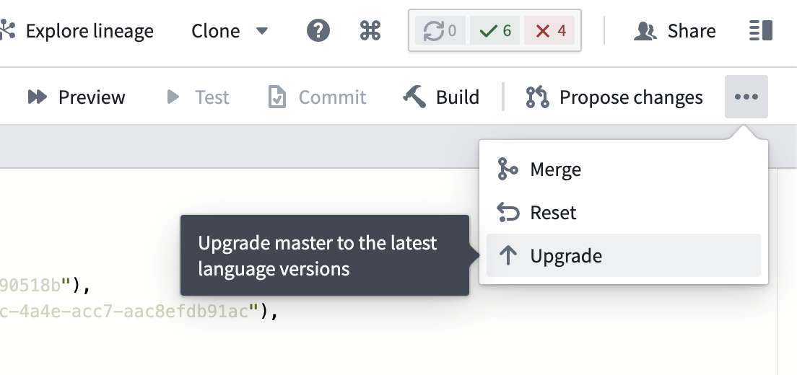

<!-- source: https://palantir.com/docs/foundry/code-repositories/repository-upgrades/ · mirrored 2026-08-14 from Palantir Foundry docs -->

# Repository upgrades

Foundry will occasionally generate upgrade pull requests on active repositories. These upgrades contain important updates to the Transforms template as well as runtime improvements. Upgrade Pull Requests will be opened on a dedicated branch and request a merge to the default branch.

## Automatic upgrades

When automatic upgrades are enabled in the repository, Foundry will attempt to merge the upgrade PRs automatically. After the required checks finish successfully, the pull request will be merged and a new merge-commit will appear in the commit history of the default branch. Select **Automatic merge of upgrade PRs** in the repository settings to enable this feature.

When this option is disabled, or when the PR fails to merge, the repository will present a message when a new upgrade PR is available and require a user with the appropriate permissions to merge it.

:::callout{theme="warning" title="Warning"}
Enabling automatic upgrades is strongly recommended in order to keep the repository up-to-date with the latest runtime improvements.
:::

There are some cases where automatic repository upgrades will require manual intervention before merging:

* The template type of the repository does not support merging.
* The user committed any changes to the upgrade PR branch after it was opened.
* The upgrade PR overwrites any files that contain user-authored changes (see [file overwrites](#file-overwrites)).
* Some datasets directly affected by this pull request have not been built with the latest version of the code (see [impact analysis](/docs/foundry/code-repositories/analyze-impact/)).
* Jobs produced by this repository have not yet been built with the runtime Spark module version introduced in the upgrade pull request (see [impact analysis](/docs/foundry/code-repositories/analyze-impact/)).
* The template version the repository is currently on is too old to support automatic upgrades.

## File overwrites

When a repository is created, it is bootstrapped with default template files, which differ depending on the type of template chosen. When a repository is upgraded, some of these default files will be overwritten to match those of the newest template version. This is because the default files are considered to be important for the correct functioning of a repository, and should not be overwritten by users.

## Impact analysis

You can use the [impact analysis](/docs/foundry/code-repositories/analyze-impact/) tab of the Repository Upgrade PR to review any potential changes to affected datasets and ensure that the changes are safe before merging. Some upgrades may affect the runtime Spark module version used, which could have an effect on the datasets built by this repository.

## Manual branch upgrade

To manually upgrade your branch to the latest language versions, open the **...** menu in Code Repositories and select **Upgrade** as shown in the screenshot below.

:::callout{theme="neutral"}
If you move a repository across different projects, the repository must be manually upgraded in the new location before any builds or checks are triggered. This is necessary to update relevant project references in the repository.
:::
