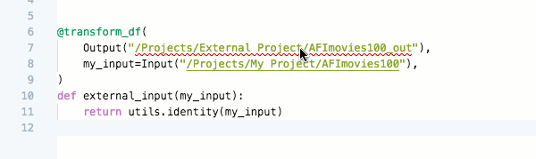
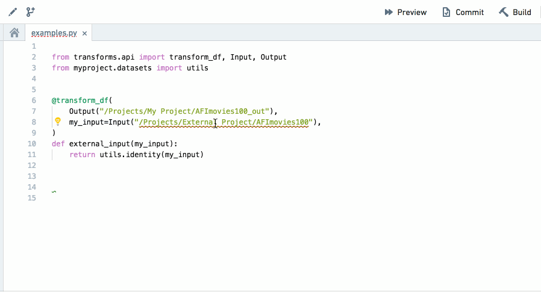

<!-- source: https://palantir.com/docs/foundry/code-repositories/use-project-references/ · mirrored 2026-08-14 from Palantir Foundry docs -->

# Use Project references

**Project references** provide a mechanism for users with higher permissions - typically the owners of a dataset or pipeline - to allow the discovery and use of their data in other Projects. Intermediate Projects can be used as permission boundaries or discovery hubs, wherein the users who own one part of a pipeline can declassify, curate, or otherwise distribute shareable versions of their datasets and make them available to downstream consumers.

Project references add an increased layer of scrutiny for moving data between Projects by explicitly acknowledging when a dataset is exported from or imported to a Project.

## Instructions

1. The code editor informs users that outputs generated from transforms must be within the Project scope of the code repository. For example, if your code repository is in a project called "Data Cleaning Project", the outputs from your code repository can only be in "Data Cleaning Project", not any other project.
   
2. When there is an input dataset from outside the Project scope, the code editor flags that the dataset must be added as a Project reference. By clicking the light bulb icon, the input dataset can be added as a Project reference.
   
3. References to datasets external to the Project can also be added from **Projects & files**.
4. If the repository's language packages are out of date, it will not be possible to enforce Project scope until they have been updated. Code Repositories will flag that these need to updated and clicking the update button that appears will resolve this.
5. You can only add a Project reference to a dataset from outside the Project scope as an input datast, not as an output dataset. Trying to output to a dataset outside of the Project scope will trigger a AccessOutsideProjectDenied error.

## Project references and permissions

To reference a resource, you must have `compass:import-resource-from` on the resource (usually expanded from the Viewer role) and `compass:import-resource-to` on the destination Project (usually expanded from the Editor role). These permissions can be customized using [custom roles](/docs/foundry/platform-security-management/manage-roles/#customizing-the-default-roles).

A user needs access to all [Markings](/docs/foundry/security/markings/) related to datasets referenced in a code repository in order to modify code in that repository.
