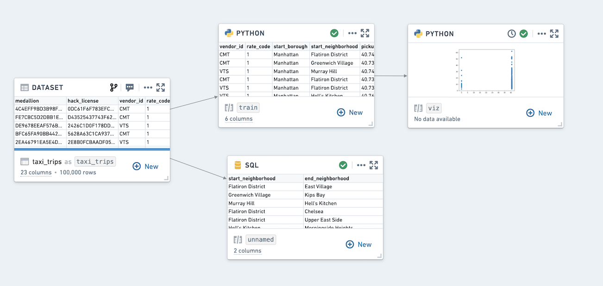

<!-- source: https://palantir.com/docs/foundry/code-workbook/ · mirrored 2026-08-26 from Palantir Foundry docs -->

# Code Workbook \[Legacy]

:::callout{theme="warning" title="Legacy"}
Code Workbook is in the [legacy](/docs/foundry/platform-overview/development-life-cycle/) phase of development, and no additional development is expected. Full support remains available. We recommend exploring other applications and tools to serve your use case purposes.
:::

**Code Workbook** is an application that allows users to analyze and transform data in code using an intuitive graphical interface.

## Goals

Code Workbook was designed with these principles in mind:

* **Iteration speed:** Users can quickly test and refine logic for transformation and visualization in order to produce useful results.
* **Low barrier to entry:** Code Workbook's graphical interface and the ability to reuse pre-authored logic were designed to enable easy onboarding of users of varying technical skill.
* **Collaboration:** Disparate groups of users can share logic and work together on a single analysis in Code Workbook.
* **Platform interoperability:** Users can productionize their findings across the platform by adding visualizations to Notepad, promoting production-ready pipelines to Code Repositories, and iterating on machine learning models.

## Features

Key features of Code Workbook include:

* An **interactive console** for rapid iteration on transformation logic and ad-hoc data exploration.
* **Visualization support** to create detailed, interactive images with commonly used packages (Matplotlib, Plotly, Seaborn).
* **Templates** that enable reuse of complex and domain-specific logic through a simple interface.
* **Multi-language support** for code and template languages to allow users to select the best language for an analysis.
* **Branching** to facilitate collaboration by isolating users’ changes from one another.
* A **point-and-click user interface** that makes it easy to customize the Spark environment, set input types for transforms, and view relationships between nodes.
