<!-- source: https://palantir.com/docs/foundry/code-workbook/branching-getting-started/ · mirrored 2026-08-26 from Palantir Foundry docs -->

# Getting started

As you create Workbooks of increasing scale and complexity, you may encounter new challenges:

* You may want to experiment with a Workbook by introducing new changes, but must preserve existing logic and avoid breaking production pipelines.
* You may want to collaborate with a colleague on a Workbook, but need to avoid conflicts when making changes to the same Workbook simultaneously.

Branching provides a solution to these challenges. In this tutorial, we explore the following concepts:

* [Creating a branch](#creating-a-branch)
* [Previewing a merge](#previewing-a-merge)
* [Completing a merge](#completing-a-merge)
* [Resolving merge conflicts](#resolving-merge-conflicts)

## Creating a branch

This example uses a short pipeline that starts with a dataset of passengers on the Titanic and applies a few filters to it.

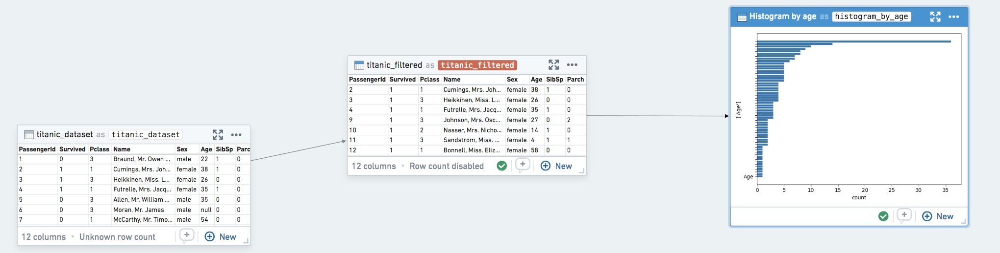

:::callout{theme="success" title="Tip"}
A **branch** is a working copy of your Workbook that allows you to make changes safely and incorporate them into the master version later. [Learn more about branching.](/docs/foundry/data-integration/branching/)
:::

Click the branch menu in the top left of the Workbook, enter the name of your new branch, and click **Create**. Branch names are commonly prefixed based on the type of change being made (e.g. `feature/` or `bugfix/`), or by your username or initials (e.g. `jdoe/` or `jd/`).

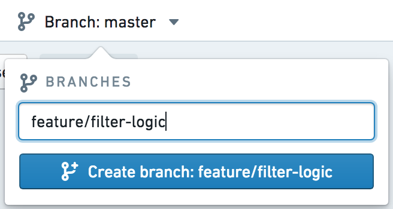

After `feature/filter-logic` is created, transforms reflect data and logic at the time of branch creation. If `master` changes, your branch `feature/filter-logic` will continue to function as before. Likewise, any changes you make on `feature/filter-logic` will not interfere with logic or data changes on `master`.

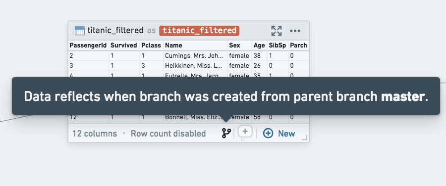

Make any changes on your new branch as you normally would. In this example, change the logic for a line of filtering code.

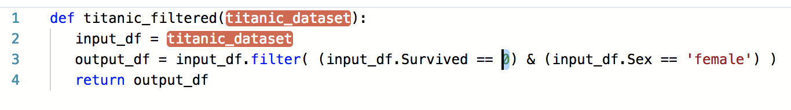

## Previewing a merge

:::callout{theme="success" title="Tip"}
A **merge** is a copy of the work you have done in your branch, combined with the current state of the master copy. This allows you to review changes before incorporating them back into master.
:::

When you are ready to introduce the changes on your branch back into the original branch, click **Preview merge** in the top right.

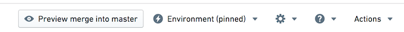

You are now taken into a merge. In this state, you can continue to make changes to your logic and run transforms until you are satisfied with the changes that will be introduced. The **Run Affected** button at the top allows you to run all affected transforms in this Workbook—those with logic changes and anything downstream of them—with a single click.

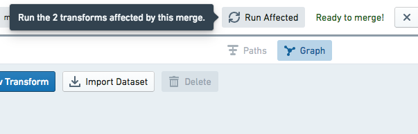

While in a merge, the sidebar shows changes in row counts or columns that will be introduced through this merge. This can help surface changes your branch has introduced, both in transforms you actually edited as well as downstream transforms.

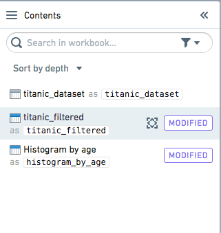

To see what logic changes will be introduced through this merge, select any modified transform and click **Show Changes**. This will show a split-screen view of the logic that has changed.

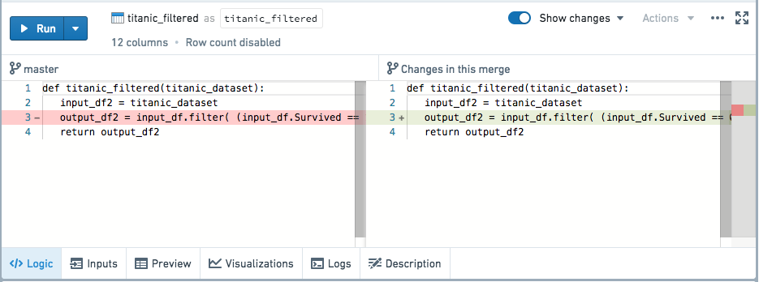

This also works for templates, as shown below:

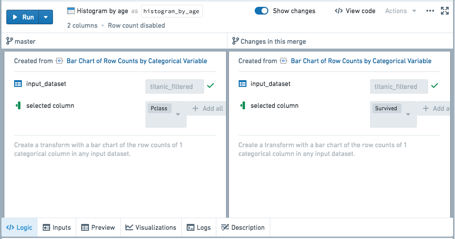

## Completing a merge

When you are satisfied with the changes you are introducing, click **Merge Branch** to finish merging into your `master` branch. You will be presented with a dialog box with two toggles:

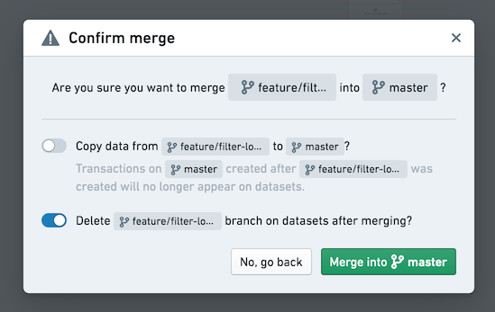

The first toggle allows you to choose whether to copy the transactions from the merging branch into the branch you are merging into. Imagine that after branching, additional work has been done on master and new transactions have been committed on the derived datasets' `master` branch. If this toggle is set to True, the transactions created on master since the `feature/filter-logic` branch was created will no longer appear on the dataset after merging.

The second toggle allows you to choose whether to delete the merging branch from the datasets. Note this is different than deleting the workbook branch itself, which is always done with a merge and not configurable. If the second toggle is True, the merging branch will be deleted from the derived datasets created in the Workbook.

Suppose that, as above, you choose not to copy the data from the merging branch into `master`. After you click **Merge into master**, the `master` branch will be updated with the logic from your merge.

## Resolving merge conflicts

As you use branching more frequently, especially while collaborating with colleagues, you may end up modifying the same piece of logic in two different branches. This section describes what happens in this scenario.

When you click **Preview merge**, if conflicting changes have already been introduced to `master`, a prompt will indicate that you need to resolve conflicts before proceeding with the merge.

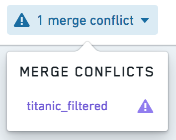

Clicking on the conflicting transform will show a merge conflict view. For code, inline conflict markers allow you to pick which logic you want to use.

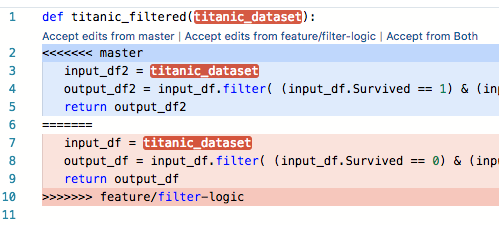

If the conflict involves a template, or a transform has been deleted on one of the branches, you can resolve conflicts using a split-screen view.

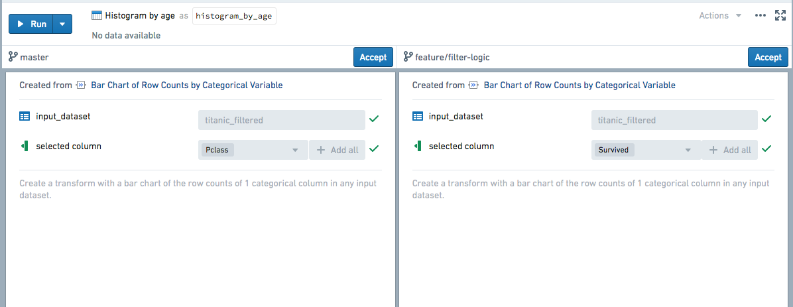

After resolving conflicts, you can continue to make further edits and run transforms to verify that your merged logic functions as expected. When you are ready, click **Complete merge** to finish merging as usual.
