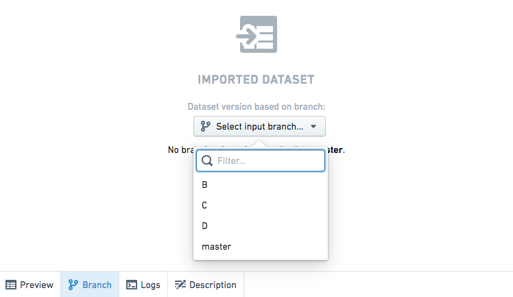

<!-- source: https://palantir.com/docs/foundry/code-workbook/branching-imported-datasets/ · mirrored 2026-08-26 from Palantir Foundry docs -->

# Choose imported dataset branch

Code Workbook implements branch *fallbacks* for imported datasets, which means that the branch hierarchy in your Workbook will be used to determine where imported datasets should be pulled from.

For example, suppose your Workbook contains two branches, `master` and `develop`, and your input dataset `titanic` also has both of these branches. When you are on the `develop`branch, the imported dataset will default to pull from `develop`. If there is another dataset that only exists on `master` and not `develop`, input data will be pulled from `master`.

This fallback structure enables useful workflows. For example, if you have imported datasets from another Workbook or a repository and you want to test your transforms with a branched version of that Workbook or repository, you can simply create a new branch with the same name in your Workbook, and imported datasets will fall back to the appropriate branch automatically.

You can also manually choose a branch for imported datasets by clicking on any imported dataset, and choosing a specific branch from the dropdown menu:

