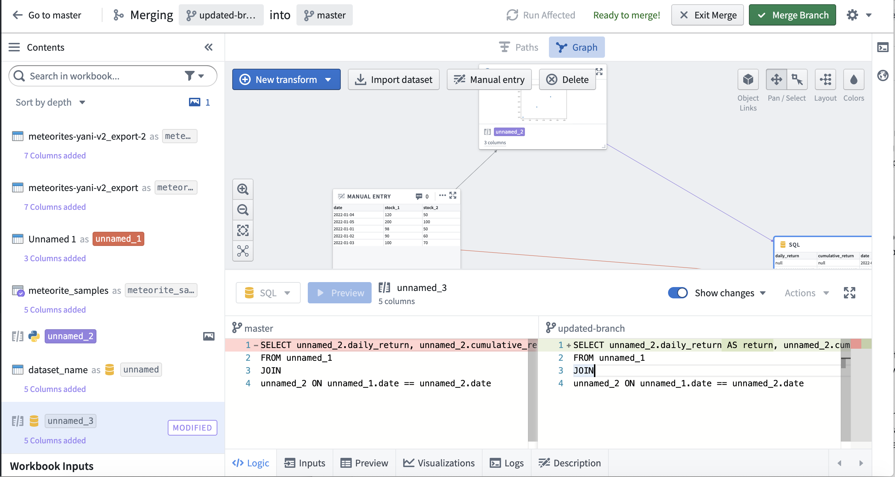
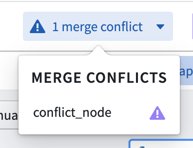
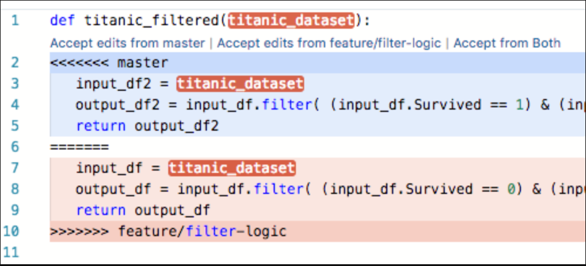
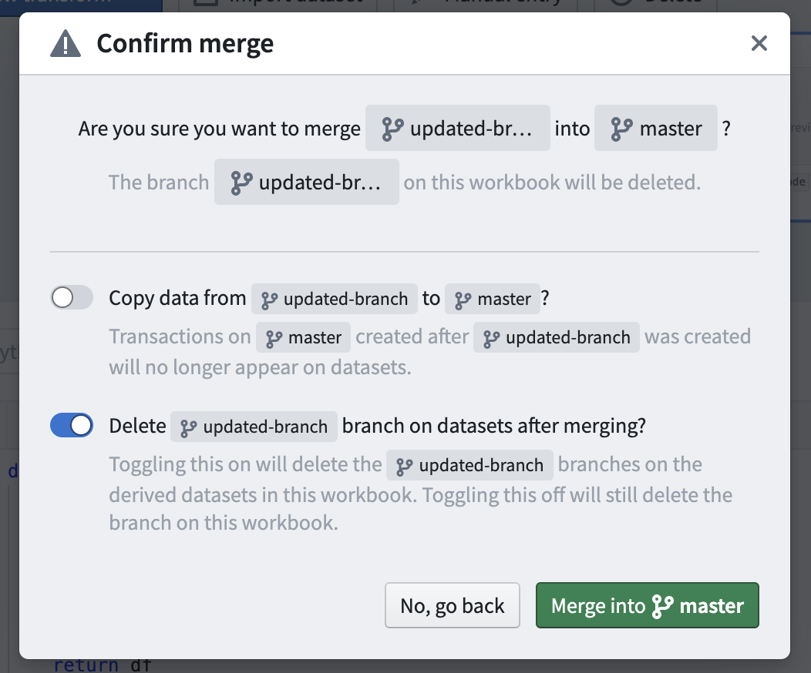

<!-- source: https://palantir.com/docs/foundry/code-workbook/branching-merging/ · mirrored 2026-08-26 from Palantir Foundry docs -->

# Merging branches

*Merges* allow you to stage the changes that will be introduced into the parent branch before deciding to copy them over. If there are logical conflicts between your branch and the parent branch, you can resolve conflicts during the merge and rerun your transforms to check that results are correct.

Throughout the rest of this documentation, we refer to the branch that you are attempting to merge as the *source branch*, and the branch you are attempting to merge into as the *target branch*.

## Previewing merges

At any point while editing your branch, you can click the **Preview merge** button in the toolbar to enter a merge state and view changes between the source branch and the target branch. Note that Code Workbook only allows branches to be merged into their immediate parent. After entering the merge, differences between the source and target branch will be highlighted on each transform. Look for **Modified** and **Conflict** tags in the Contents panel to see changes. In the below screenshot, code changes between the source branch (on the right) and the target branch (on the left) are highlighted in green.

When you run transforms while merging, Code Workbook automatically creates a *merge branch* on output datasets. This allows the merge to be isolated from both the target branch and the source branch. These merge branches will appear on your dataset in the form `vector-merge-{source}-{target}-{uuid}`.

## Resolving merge conflicts

Merge conflicts may arise if the same transform is modified in both the source and target branch. This section describes what happens in this scenario.

After clicking **Preview Merge**, a prompt will indicate you need to resolve conflicts before proceeding with the merge.

Clicking on the conflicting transform will show a merge conflict view. For code, inline conflict markers allow you to pick which logic to choose.

After resolving the merge conflicts, the **Merge branch** button will become enabled.

## Managing merges

While a branch is being merged, you can use the back button in the top left of the toolbar to go back to the target branch. To go back to the source branch before you started the merge, click **Exit merge**. Any changes you made in the merge will be removed when exiting.

Note that preparing and exiting merges is completely safe and will not affect changes you have made on your branch - you can freely preview and exit merges to see the changes that will be introduced to the target branch. If changes are introduced on the target branch after you begin your merge, an **Update merge** button will appear in the toolbar. You can use this button to update your merge with the latest logic from the target branch.

## Completing a merge

Once you have resolved conflicts and any other branch-specific checks have succeeded, click **Merge branch** to introduce changes into your target branch. You will be presented with a dialog with two toggles:

The first toggle allows you to choose whether to copy the transactions from the source branch into the target branch. Imagine that after branching, additional work has been done on master and new transactions have been committed on the derived datasets' `master` branch. If this toggle is set to True, the transactions created on master since the `updated-branch` branch was created will no longer appear on the dataset after merging.

The second toggle allows you to choose whether to delete the source branch from the datasets. Note this is different than deleting the workbook branch itself, which is always done with a merge and not configurable. If the second toggle is True, the source branch will be deleted from the derived datasets created in the Workbook.

Completing a merge may take some time. After the merge is completed, the branch you just merged will be deleted automatically, unless it still has child branches.
