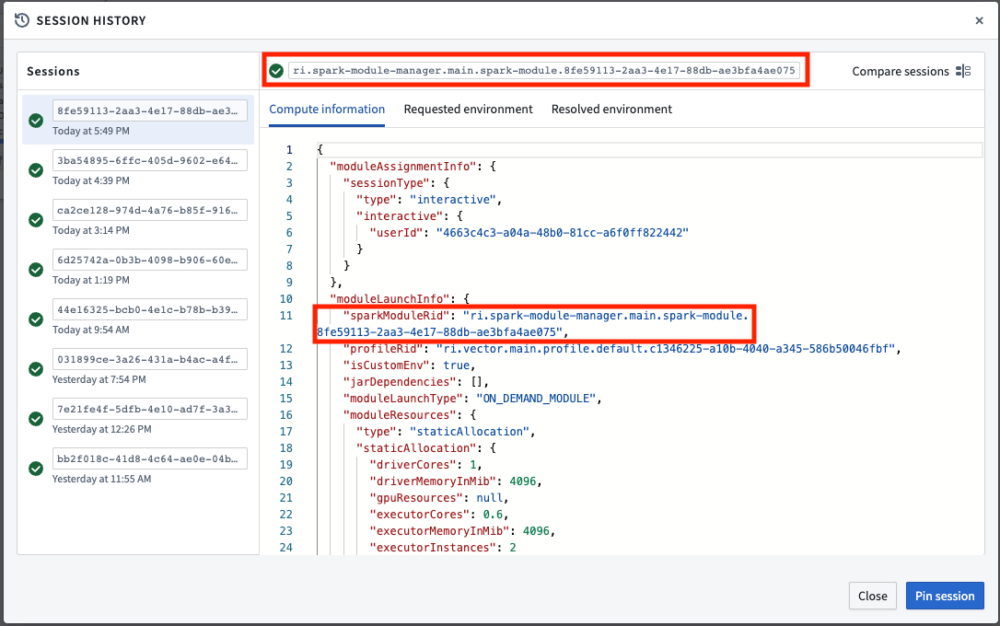
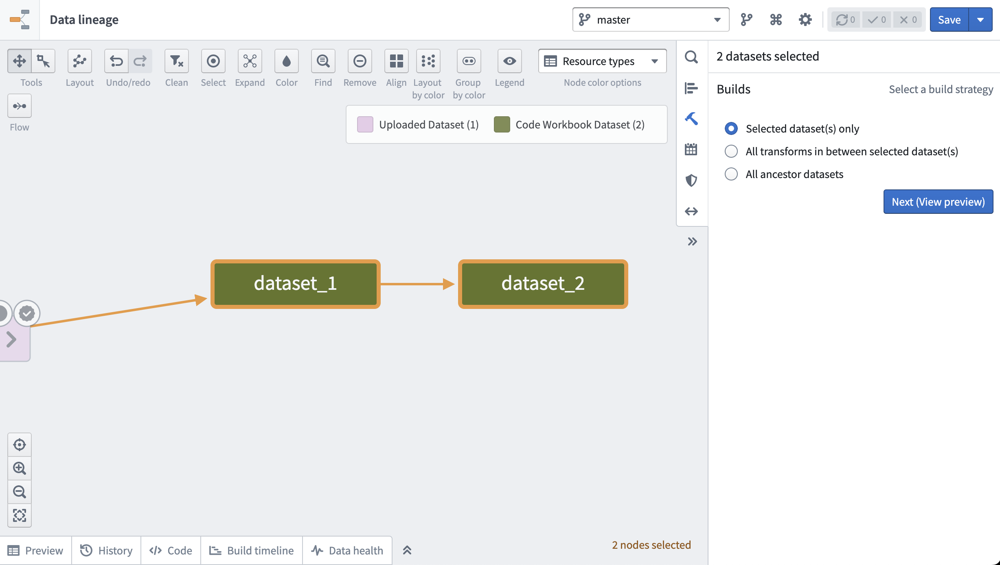
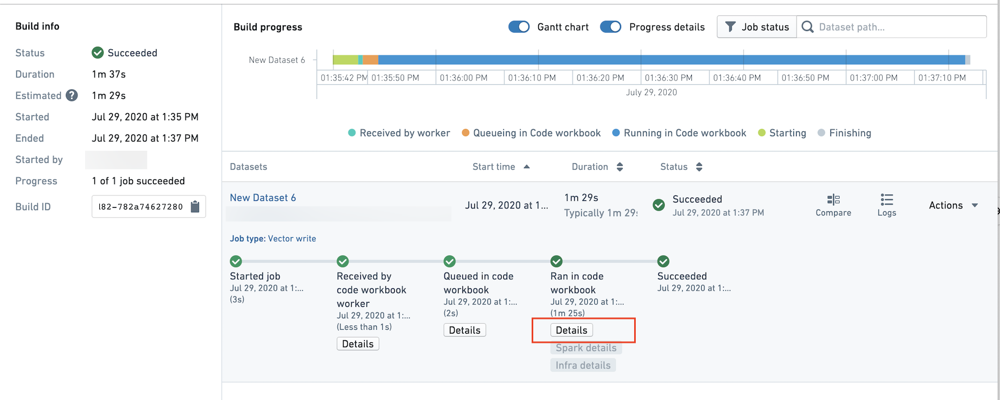
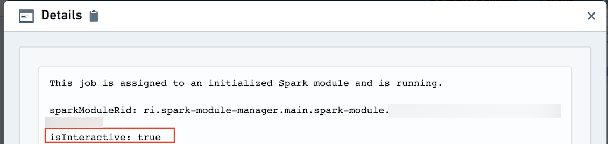

<!-- source: https://palantir.com/docs/foundry/code-workbook/environment-batch-interactive/ · mirrored 2026-08-26 from Palantir Foundry docs -->

# Batch builds and interactive builds

When using Code Workbook interactively by running jobs from within the workbook interface, all jobs will use the Spark module associated with the workbook. As seen in the image below, you can view the Spark module ID [in the session history](/docs/foundry/code-workbook/session-history-pinning/) dialog for any session.

Because each user is assigned one Spark module that is used across workbooks in the same project with the same environment, your interactive job may queue on other jobs from a different workbook completing. For example, up to five Python jobs can run simultaneously on the same module. The sixth job will appear as "Queueing in Code Workbook."

Within a batch build (for example, a scheduled build or a build from Dataset Preview), one build will use one Spark module per environment in the build. For example, if a scheduled build contains datasets created within multiple Code Workbooks, and these Code Workbooks all use the same environment, the build will use the same Spark module for all jobs. No interactive jobs will be routed to that Spark module.

We recommend using batch builds when the desired outputs are saved as datasets, and you are not running transforms one-by-one to iterate on code. This may include the following cases:

* You would like to build some long-running transforms in the same workbook or other workbooks using the same interactive Spark module.
* You want the datasets to be updated on some regular cadence. For example, if you would like to see updated data when there is new input data, or daily at 9AM, you should use a scheduled batch build.

From a workbook, use **Open Dataset** to view a dataset in Dataset Preview and build using the **Build** button in the top right of the screen. To build multiple datasets, navigate to the cog at the top of the page, then choose **Explore Data Lineage**. Then, select the datasets you want to build and choose to build them in the right sidebar.

Alternately, use the same sidebar and click on the calendar icon to set up a recurring schedule to build the datasets. [Learn more about setting up schedules.](/docs/foundry/code-workbook/workbooks-production/#using-batch-builds)

To tell if a job is being built in batch build or interactive mode, navigate to the Builds application and click on the "Details" button.

The details will list the ID of the Spark module, and whether `isInteractive` is true. If true, the job is running in interactive mode. If false, the job is running in batch build mode and does not share a Spark module with any interactive jobs.

