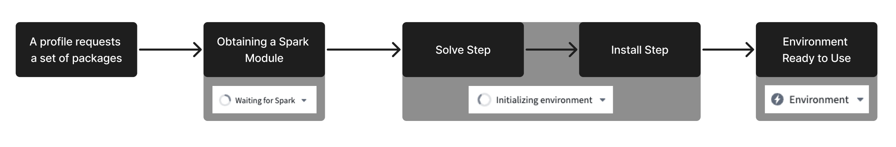
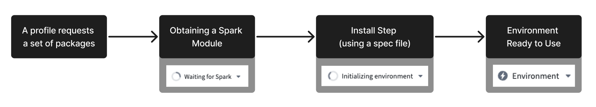
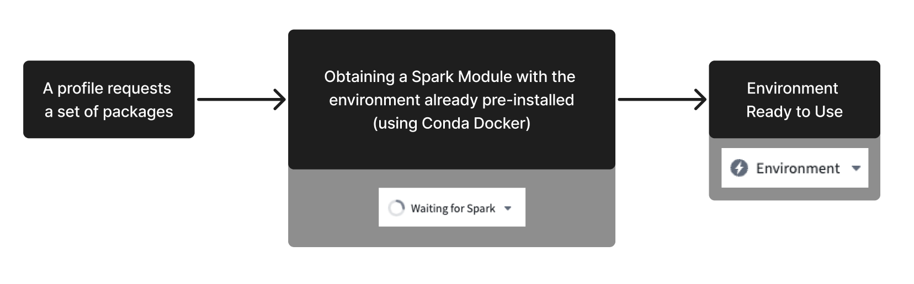

<!-- source: https://palantir.com/docs/foundry/code-workbook/environment-creation-overview/ · mirrored 2026-08-26 from Palantir Foundry docs -->

# Environment creation

:::callout{theme="neutral"}
This is an advanced guide that goes into detail about the environment initialization process. It is intended for users who are interested in the technical considerations that can affect initialization performance.

For general guidance regarding common environment-related issues, see the [Environment Troubleshooting Guide](/docs/foundry/code-workbook/environment-troubleshooting/).
:::

Conda is an open-source language-agnostic package and environment manager. Mamba is an open-source reimplementation of the Conda package manager. Code Workbook has moved to using Mamba to resolve package dependencies and install sets of packages into independent environments. Mamba offers several advantages in package resolution over Conda, most notably in increased speed and increased legibility of error messages.

This page introduces the most important concepts and outlines the environment creation process; for more information, consult the [official Conda documentation ↗](https://docs.conda.io/en/latest/) and [Mamba documentation ↗](https://github.com/mamba-org/mamba).

## Important Terms

* [Package](#package)
* [Channel](#channel)
* [Environment](#environment)

### Package

A **package** is a collection of files that commonly contains metadata, libraries, and/or binaries. Code Workbook provides access to a broad selection of packages (`numpy`, for example) to supplement the core language features.

A package is *versioned*, and nearly always has a set of dependencies—other packages that must also be installed for it to function properly. A dependency might be a specific version of a package, a range of acceptable versions, or any version at all.

### Channel

A **channel**, sometimes called a repository, is any location where packages are stored. One channel might be a directory in the local file system, and another might be a directory hosted on a web server.

Regardless of type, each channel is a directory tree that separates packages by platform architecture. Each platform subdirectory contains a file called `repodata.json`, which is an index of all packages in that subdirectory.

Conda searches a set of preconfigured channels whenever it needs to fetch a package. For more information about channel management in Foundry, see the [Code Repositories documentation](/docs/foundry/transforms-python/use-python-libraries/).

### Environment

A Conda **environment** is a directory that contains a specific collection of packages. An environment is created for each Workbook by passing to Conda the packages specified in the Environment Configuration panel. Conda constructs a set of packages that satisfies the configuration and all dependencies, and installs these packages onto the Spark module that backs the Workbook.

## Performance

The following explanation of performance draws on [this Anaconda blog post ↗](https://www.anaconda.com/blog/understanding-and-improving-condas-performance), which discusses Conda performance at length, but will similarly apply to a Mamba implementation. The next two sections summarize this material and outline the performance factors that are most relevant to Code Workbook:

* [Creating an Environment](#creating-an-environment)
* [Limitations](#limitations)

### Creating an Environment

Environment creation comprises two major steps: the solve step and the install step.

#### Solve step

In the *solve step*, the designated package manager, either Conda or Mamba, attempts to find packages and versions that satisfy all transient dependencies. Transient dependencies comprise the dependencies of the packages specified in the Environment Configuration panel, those dependencies' dependencies, and so on. This step contains four stages:

1. Download and process package indices. Conda will download relevant `repodata.json` files from each configured channel, and will convert the index entries into objects in memory.
2. Reduce the index. Conda builds up a set of all packages that could possibly be used for the environment. To do this, the algorithm begins with the provided package specification and recurses through all dependencies. All unneeded packages—primarily those that are not in the dependency graph—are pruned away.
3. Express dependency constraints as a Boolean satisfiability (SAT) problem. Conda prefers certain types of solutions (e.g. use the newest possible versions of packages), and these biases are baked into clause construction.
4. Run the SAT solver.

#### Install step

If the solve succeeds, the *install step* is next. Here, each artifact is retrieved from the proper channel and uses them to construct the environment. This step contains three stages:

1. Download and extract all packages in the solved environment.
2. Verify package contents. Depending on configuration, Conda will either use a checksum or will verify that the file size is correct.
3. Link packages into the environment.

### Limitations

All of the steps outlined above can be susceptible to slowness in certain situations. Causes of slowness usually fall into one of three categories:

* [Upstream changes](#upstream-changes)
* [Environment specification](#environment-specification)
* [Package size](#package-size)

#### Upstream changes

A significant portion of slowness is caused by factors external to Foundry.

* Downloading and processing channel indices scale with total size of index files; the more channels that are needed to consider and the larger these channels are, the longer these steps will take.
* Index reduction also scales with the number of transitive dependencies; the number of transitive dependencies is determined by which dependencies packages choose to declare.

Because these factors are external and opaque, it can be difficult to perform root cause analysis on performance regressions. An environment may suddenly take longer to load because a channel recently increased in size, or because a package declared several new dependencies in its newest release.

#### Environment specification

More commonly, slow initialization is directly tied to the **environment specification** itself. The solve step scales superlinearly with environment size, so as a general rule of thumb, environments with more packages will take disproportionately longer to initialize.

There are two ways to remediate these situations.

* First, remove unneeded packages from the environment definition. It is much more performant to have small, specialized environments than to have large, general-purpose ones.
* Second, try adding version constraints to some of the packages in the Environment Configuration panel. It is most effective to pin versions for packages with many extant builds like `python` and for packages with complex dependency graphs like `scipy`. Doing so will allow Conda to more aggressively reduce the indices, meaning that the SAT solve will not need to account for as many package versions.

#### Package size

**Package size** is typically less problematic than the other factors in this section, but it is still relevant in some cases.

Downloading and extracting even a single package may not be trivial. For example, the `pytorch` package is about 460 MB in size, and can take 35+ seconds to extract.

Download, extraction, and verification all scale linearly with the size and number of packages in the environment. Due to transitive dependencies, the solved environment typically contains many more packages than were explicitly specified in the environment definition, and the increase in packages may cause slowness.

Remediation in this case is similar to the suggestions for [environment specification](#environment-specification): try to keep environments as small as possible.

## Environment optimizations

The previous sections of this page describe the [environment initialization process](#environment-creation) and [factors that affect initialization performance](#performance). The following diagram summarizes the standard process of obtaining an environment:

To decrease time spent in the “Waiting for resources” and “Initializing environment” stages of the process, Code Workbook uses a series of optimizations designed to obtain an environment as quickly as possible.

### Solve step optimization: Spec files

If no changes are made to the set of requested packages of the environment, there should be no need to solve the environment again, as that would lead to the same resolved environment. As a result, Code Workbook avoids the [solve step](#solve-step) of the environment initialization by storing the result of a successful solve in a *spec file*. The next time that an identical environment needs to be initialized, Code Workbook skips the solve step by referring instead to the spec file. This allows for a strictly better initialization time, since Code Workbook only has to perform the install step. As a precautionary measure for the rare cases where previously successful environments stop working, Code Workbook will, by default, invalidate a spec file after 24 hours. After that, a new spec file will be generated on the next successful solve of the environment.

As a result, with spec files, every subsequent initialization attempt of a known environment will look like the following diagram:

:::callout{theme="neutral"}
Initializing a new environment that Code Workbook has never seen before will naturally lead to slower initialization times. However, once the environment initializes successfully, all subsequent initialization attempts should succeed much faster.
:::

### Initialization optimization: Conda Docker

:::callout{theme="neutral"}
Conda Docker is an optimization only available on Kubernetes-enabled environments. More information on Kubernetes can be found in the blog post [Introducing Rubix: Kubernetes at Palantir ↗](https://blog.palantir.com/introducing-rubix-kubernetes-at-palantir-ab0ce16ea42e).
:::

As indicated in the diagrams above, to initialize an environment, Code Workbook must first obtain a Spark module, then install packages onto the module. Similarly to how Code Workbook stores the result of a successful solve in a spec file, valid environments can also be stored as a Docker image. Using this image, Code Workbook can request subsequent Spark modules with all necessary packages already present on the module. This bypasses both the solve step and the on-module Conda install step, leading to much faster environment initialization times. Code Workbook will, by default, invalidate a Docker image after 24 hours. A new image will be generated on the next successful solve of the environment.

The following diagram illustrates how Conda Docker simplifies the initialization process:

#### Disable Conda Docker

In rare cases, environments using Conda Docker may fail at runtime if their packages contain [pre-link or post-link scripts ↗](https://docs.conda.io/projects/conda-build/en/latest/resources/link-scripts.html). If an environment containing such scripts appears to be failing, you can manually disable this optimization in the bottom left of Code Workbook’s environment configuration tab. After disabling Conda Docker, environments will still benefit from the other available optimizations. This configuration will persist for the combination of the profile used and the workbook branch on which it was toggled.

### Prewarming

While the optimizations mentioned above can shorten the initialization time of an environment, you can avoid waiting for an environment altogether by proactively initializing some number of modules. Those modules are referred to as “warm” modules. By configuring a warm module queue, Code Workbook ensures that a set of pre-initialized Spark modules are always ready to be assigned. For more information on how to configure warm modules, see the [Prewarming](/docs/foundry/administration/configure-code-workbook-profiles/#prewarming) section of the Code Workbook configuration documentation.

:::callout{theme="neutral"}
If you regularly encounter long times waiting for an environment to initialize, consider implementing a warm module queue for the profile in question.
:::

:::callout{theme="warning"}
The optimizations mentioned above benefit environments that Code Workbook has already stored. When requesting a custom environment, Code Workbook must perform the standard initialization process, which will not benefit from any optimizations. As a result, custom environments will generally have slower initialization times. To troubleshoot a slow initialization process of a custom profile, consult the [troubleshooting](/docs/foundry/code-workbook/environment-troubleshooting/) documentation.
:::
