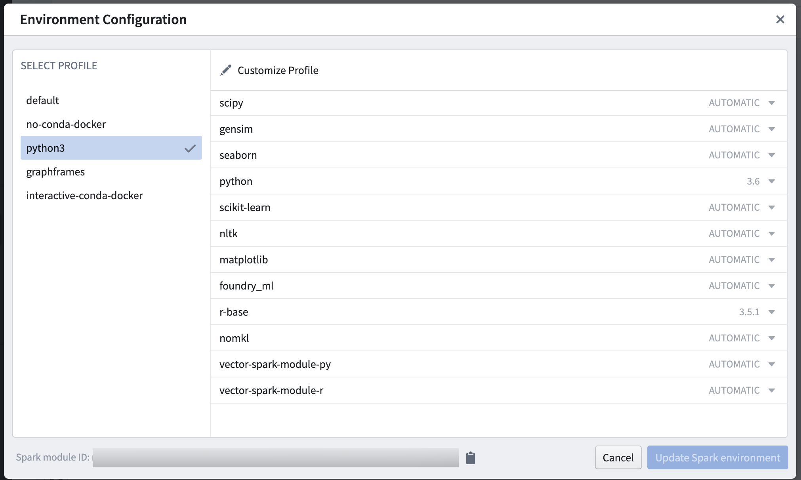
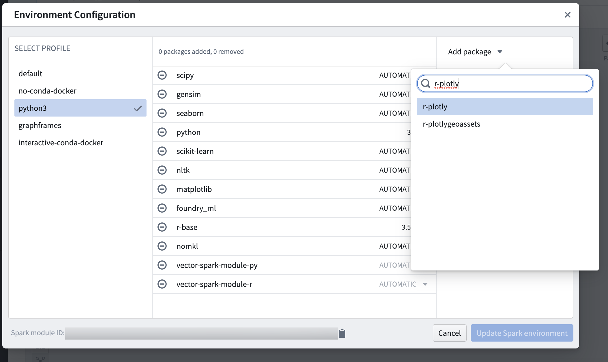

<!-- source: https://palantir.com/docs/foundry/code-workbook/environment-overview/ · mirrored 2026-08-26 from Palantir Foundry docs -->

# Environments

Each Code Workbook is associated with an environment. An environment includes a set of Conda packages and Spark settings installed on the Spark module backing computation in the Workbook. On opening a Workbook, you may see **Waiting for resources** or **Initializing Environment** as the Workbook obtains a Spark module. You will not be able to use the console or run transforms until a Spark module is acquired.

Each user is assigned one Spark module that is used across workbooks in the same project with the same environment. Spark modules are never shared between users.

### Select a profile

You can configure your environment by clicking on **Environment** and then **Customize Spark environment.** You will see a list of [predefined profiles](/docs/foundry/code-workbook/environment-profiles/). These have been configured by your administrator as useful sets of defaults for particular workflows or user groups.

To use a predefined profile, select it in the left-hand panel, then click **Update Spark environment**.

### Modify a profile

If none of the predefined profiles suit your use case, you can add or remove packages to modify a profile by editing the predefined profile in Control Panel or customizing the predefined profile in a workbook. The main difference between these options is the scope of your changes. If you edit a predefined profile in Control Panel, packages installed for all workbooks with that profile will change accordingly. Conversely, if you customize a predefined profile in a workbook, only the packages installed for that particular workbook will change.

To edit a predefined profile in Control Panel, you can [configure the packages for a Code Workbook profile](/docs/foundry/administration/configure-code-workbook-profiles/#conda-environment).

To customize a predefined profile in a workbook, open the desired workbook, click on **Environment**, select **Configure environment**, and click on the **Customize profile** button. In the customization view, you can remove existing packages by clicking the minus sign, or change their requested versions. To add a new package, search for it in the **Packages** sidebar and click on the plus sign. Once it is added to the profile, you can choose a specific version, choose `AUTOMATIC`, or specify a custom Conda version.

:::callout{theme="warning"}
Customized environments will be slower to initialize than predefined profiles.
:::

### Add a profile

To create a new predefined profile for use across workbooks, you can [configure Code Workbook profiles](/docs/foundry/administration/configure-code-workbook-profiles/) in Control Panel.

### Custom Conda Versions

A Custom Conda Version can be:

* A version (such as `3.6`)
* A comparison operation and a version (such as `>=3.6`) (Accepted comparison operators are `=`, `==`, `>=`, `>`, `<=` and `<`) For more details, see the [Conda package specification ↗](https://docs.conda.io/projects/conda/en/latest/user-guide/concepts/pkg-specs.html#package-match-specifications).
