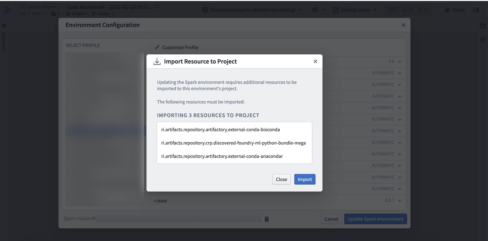

<!-- source: https://palantir.com/docs/foundry/code-workbook/environment-profiles/ · mirrored 2026-08-26 from Palantir Foundry docs -->

# Code Workbook profiles

A Code Workbook profile is a predefined set of Conda packages and Spark settings that serves as a useful default environment for a use case or group of users. For a given Code Workbook profile, you can also configure pre-warmed modules to reduce user wait times.

For example, a data science group may want to configure a data science profile with Conda packages like `tensorflow` and `keras`, along with a higher amount of driver memory.

In Code Workbook, users can choose from a list of Code Workbook profiles in the Environment Configuration dialog. Users can then further customize the Conda packages. Users are unable to customize the Spark settings for a given Code Workbook profile.

For a given profile, the permissions boundary is the project. Users with Viewer access to the profile can import the profile into a project. Once the profile has been imported into a project, anyone using Code Workbook in the project can use the profile.

## Artifacts profiles

[New Code Workbook profiles created in Control Panel](/docs/foundry/administration/configure-code-workbook-profiles/) use Artifacts. Artifacts-backed profiles allow use of libraries securely produced by Artifacts, including Python libraries authored in Foundry that are not published to the `shared` channel. Refer to the [Control Panel documentation](/docs/foundry/administration/configure-code-workbook-profiles/) to learn more about creating Artifacts profiles.

### Using an Artifacts profile

After an Artifacts profile is created in Control Panel, users can use that profile in Code Workbook. An Artifacts profile contains a list of requested packages and a list of backing repositories that provide those packages. To use the profile, all backing repositories on the profile must be added as a project import in the workbook's project. If you do not have permissions to import all of the backing repositories on the profile, you will not be able to set the environment with that profile.

If at any point, a backing repository of the profile is no longer imported into the project, you will no longer be able to obtain an environment until it is added as an import, which you will be prompted to do in the UI.

### Customizing an Artifacts profile

When using a customized Artifacts profile in Code Workbook, the list of backing repositories used is that of the Code Workbook rather than that of the profile. Newly created Code Workbooks are initialized with no backing repositories, and the list of backing repositories is automatically populated as users use customized Artifacts environments in the Workbook. Note this means that all users of customized Artifacts environments, across all branches in the Workbook, are adding to and using the same list of backing repositories.

When using a customized Artifacts environment in Code Workbook, all backing repositories of the Workbook must be imported into the project. If at any point, a backing repository of the workbook is no longer imported into the project, you will no longer be able to obtain an environment until it is added as an import, which you will be prompted to do in the UI.

### Future plans

In the future, all existing profiles and environments will be migrated to use Artifacts. This means that regardless of base profile, users will be able to use libraries securely produced from Artifacts.
