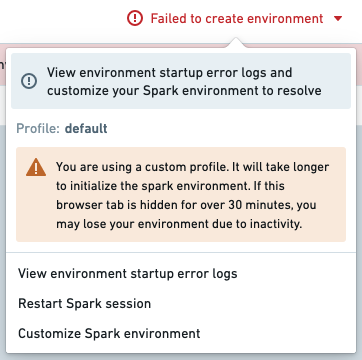

<!-- source: https://palantir.com/docs/foundry/code-workbook/environment-troubleshooting/ · mirrored 2026-08-26 from Palantir Foundry docs -->

# Troubleshooting guide

* [My custom environment initializes slowly](#my-custom-environment-initializes-slowly)
* [Environment fails to initialize](#environment-fails-to-initialize)
  * [Code 1 - Environment resolution error](#code-1---environment-resolution-error)
    * [New Mamba error messages](#new-mamba-error-messages)
    * [Legacy Mamba error messages](#new-mamba-error-messages)
  * [Code 137 - Module ran out of memory](#code-137---module-ran-out-of-memory)
  * [Other Codes](#other-codes)
* [Default environment initialization speed is inconsistent](#default-environment-initialization-speed-is-inconsistent)
* [Packages which require both a Conda package and a JAR](#packages-which-require-both-a-conda-package-and-a-jar)
* [Other issues](#other-issues)

## My custom environment initializes slowly

Slow initialization generally indicates that the environment definition is too large or too complex. Initialization time tends to increase superlinearly with the number of packages in the environment. Additionally, Foundry will often pre-initialize commonly used environments, so if you created a custom environment based on a default profile, the slowness is likely because you are no longer getting a pre-initialized environment and must wait for a new environment to be created. See [Introduction to Environment Creation](/docs/foundry/code-workbook/environment-creation-overview/) for more details about the environment creation process.

Try the following:

1. **Undo** - If the environment began initializing slowly after a change was made to its configuration, try reverting the change. Adding even a single package can dramatically increase initialization time in certain cases.
2. **Simplify** - Remove any unneeded packages from the environment definition. Small, specialized environments are much more performant than large, general-purpose ones.
3. **Pin versions** - Add version constraints to some of the packages in the Environment Configuration panel, as discussed in [Selecting an Environment](/docs/foundry/code-workbook/environment-overview/#select-a-profile). It is most effective to do this for packages with many possible versions like `python` and for packages with complex dependency graphs like `scipy`. If adding a particular package caused the environment to become slow, try pinning a version for that package.
   * *Caveat*: Adding version pins may cause an environment to become unsatisfiable. If the environment fails to initialize, try relaxing the pin. For example, `python=3.6.10` will match only that version, but `python=3.6` will match any of `python 3.6.x`, and so is more likely to be satisfiable.
   * One option is to wait for your environment (with no pins) to resolve, then check which versions were selected (see [Viewing Resolved Environment](/docs/foundry/code-workbook/environment-view-resolved/)). You can then add pins for those specific versions until initialization performance is sufficiently fast. It is usually optimal to pin versions for packages with many dependencies while leaving all other packages unpinned.

## Environment fails to initialize

If your environment fails to initialize, you can view the environment startup error logs to view additional information about what went wrong.



The first line of the log will read `Execution failed with non-zero exit code:` followed by an integer error code. This error code indicates the specific failure mode.

### Code 1 - Environment Resolution Error

This error indicates that some subset of the specified packages (and/or their dependencies) are incompatible or could not be installed. If a recent change in the Environment Configuration panel caused initialization to begin failing, try reverting the change. Below is a list of common environment resolution errors.

#### New Mamba error messages

Palantir [contributed ↗](https://medium.com/@AntoineProuvost/managing-conflicts-with-mamba-6a5fa10ed6a) to the open-source Mamba community by providing better formatting of environment initialization error messages. As of February 2023, Foundry services benefit from errors that more closely represent the dependency tree being infringed by environment failures.

For guidance on understanding those new messages, how to interpret them, and advice on how to remediate them, see [New error messages](/docs/foundry/transforms-python/environment-troubleshooting/#new-mamba-error-messages).

#### Legacy Mamba Error Messages

Find below a list of common error messages from the legacy error messages, before the [new Mamba error messages](#new-mamba-error-messages) were introduced.

##### Package not found

In this case, no configured channel provides the package `A` dependency.

```javascript
Problem: nothing provides requested A.a.a.a
```

This can happen if the pinned version of your package does not exist. If this is the case, try relaxing or removing the versioning from your package within the `meta.yml`; for example, `matplotlib 1.1.1` could become `matplotlib`. Alternatively, this may also mean that the environment manager could not locate the necessary package to install the specified version.

##### Dependency not found

In this case, package `A` contains a required dependency `B` which was not provided by any channel.

```javascript
Problem: nothing provides B-b.b.b needed by A-a.a.a:
```

Note that `B` can be a package the user requested explicitly (in `meta.yml/foundry-ml/vector` profiles) or it can be a transitive dependency.

This may occur if `B` is not available for installation on your enrollment; for example, `B` may have been recalled and therefore is not available for install.

If this is the case, try removing the pinned version of `A` in case there is a version of `A` that has all its dependencies available, or contact your Palantir representative to import the necessary package into Foundry.

##### Duplicate package error

```javascript
cannot install both X.a.b.c and X.d.e.f
```

This error occurs if you try to install the same package `X` and have two different version pinnings for both. For example, you might receive this error if you try to pin both `python 3.6.*` and `python 3.7.*` in your `meta.yml`. You can resolve this issue by removing one of the duplicate package pinnings.

##### Permission errors

```javascript
CondaService:ReadRepositoryPermissionDenied
```

If you receive this error, it may be because some of the assets and packages you need are not available in your enrollment.

##### Package conflict

In this case, package `A` has a requirement on the version of package `B` but this version of `B` conflicts with other packages:

```javascript
Problem: package A-a.a.a requires B >=2.2.5,<2.3.0a0, but none of the providers can be installed
```

Note that the package `B` could refer to a transitive dependency of `A`, which you have not explicitly listed as a requirement in your environment. See [Resolved Environment](/docs/foundry/code-workbook/environment-view-resolved/) documentation for more information on transitive dependencies.

##### Remediating a Code 1 error

To remediate an environment failure, consider the following steps:

1. Check the `STDOUT` in the environment startup logs.
2. Create a minimal example of a failing solve. Remove packages until the environment initializes, and then add packages back in until you have determined which packages are the blockers.
3. Try relaxing constraints by removing package pins.
   * You can open up multiple workbooks or multiple branches of the same workbook in different windows to make this process faster.
   * We recommend using binary search to discover issues. Try removing all constraints in one workbook, removing half of the constraints in another workbook, then the other half in another workbook, and so on.

### Code 137 - Module ran out of memory

This error typically indicates that the environment initialization required more memory than was available on the Spark module. If a recent change in the Environment Configuration panel caused initialization to begin failing, try reverting the change. Otherwise, try one or more of the following suggestions:

* Remove unneeded packages from the environment. Memory usage increases superlinearly with the number of packages in an environment, so removing even a few packages may be enough to resolve the problem.
* Add version constraints for some of the packages as described in Step 3 of the [Environment initialization is slow](#my-custom-environment-initializes-slowly) section. Each package version that you pin will reduce the complexity of the environment solve, which will in turn reduce the amount of memory required to initialize the environment.

If your environment still fails to initialize after removing all unneeded packages and pinning some of the remaining packages to specific versions, contact your Palantir representative and include details of all debugging steps you tried.

### Other codes

If your environment fails to initialize with an error code not listed above and the environment fails again on retry, contact your Palantir representative and include the full text of the error log.

## Default environment initialization speed is inconsistent

We expect that default profiles will sometimes initialize quickly and sometimes take longer. In the latter case, you are waiting for Mamba to resolve your environment specification and install it onto the Spark module backing your Workbook. This is the default behavior. In the former case, either you are getting a pre-initialized module or your environment specification matches a resolved environment in the cache that can be installed right away. If many users are opening Workbooks around the same time, you are less likely to get a pre-initialized module and will need to wait for a new one to be spun up.

## Packages which require both a Conda package and a JAR

Some packages require both a Conda package and a JAR in order to be available. A common example is the graphframes package. Such packages require a special setup process, and you may experience the following error during build time if this package has not previously been configured for your instance:

```js
o257.loadClass.: java.lang.ClassNotFoundException:<Class>
```

JAR Files can be added to a profile's configuration in the **Advanced** section of the Conda Environment configuration tab in Control Panel (see [Configure Code Workbook Profiles](/docs/foundry/administration/configure-code-workbook-profiles/)). Contact your Palantir representative if you need assistance in configuring such packages.

## Other issues

If the guidance above is insufficient to resolve your issue, or if you encounter an issue outside the scope of this guide, contact your Palantir representative and include details of any debugging steps you tried.
