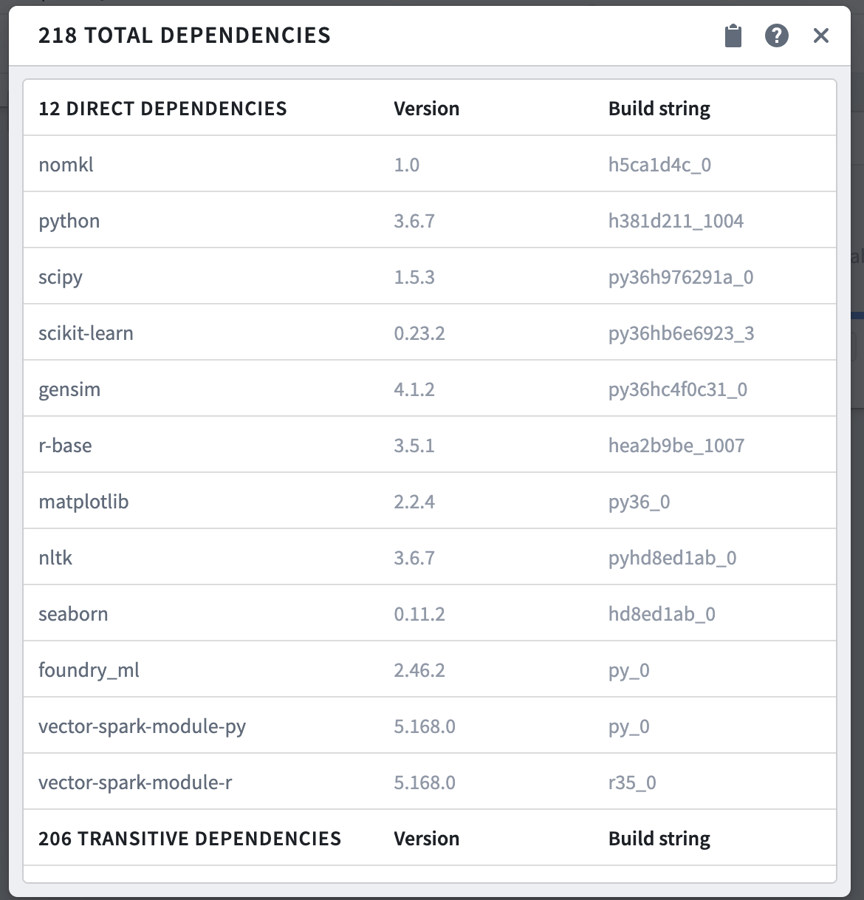
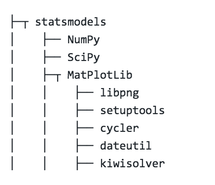

<!-- source: https://palantir.com/docs/foundry/code-workbook/environment-view-resolved/ · mirrored 2026-08-26 from Palantir Foundry docs -->

# View resolved environment

After obtaining a Spark environment, you can view the exact packages installed in the Spark environment in the Resolved Dependencies dialog. To open the dialog, select **Environment > View resolved packages**. The dialog will show a list of the direct and transitive dependencies.

A direct dependency is a package explicitly specified by the user to include in the Spark environment. You can specify direct dependencies in the **Customize Spark Environment** menu.

A transitive dependency is a package relied upon by a direct dependency. For example, depending on `statsmodels` transitively imports `NumPy`, `SciPy`, `MatPlotLib`, and their dependencies as well.

