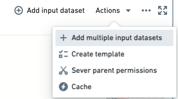

<!-- source: https://palantir.com/docs/foundry/code-workbook/faq/ · mirrored 2026-08-26 from Palantir Foundry docs -->

# Code Workbook FAQ

The following are some frequently asked questions about Code Workbook.

For general information, view our [Code Workbook documentation](/docs/foundry/code-workbook/overview/).

* [Can I easily move all of my work from one workbook to another?](#can-i-easily-move-all-of-my-work-from-one-workbook-to-another)
* [Can I set a transformation node to be a variable?](#can-i-set-a-transformation-node-to-be-a-variable)
* [Why does each transformation node need to return a table or a dataframe?](#why-does-each-transformation-node-need-to-return-a-table-or-a-dataframe)
* [Can Code Workbook handle merging and merge conflicts?](#can-code-workbook-handle-merging-and-merge-conflicts)
* [How long does it take to initialize my environment?](#how-long-does-it-take-to-initialize-my-environment)
* [How do I restore code I previously deleted from my code workbook?](#how-do-i-restore-code-i-previously-deleted-from-my-code-workbook)
* [Spark environment and custom libraries](#spark-environment-and-custom-libraries)
  * [Cannot find required Python library](#cannot-find-required-python-library)
  * [Trouble importing Python libraries](#trouble-importing-python-libraries)
  * [Failed to create environment](#failed-to-create-environment)
* [Python code is failing](#python-code-is-failing)
  * [Retryer error](#retryer-error)
* [Failed to save as dataset](#failed-to-save-as-dataset)
* [Workbook not automatically recomputing after updating input dataset preview](#workbook-not-automatically-recomputing-after-updating-input-dataset-preview)
* [Unable to merge my branch into master](#unable-to-merge-my-branch-into-master)
* [Make cell computation faster](#make-cell-computation-faster)
  * [1. Refactoring](#1-refactoring)
  * [2. Caching](#2-caching)
  * [3. Function calls](#3-function-calls)
  * [4. Downsampling](#4-downsampling)
  * [5. Summary](#5-summary)

***

## Can I easily move all of my work from one workbook to another?

Yes. You can copy-paste nodes (elements on the graph of a workbook) between workbooks.

1. Hold `Ctrl` while selecting the nodes you would like to copy from one workbook. Copy-pasting Contour board nodes is not supported.
2. Copy the selected nodes using the right-click context menu.
3. Select the graph of your target workbook and paste the nodes using the combination `Cmd+V` (macOS) or `Ctrl+V` (Windows). The new nodes will be imported into your new workbook.

[Return to top](#code-workbook-faq)

***

## Can I set a transformation node to be a variable?

No. Each transformation node on a code workbook graph must return a table or a dataframe (such as a two-dimensional data structure with columns).

[Return to top](#code-workbook-faq)

***

## Why does each transformation node need to return a table or a dataframe?

The atomic unit of artifacts within Foundry is the dataset. Each transformation node needs to return a table or a dataframe (such as a two-dimensional data structure with columns) so that each node can be registered as a Foundry dataset and therefore available throughout the rest of Foundry. Moreover, the tables or dataframes in Code Workbook must be returned with a valid schema such that they will produce datasets (for example, at least one column exists, column names are not duplicated, column names do not contain invalid letters, and so on.).

[Return to top](#code-workbook-faq)

***

## Can Code Workbook handle merging and merge conflicts?

Yes. For more information, view the documentation on [branching and merging](/docs/foundry/code-workbook/branching-merging/).

[Return to top](#code-workbook-faq)

***

## How long does it take to initialize my environment?

Code Workbook’s default configuration has an average initialization time of 3-5 minutes. However, if you have added additional packages to your Code Workbook profile, initialization times may range from 20-30 minutes, depending on the complexity and interdependencies of these packages. Initialization time tends to increase significantly as the number of packages in the environment increases.

Slow initialization generally indicates that the environment definition is too large or too complex. Initialization time tends to increase superlinearly with the number of packages in the environment, so you may want to simplify any custom environments. In some cases, Code Workbook may pre-initialize commonly-used environments to speed up initialization. If you have created a custom environment based on a default profile, the slower initialization time may be due to the lack of pre-initialization. Learn more about [optimizing the initialization time of a custom environment](/docs/foundry/code-workbook/environment-troubleshooting/#my-custom-environment-initializes-slowly)

If the browser tab is inactive for more than 30 minutes, the environment may be lost due to inactivity.

[Return to top](#code-workbook-faq)

***

## How do I restore code I previously deleted from my Code Workbook?

If these transforms were built into a dataset, you can use the **Compare** feature of the resulting Dataset Preview to view the code at that time. From there you can copy-paste the relevant transforms. Unfortunately, if this code was in an intermediate transform, it cannot be recovered.

Code Workbook is a more iterative platform than Code Repositories, the latter of which has a full git commit and publish functionality. If you have any other branches available, we recommend checking them for the deleted transform.

[Return to top](#code-workbook-faq)

***

## Spark environment and custom libraries

### Cannot find required Python library

By default, any Python package available in [Conda Forge ↗](https://conda-forge.org/feedstock-outputs/index.html) is available to add to a custom environment for your workbook. If the Python library is included in Conda Forge, then you can customize your environment to include it directly.

To troubleshoot, perform the following steps:

1. Select **Environment > Customize Environment** in the top-right.
2. Search for the desired library and add either **automatic** (which will take upgrades, but may leave you vulnerable to unintentional breaks if the module upgrades) or a specific version of this library.
3. Select **Update Spark environment**.

Note that it might take a while for the environment to reload, working with custom environments in general will be slower than with the stock environment, since a pool of stock environments is kept "warmed" whereas each custom environment is spun up from scratch.

[Return to top](#code-workbook-faq)

***

### Trouble importing Python libraries

Sometimes it may be required to use a library that is not already available within Code Workbook. It is possible to have these added to your available list, but this requires some hands-on work.

To troubleshoot, perform the following steps:

1. Confirm that the Python library is not available in the workbook custom Spark environment list.
2. If it does not exist, then vet whether another available library might provide the same functionality.
3. If necessary to include this library, contact Palantir Support.
4. Once the library is available, you can refer to the previous troubleshooting steps to add a library.

[Return to top](#code-workbook-faq)

***

### Failed to create environment

I am trying to update my workbook environment, and it states "Waiting for Spark / Initializing environment" for a while and then errors out with a “Failed to create environment” message.

To troubleshoot, perform the following steps:

1. Confirm whether there were any updates to customize the workbook's Spark environment. If there have been, then your investigation should center on any custom libraries added.
2. Ensure none of the modules were pinned to a specific version. It is generally good practice to use the latest version of a module.
3. Remove any custom libraries and see if the Spark environment loads.
4. If a particular library is preventing your Spark environment to load, escalate to Palantir Support.

[Return to top](#code-workbook-faq)

***

## Python code is failing

This section discusses failures that are generally specific to Code Workbook.

For additional information, you may also refer to our guidance on [Builds and checks errors](/docs/foundry/health-checks/builds-checks-faq/).

[Return to top](#code-workbook-faq)

### Retryer error

Running an import package or any basic command returns the following error: "com.github.rholder.retry.RetryException: Retrying failed to complete successfully after 3 attempts. at com.github.rholder.retry.Retryer.call(Retryer.java:174)". When using a workbook in Pandas, the Code Workbook application will still convert from a Spark dataframe to a Pandas dataframe before your transformation, which consumes significantly more memory on the driver and is likely making it OOM.

To troubleshoot, perform the following steps:

1. Verify that your transformation cell is using Pandas and that this problem is exhibited for code that specifically runs Pandas.
2. If this computation is possible in Spark, we strongly recommend re-configuring your code to use Spark since it is parallel and more scalable.
3. As a last resort when this computation must be done on the driver, we recommend using a profile that increases driver memory.

[Return to top](#code-workbook-faq)

***

## Failed to save as dataset

This issue could occur for a variety of reasons, but the most common circumstance is with returning a table or dataframe that contains a valid schema. If none of the below steps help identify the particular error you are seeing, refer to our guidance on [Builds and checks errors](/docs/foundry/health-checks/builds-checks-faq/).

To troubleshoot, perform the following steps:

1. Ensure the transformation node is returning a table or dataframe.
2. Confirm the table or dataframe conforms to the basic requirements of being written to Foundry as a dataset: For example:
   1. There is at least one column.
   2. All column names are valid (such as they do not contain spaces or invalid characters).
   3. There are no duplicate column names.
3. If you are confident this transformation node should be capable of being written out as a dataset, then try running another transformation node or building a new, very simple transformation node.
   1. This can help identify if it is a local issue (something unexpected happening with that particular transformation node, for example) or a more systemic issue (such as transformation nodes in general are failing to save to Foundry).
   2. If it is a local issue, continue to debug the code being used to create this table / dataframe.
   3. If it is systemic, escalate the issue to Palantir Support providing all the relevant information from your investigation.

[Return to top](#code-workbook-faq)

***

## Workbook not automatically recomputing after updating input dataset preview

When opting to **Update table preview** for input tables, only the view for the input datasets is updated and the underlying dataset in Foundry is not automatically refreshed.

To troubleshoot, perform the following steps:

1. If the input datasets do not refresh after selecting **Update table preview** for input tables, then:
   * Open these datasets and see if they have been failing to build.
   * If the input datasets have been failing to build, then this would explain why you are not seeing any updated information in your workbook. Continue debugging from here.
   * If the input datasets have been building as expected, and there is a mismatch with what you are seeing as the preview in the code workbook, then:
     * Try deleting the input table from the code workbook and adding it back in.
     * If this does not work, and there is still a discrepancy between the preview and the actual table, then contact Palantir Support.
2. If the transformation nodes are not updating when selecting **Update table preview**, then this is expected behavior as these are not impacted by this operation. To update all the transformation nodes within the code workbook, select `run -> run all`. This will run all the transformation nodes in your code workbook while respecting build dependencies.

[Return to top](#code-workbook-faq)

***

## Unable to merge my branch into master

The most common issue when you find yourself unable to merge your branch back into main is that the `master` branch is protected. There may be issues around merge conflicts, but that is covered in another section.

To troubleshoot, perform the following steps:

1. Determine whether the branch is protected.
2. If the branch is protected then identify the owner and request that they merge your branch.
   * For a given workbook, turn on branch protection on `master`, and ensure that the users you want to restrict from merging branches only have `compass:edit` permissions on the Workbook.
   * Internally, Code Workbook has four permission levels related to branches: `view`, `edit`, `maintain`, and `manage`. By default, `compass:read` expands to `view`, `compass:edit` expands to `edit`, and `compass:manage` expands to `maintain` and `manage`.
   * Creating a branch and preparing a merge into a parent branch always requires only `edit` permissions. Merging into a protected branch requires `maintain` permissions. Changing branch protection settings requires `manage` permissions.
   * More information is available in our [Branching overview](/docs/foundry/code-workbook/branching-overview/#branch-settings).
3. If the branch is not protected, then you run into merge conflicts, where this is non-additive code that conflicts with the code in the `master` branch.
   * In these instances, resolve these merge conflicts before merging your branch back into `master`.
   * More information is available in our [Merging branches](/docs/foundry/code-workbook/branching-merging/) documentation.
4. If the `master` branch is not protected, and there are no merge conflicts, and you are still unable to merge your branch into `master`, contact Palantir Support.

[Return to top](#code-workbook-faq)

***

## Make cell computation faster

Assuming I have dataset inputs of (1000 rows \* 30 columns) + (1 million rows \* 30 columns), and a transformation with a lot of windowing / column derivation steps, how can I make the computation run faster?

To troubleshoot, perform the following steps:

### 1. Refactoring

For experimentation or fast iteration, it is often a good idea to refactor your code into several smaller steps instead of a single large step.

This way, you compute the upstream cells first, write the data back to Foundry, and use this pre-computed data in later steps. If you were to keep re-computing without changing the logic of these early steps, this creates excessive work.

Concretely:

```
workbook_1:
  cell_A:
    work_1 : input -> df_1
      (takes 4 iterations to get right): 4 * df_1
    work_2: df_1 -> df_2
      (takes 4 iterations to get right): 4 * df_2 + 4 * df_1
        = 4 df_2 + 4 df_1
    work_3: df_2 -> df_3
      (takes 4 iterations to get right): 4 * df_3 + 4 * df_2 + 4 * df_1
  total work:
    cell_A
     = work_1 + work_2 + work_3
     = 4 * df_1 + (4 * df_2 + 4 * df_1) + (4 * df_3 + 4 * df_2 + 4 * df_1)
     = 12 * df_1 + 8 * df_2 + 4 * df_3
```

Instead, if you wrote work\_1 and work\_2 into their own cells, the work you perform would instead look like:

```
workbook_2:
  cell_A:
    work_1: input -> df_1
      (takes 4 iterations to get right): 4 * df_1
  cell_B:
    work_2: df_1 -> df_2
      (takes 4 iterations to get right): 4 * df_2
  cell_C:
    work:3: df_2 -> df_3
      (takes 4 iterations to get right): 4 * df_3
  total_work:
    cell_A + cell_B + cell_C
       = work_1 + work_2 + work_3
       = 4 * df_1 + 4 * df_2 + 4 * df_3
```

If you assume df\_1, df\_2, and df\_3 all cost the same amount to compute, `workbook_1.total_work = 24 * df_1`, whereas `workbook_2.total_work = 12 * df_1`, so you can expect closer to the order of a 2x speed improvement on iteration.

### 2. Caching

For any "small" datasets, you should cache them by selecting the workbook, then choosing **Actions > Cache**.



This will keep the rows in-memory for your workbook and not require fetching from the written-back dataset. "Small" is an arbitrary judgment given several factors that must be considered, but Code Workbook does a good job of trying to cache it and will warn you if it is too big.

### 3. Function calls

You should stick to native PySpark methods as much as possible and never user Python methods directly on data (such as looping over individual rows, executing a UDF). PySpark methods call the underlying Spark methods that are written in Scala and run directly against the data instead of the Python runtime; if you simply use Python as the layer to interact with this system instead of being the system that interacts with the data, you will get all the performance benefits of Spark itself.

### 4. Downsampling

If you can derive your own accurate sample of a large input dataset, this can be used as the mock input for your transformations, until such time you perfect your logic and want to test it against the full set.

Consider downsampling and caching datasets above one million rows before ever writing a line of PySpark code; you may experience faster turnaround times without catching syntax bugs slowly due to large dataset sizes.

### 5. Summary

A good code workbook looks like the following:

* Discrete chunks of code that do particular materializations you expect to re-use later but do not need to be recomputed over and over again.
* Down-sampled to "small" sizes.
* Cached "small" datasets for very fast fetching.
* Only native PySpark code that exploits the fast, underlying Spark libraries.

[Return to top](#code-workbook-faq)
