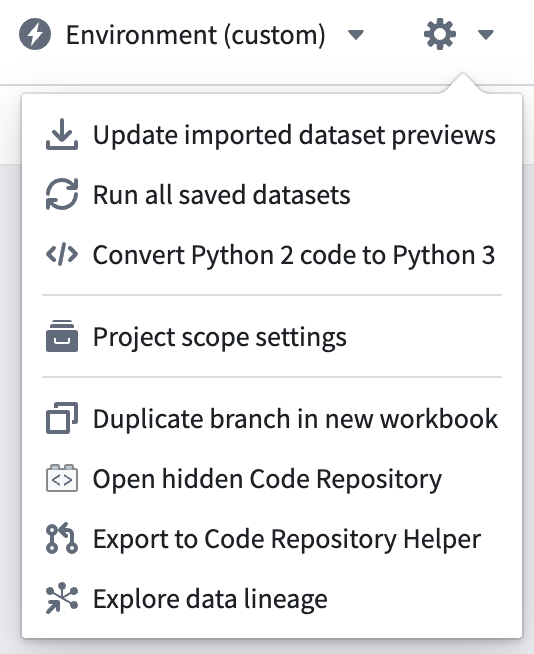

<!-- source: https://palantir.com/docs/foundry/code-workbook/hidden-repository/ · mirrored 2026-08-26 from Palantir Foundry docs -->

# Hidden code repositories

Code Workbook offers lightweight version control through the use of [branches](/docs/foundry/code-workbook/branching-overview/). Additionally, every workbook is backed by a special hidden code repository. This repository serves as a secure backup of the code written in a code workbook while also exposing the history of all code changes made on the workbook.

You can access the hidden code repository of a workbook by opening the gear icon menu at the top right of the Code Workbook interface and selecting **Open hidden Code Repository**.



## Special properties

A workbook's hidden repository will always have the following properties:

* **The repository is read-only:** Repository contents can only be viewed and never updated directly in the repository. The only way to update the repository is to make code changes in the workbook.
* **The repository is hidden by default:** It will only be discoverable through the Code Workbook interface.
* **The repository stores three separate files:** The `pipeline.R`, `pipeline.py`, and `pipeline.sql` files each contain all of the code of the converted workbook for their respective language.
* **The repository saves a full change history:** A full history of the workbook's code changes for each branch is available under the **Branches** tab of the hidden repository.
* **The repository contains a hidden `workbook.yml` file:** The file stores basic metadata about the workbook.

Every code change made on a workbook branch automatically creates a new commit to the corresponding branch in the hidden code repository.

## Code conversion

Code Workbook code, when committed to the hidden repository, is automatically converted to Code Repository syntax. For example, consider the following code cell in Code Workbook:

```python
def rename_column(dataset):
    return dataset.withColumnRenamed("old_name", "new_name")
```

The code will be converted to the following in the `pipeline.py` file of the hidden repository:

```python
@transform_pandas(
    Output(rid="ri.foundry.main.dataset.id-1"),
    dataset=Input(rid="ri.vector.main.dataset.id-2")
)
def rename_column(dataset):
    return dataset.withColumnRenamed("old_name", "new_name")
```

If more than one code cell of a given language is present in a code workbook, each of the code cells will be appended in the same, unique file: `pipeline.R` for R, `pipeline.py` for python, and `pipeline.sql` for SQL. This allows you to view all of the code of a given language in a single file. Code written in the **Global code** section of the workbook will also be stored in the appropriate files.

## Recover lost code

By regularly storing backups of a workbook, hidden code repositories are the recommended way to restore code that was lost or accidentally removed. To consult the history of a given workbook's branch, open the **Branches** tab at the top of the hidden repository, select the desired branch (such as `master`), and select the commit for which you would like to inspect code changes. You can then copy the code and paste it back into the workbook.
