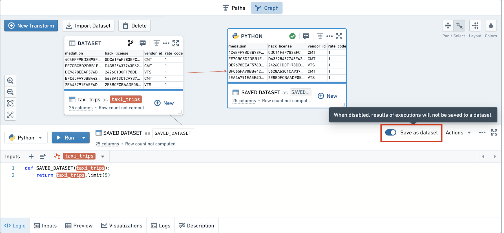
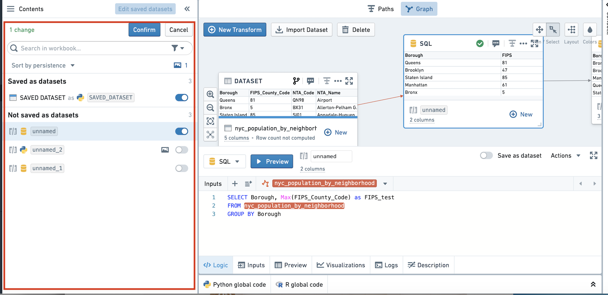
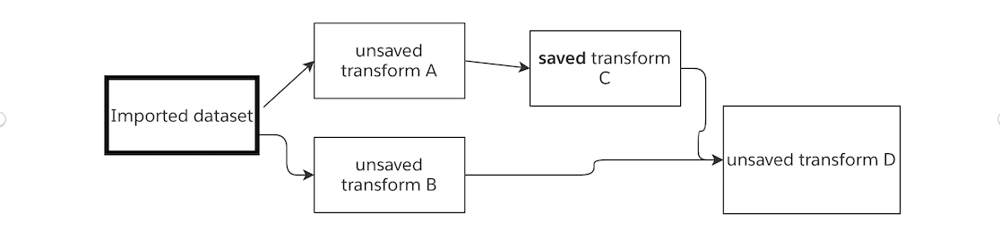
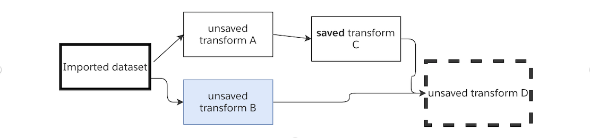
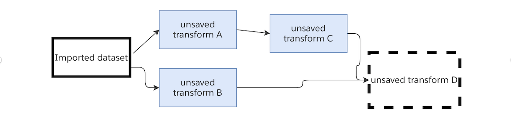
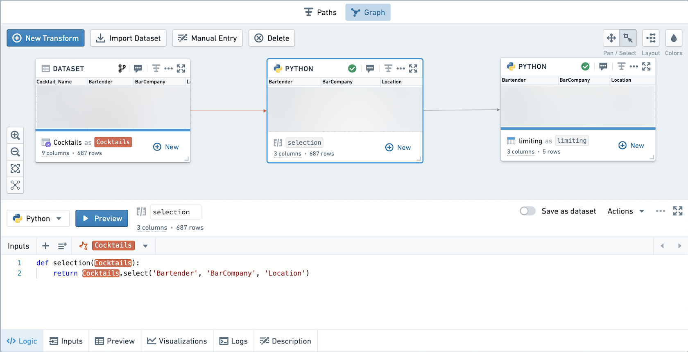
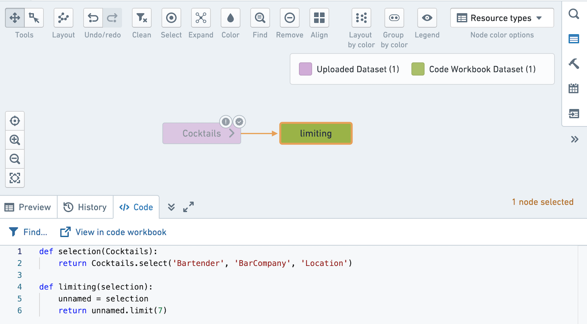

<!-- source: https://palantir.com/docs/foundry/code-workbook/optional-data-persistence/ · mirrored 2026-08-26 from Palantir Foundry docs -->

# Optional data persistence

For each transform in a workbook, users can choose whether to save the result as a dataset.

## Choose whether to save as a dataset

By default, new transforms are not saved as datasets. To save them, use the toggle in the logic pane.

*These screenshots use open source data from the [NYC Taxi & Limousine Commission ↗](https://www.nyc.gov/site/tlc/about/tlc-trip-record-data.page).*

To change the persistence of multiple transforms at once, use the bulk editor on the left-hand side.

:::callout{theme="neutral"}
If you choose to change a transform from not saved to saved, it will re-link to its previous saved dataset. If a previous saved dataset does not exist, a new dataset will be created.
:::

Transforms that are saved are denoted with a horizontal blue bar.

## Execution Model

When running a node, the logic from all unpersisted nodes upstream of that node will also be run. In the diagram below, when running Saved Transform C, the logic from Unsaved Transform A will also be executed.

If you change the code in Unsaved Transform A but do not run it, and then run Saved Transform C, the result of Saved Transform C will reflect the change in logic.

On running Unsaved Transform D, Saved Transform C will be read in from the Foundry dataset, and the logic from Unsaved Transform B will be executed.

Imagine that you toggle Saved Transform C so it is no longer saved as a dataset. When running Unsaved Transform D, the logic of all three upstream transforms will be executed.

In this case, when running this series of transformations - if my end goal is to view the result in Unsaved Transform D, **there is no need to preview the 3 upstream unsaved transforms**. By running Unsaved Transform D, the latest logic in all four transforms and the latest transaction for the imported dataset will be used.

## FAQ

### When should I save a transform as a dataset?

If a transform is very computationally intensive, and is used upstream of many other transforms, you may want to save it as a dataset, to prevent poor performance.

If you want to use the results of a transform outside of workbook (for example, in another Code Workbook or in a Contour analysis), you should save the results of the transform as a dataset.

If a transform computes a function nondeterministically (for example, using a `row_number` function or a function that calls the current time), you should persist the dataset to Foundry. This will guarantee that downstream transforms will use the exact results that were written to the dataset.

:::callout{theme="success" title="Checkpoint your work"}
If your workbook contains long chains of nodes that are unpersisted, it is recommended to periodically checkpoint your workbook by persisting an intermediate node.
:::

### When should I preview a node?

In general, the preview functionality should be used when creating a series of transforms, to validate their correctness and preview their results. Once a series of transformations is codified, there are fewer reasons to use the preview functionality.

### Why don't my unsaved transforms appear in Data Lineage?

Unsaved transforms in Code Workbook are logical blocks, not resources in a Project. When you Explore Data Lineage, datasets will show all of the code they execute. That includes the code in any unsaved transforms upstream of the saved transform.

For example, this workbook contains one unsaved transform and one saved transform.

If you click Explore Data Lineage, it will appear as below. Note that the code for the `selection` transform is prepended to the code in the `limiting` transform.

### What are the performance and resource usage effects of optional data persistence?

Code Workbook originally used an execution model where each transform was saved as a Foundry dataset. The current execution model allows users to choose whether to save transforms as datasets, and there are implications for performance and resource usage.

#### Scheduled builds

Imagine you had a scheduled build running in the previous execution model. In the new execution model, if all transforms remain persisted, the performance will remain identical to before.

If you determine that some intermediate transforms do not need to be saved as Foundry datasets, and choose to unpersist them, there will be strict performance improvements in the speed of the pipeline. This is because the intermediate results of these nodes no longer need to be written to Foundry, and in some cases can help the Spark query planner further optimize downstream computations.

#### Interactive use

In the interactive case, in the old execution model both the preview result and the write result were computed. With optional persistence, unpersisted nodes compute only a preview, and persisted nodes only compute a write. Thus, no duplicative work is done and running an identical workbook will use less resources in the new execution model than in the previous execution model.

The effects of optional persistence on performance in the interactive case are more nuanced. For workflows with a very computationally intensive transform (for example, a large join), you may want to persist the join to avoid recomputing the large join each time you run a downstream transform.

In all cases, when you decide to unpersist a transform, storage space is saved by not writing to Foundry.
